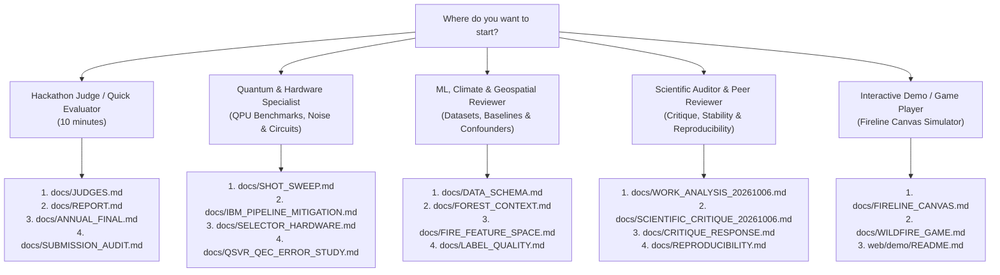

# Quantum Kernels for Annual Ontario Wildfire Estimation

Welcome to the official repository for the OhRats Qiskit Fall Fest 2026 open challenge (**Quantum Machine Learning / Sustainability**).

This project investigates whether quantum machine learning—specifically Quantum Support Vector Regression (QSVR) and Quantum Approximate Optimization Algorithm (QAOA) feature selection—can improve retrospective macro estimation of annual wildfire burn severity across Ontario, Canada, benchmarked under strictly matched computational and data budgets.

> [!NOTE]
> **Core Finding in 30 Seconds:**
> On the frozen 2019–2024 holdout evaluation, classical RBF-SVR leads development, and **no tested climate model beats the historical training-mean baseline**. Across **39 IBM Quantum hardware executions** (1.1M shots on Heron and Eagle processors), we show that:
> 1. Scaling shots buys candidate coverage but **does not increase feasible yield** on deep circuits (~1,000 CZs).
> 2. Classical uniform feasible sampling **outperforms 11 of 12 measured hardware minima**.
> 3. Readout error mitigation lowers Gram matrix RMSE but **consistently degrades downstream regression prediction**.
> 4. Classical station-reporting coverage (MAE 83.08) and calendar trends (MAE 88.61) explain the bulk of macro wildfire variance (baseline 92.00 ha/fire).
>
> We report this as a rigorous, fully reproducible **empirical benchmark and diagnostic post-mortem on NISQ machine learning**, with zero hype and no claimed quantum advantage.

---

## Quick Navigation Links

[Judge Guide](docs/JUDGES.md) · [Main Report](docs/REPORT.md) · [Holdout Evaluation](docs/ANNUAL_FINAL.md) · [Hardware Shot Sweep](docs/SHOT_SWEEP.md) · [Critique Response](docs/CRITIQUE_RESPONSE.md) · [Fireline Canvas Game](web/demo/README.md) · [Slide Presentation](web/presentation/README.md) · [Docs Directory](docs/README.md)

---

## Curated Reading Pathways

With 50 detailed technical documents across this repository, choose your reading pathway below based on your role and interest:



---

## Master Thematic Document Directory

All 50 technical documentation files are organized into seven logical categories below:

### 1. Core Reports and Official Submission Gateways
*Start here to understand the core research question, experimental methodology, and final results.*

| Document | Description |
| :--- | :--- |
| **[`docs/JUDGES.md`](docs/JUDGES.md)** | **Primary entry point for judges.** Core challenge question, matched results, reading order, and evaluation checklist. |
| **[`docs/REPORT.md`](docs/REPORT.md)** | **Main scientific paper.** Formulation of annual Ontario wildfire regression, matched RBF/QSVR comparison, and negative results. |
| **[`docs/ANNUAL_FINAL.md`](docs/ANNUAL_FINAL.md)** | **Frozen annual holdout results.** Final evaluation errors across all 11 models on 2019–2024, spectra, and parameter tables. |
| **[`docs/SUBMISSION_AUDIT.md`](docs/SUBMISSION_AUDIT.md)** | Complete audit against hackathon prompts, slide deck readiness, and submission requirements. |
| **[`docs/REPRODUCIBILITY.md`](docs/REPRODUCIBILITY.md)** | Step-by-step reproduction guide, public offline evidence bundle instructions, and environment locks. |

---

### 2. Real IBM QPU Hardware Benchmarks and NISQ Scaling
*Empirical results from 39 IBM Quantum jobs across `ibm_fez`, `ibm_marrakesh`, and `ibm_quebec`.*

| Document | Description |
| :--- | :--- |
| **[`docs/SHOT_SWEEP.md`](docs/SHOT_SWEEP.md)** | **Two-device physical shot sweep** (512, 1024, 2048 shots on Marrakesh & Quebec; 12 jobs, 301k shots). Proves shots buy candidate coverage rather than feasible yield, while classical sampling beats 11/12 QPU minima. |
| **[`docs/IBM_PIPELINE_MITIGATION.md`](docs/IBM_PIPELINE_MITIGATION.md)** | **Three-device pipeline comparison** (`ibm_fez`, `ibm_marrakesh`, `ibm_quebec`; 6 jobs, 75s QPU). Evaluates DD, twirling, and readout mitigation across QPUs. |
| **[`docs/SELECTOR_HARDWARE.md`](docs/SELECTOR_HARDWARE.md)** | **Hardware selector execution** on `ibm_marrakesh` for 10/16/20 feature pools, Dicke state preparation depth, and 10-shard recovery from scheduler error 1520. |
| **[`docs/SELECTOR_SCALING.md`](docs/SELECTOR_SCALING.md)** | Ideal vs noisy QAOA/SQD selection across 10, 16, and 20 candidate pools; details why better QUBO sampling does not improve regression. |
| **[`docs/RESEARCH_FINDINGS.md`](docs/RESEARCH_FINDINGS.md)** | Comprehensive search followup: 6 local studies, multi-start QAOA ($p=1\dots 4$), distinct 720-grid hyperparameter tuning ($C=100$ boundary collapse), and 9 IBM jobs. |
| **[`docs/RESEARCH_COVERAGE.md`](docs/RESEARCH_COVERAGE.md)** | Verification matrix mapping proposed research milestones to implemented evidence. |

---

### 3. Scientific Review, Peer Critique and Stability Audits
*In-depth synthesis, adversarial critique, and empirical sensitivity checks.*

| Document | Description |
| :--- | :--- |
| **[`docs/WORK_ANALYSIS_20261006.md`](docs/WORK_ANALYSIS_20261006.md)** | **Full synthesis of October 6 campaign** (08:00–16:15 EDT) covering 5 research streams, 39 QPU jobs, 405s QPU time, and key takeaways. |
| **[`docs/SCIENTIFIC_CRITIQUE_20261006.md`](docs/SCIENTIFIC_CRITIQUE_20261006.md)** | **Adversarial peer-review critique** identifying the $N=31$ sample size limitation, combinatorial triviality of $\binom{20}{4}$, calibration drift, and reporting confounders. |
| **[`docs/CRITIQUE_RESPONSE.md`](docs/CRITIQUE_RESPONSE.md)** | **Formal response to critique** with leave-one-out sensitivity analysis, exact classical timing benchmarks (3.07 ms), and spectral validation without retraining. |

---

### 4. Environmental Data, Forestry Rasters and Geospatial Audits
*Data provenance, spatial-temporal joins, and rigorous cleaning of Canadian environmental feeds.*

| Document | Description |
| :--- | :--- |
| **[`docs/DATA_SCHEMA.md`](docs/DATA_SCHEMA.md)** | Formal schema, entity relationships, and temporal join logic for NFDB fire points, ECCC monthly weather, and NRCan forest cover. |
| **[`docs/DATA_REVIEW.md`](docs/DATA_REVIEW.md)** | Detailed audit of historical fire record counts, size denominators, and extreme fire distributions. |
| **[`docs/DATA_DOWNLOADS.md`](docs/DATA_DOWNLOADS.md)** | Exact source URLs, retrieval dates, and commands for downloading Canadian open data snapshots. |
| **[`docs/FOREST_CONTEXT.md`](docs/FOREST_CONTEXT.md)** | Numerical forest expansion: 42 coarse raster layers (canopy height, crown closure, biomass, stem volume, stand age) across Ontario (1988–2022). |
| **[`docs/FIRE_FEATURE_SPACE.md`](docs/FIRE_FEATURE_SPACE.md)** | Exhaustive audit of all 46 Open Canada `fire` search pages, assessing geospatial coverage, resolution, and availability. |
| **[`docs/LABEL_QUALITY.md`](docs/LABEL_QUALITY.md)** | Audit of reported-size boundaries, missing coordinates, and exclusion rules. |
| **[`docs/SOURCE_ASSUMPTIONS.md`](docs/SOURCE_ASSUMPTIONS.md)** | Core assumptions on station spatial averaging, reporting lags, and retrospective annual boundaries. |

---

### 5. Quantum Methods, Error Mitigation and Algorithmic Theory
*Mathematical formulations, noise models, and algorithmic behavior.*

| Document | Description |
| :--- | :--- |
| **[`docs/QSVR_QEC_ERROR_STUDY.md`](docs/QSVR_QEC_ERROR_STUDY.md)** | **Deep 50KB technical monograph** on QSVR mathematics, hardware noise channels, Pauli twirling, and error mitigation theory. |
| **[`docs/QSVR with Qiskit Literature and Performance Guide.md`](<docs/QSVR with Qiskit Literature and Performance Guide.md>)** | Comprehensive literature review and performance guide for implementing QSVR in Qiskit. |
| **[`docs/PIPELINE_MITIGATION.md`](docs/PIPELINE_MITIGATION.md)** | Specification of pipeline error-mitigation techniques (DD, twirling, readout calibration, PSD/rank repair). |
| **[`docs/PROXY_ALIGNMENT.md`](docs/PROXY_ALIGNMENT.md)** | Empirical study evaluating whether minimizing QAOA QUBO energy aligns with lower regression error. |
| **[`docs/ANNUAL_BANDWIDTH_GEOMETRY.md`](docs/ANNUAL_BANDWIDTH_GEOMETRY.md)** | Investigation of input encoding bandwidth ($\theta = a \tanh(z/2)$) and its impact on kernel conditioning and concentration. |
| **[`docs/LOCAL_GEOMETRY.md`](docs/LOCAL_GEOMETRY.md)** | Quantum Geometric Tensor (QGT) analysis and local classical tangent space approximations. |
| **[`docs/TANGENT_PREDICTION.md`](docs/TANGENT_PREDICTION.md)** | Comparison of local tangent linear models against exact quantum kernels. |
| **[`docs/QUANTUM_METHODS.md`](docs/QUANTUM_METHODS.md)** | Mathematical formulation of feature maps, compute-uncompute circuits, and resource scaling. |
| **[`docs/KERNEL_CONVERGENCE.md`](docs/KERNEL_CONVERGENCE.md)** | Numerical stability and condition number analysis of quantum Gram matrices. |
| **[`docs/KERNEL_RIDGE.md`](docs/KERNEL_RIDGE.md)** | Direct smooth Kernel Ridge Regression controls vs support vector regression. |
| **[`docs/QUANTUM_LANDMARKS.md`](docs/QUANTUM_LANDMARKS.md)** | Nyström landmark approximation and low-rank quantum kernel subsampling. |
| **[`docs/LANDMARK_SHOT_RIDGE.md`](docs/LANDMARK_SHOT_RIDGE.md)** | Landmark kernel ridge regression under explicit binomial shot noise models. |
| **[`docs/SHOT_FEASIBILITY.md`](docs/SHOT_FEASIBILITY.md)** | Theoretical shot budget requirements as a function of feature dimension and angle scaling. |
| **[`docs/CONSTRAINED_SELECTION.md`](docs/CONSTRAINED_SELECTION.md)** | Comparison of penalty-based QAOA vs constrained mixer designs for cardinality constraints. |
| **[`docs/PROBABILITY_REPORT.md`](docs/PROBABILITY_REPORT.md)** | Reliability diagrams, calibration curves, and Brier score analysis. |
| **[`docs/QISKIT_FOLLOWUP.md`](docs/QISKIT_FOLLOWUP.md)** | Analysis of Qiskit library primitives, runtime options, and addon-sqd capabilities. |

---

### 6. Interactive Demonstrations and Educational Game Engine
*Interactive tools and browser-based educational experiences.*

| Document | Description |
| :--- | :--- |
| **[`docs/FIRELINE_CANVAS.md`](docs/FIRELINE_CANVAS.md)** | Architecture and guide for the **Fireline 2D Canvas Engineering Simulator** (`web/demo/`), an interactive sandbox for building, testing, and repairing QSVR engines. |
| **[`docs/WILDFIRE_GAME.md`](docs/WILDFIRE_GAME.md)** | Game design document covering Ontario wildfire strategy mechanics and resource allocations. |
| **[`docs/QSVR_GAME.md`](docs/QSVR_GAME.md)** | Documentation of the interactive educational QSVR kernel repair interface. |

---

### 7. Historical Context and Preserved Milestone Records
*Preserved records from earlier development phases retained for transparency and provenance.*

| Document | Description |
| :--- | :--- |
| **[`docs/FINAL_EVALUATION.md`](docs/FINAL_EVALUATION.md)** | Historical final evaluation of the earlier incident-level classification branch ($\ge 10$ ha fires). |
| **[`docs/PILOT_REPORT.md`](docs/PILOT_REPORT.md)** | Preliminary pilot report on Ontario wildfire size estimation. |
| **[`docs/ANNUAL_QSVR.md`](docs/ANNUAL_QSVR.md)** | Initial active planning document for the annual macro regression study. |
| **[`docs/FINDINGS.md`](docs/FINDINGS.md)** | Early development findings and initial hypothesis screening. |
| **[`docs/SCOPE_CORRECTION.md`](docs/SCOPE_CORRECTION.md)** | Formal scope correction document recording the shift from individual-fire classification to macro annual regression. |
| **[`docs/GOAL_AUDIT.md`](docs/GOAL_AUDIT.md)** | Formal audit of repository milestones, execution authority, and historical constraints. |
| **[`docs/POLICY_EVOLUTION.md`](docs/POLICY_EVOLUTION.md)** | Experiment records from autonomous policy evolution testing. |
| **[`docs/HANDOFF.md`](docs/HANDOFF.md)** | Engineering handoff receipts and milestone change logs. |
| **[`docs/PIPELINE.md`](docs/PIPELINE.md)** | Core processing pipeline architecture and directory layout. |
| **[`docs/EXPERIMENTS.md`](docs/EXPERIMENTS.md)** | Experimental design principles and model hypothesis log. |

---

## Core Quantitative Results at a Glance

### Annual Wildfire Regression (MAE in hectares / recorded fire)
*Chronological development (1988–2018) vs frozen holdout (2019–2024). Lower is better.*

| Model | Width | Chronological Development MAE | Reused 2019–2024 Holdout MAE |
| :--- | :---: | :---: | :---: |
| **Training Mean Baseline** | 0 | 92.00 | **276.81** |
| **Linear Year Trend** | 0 | 88.91 | 321.12 |
| **Tuned Ridge Regression** | 10 | 81.21 | 305.42 |
| **Matched Classical RBF-SVR** | 4 | **77.02** | 299.81 |
| **Matched Quantum QSVR** | 4 | 86.64 | 280.68 |
| **Station Count Alone** *(Confounder Control)* | 1 | **83.08** | — |
| **Calendar Trend Alone** *(Confounder Control)* | 1 | **88.61** | — |
| **Weather + Calendar Ridge** *(Confounder Control)* | 11 | **67.97** | — |

*Takeaway:* While 4-input QSVR edges out RBF on the holdout, neither beats the simple training mean baseline. Simple station coverage and calendar trends explain more development variance than complex models.


---

### Hardware Shot Sweep on 20-Feature Selector
*Feasible cardinality-4 yield across shot levels on `ibm_marrakesh` (Heron) and `ibm_quebec` (Eagle).*

| Backend | Arm | 512 Shots: Valid Yield | 1,024 Shots: Valid Yield | 2,048 Shots: Valid Yield | Best Objective Gap (2,048 shots) |
| :--- | :--- | :---: | :---: | :---: | :---: |
| **Marrakesh** | Raw | 74 (14.45%) | 129 (12.60%) | 259 (12.65%) | 0.0895 |
| **Marrakesh** | DD + Twirling | 13 (2.54%) | 35 (3.42%) | 75 (3.66%) | 0.1791 |
| **Quebec** | Raw | 2 (0.39%) | 10 (0.98%) | 19 (0.93%) | 0.1912 |
| **Quebec** | DD + Twirling | 4 (0.78%) | 6 (0.59%) | 12 (0.59%) | 0.3027 |
| **Classical Uniform** | 100 MC Trials | 512 (100.0%) | 1,024 (100.0%) | 2,048 (100.0%) | **0.0432** (mean) |

*Takeaway:* Valid feasible fraction stays completely flat as shots quadruple. Classical uniform random sampling at the same physical budget consistently beats quantum optimization minima.


---

## Data and Experimental Design

- **One row per Ontario year:** 1988–2018 training (**31 observations**); 2019–2024 evaluation (**six reused years**, previously inspected in an incident study).
- **Fire labels:** Audited NRCan National Fire Database point snapshot, with 39,616 size-observed training incidents and 3,828 evaluation incidents. Identity and prescribed-fire exclusions are explicit. Mean size, total reported hectares and incident count are separate outcomes; recorded fires are not a certified census.
- **Climate:** ECCC Monthly Climate Summaries, 456 downloaded months covering 1987–2024. Ten temperature/precipitation/snowfall/degree-day summaries; eligible station-years have equal weight. Counts vary 65–340. Monthly weather is not daily weather.
- **Woodland:** NRCan annual land-cover maps, official Ontario boundary, prior-year classified-area fractions in a separate training ablation. Map coverage ends in 2022; woodland is not a final predictor. Classes are not tree density.

[Data sources, coverage and download commands](docs/DATA_DOWNLOADS.md) · [Schema and exclusions](docs/DATA_SCHEMA.md) · [Independent source audit](docs/DATA_REVIEW.md) · [31-row public table](docs/data/annual_training.csv). Source versions and SHA-256 hashes are recorded in manifests and frozen plans; no large raw download is needed for the public replay below.

Three expanding chronological outer folds cover 2007–2010, 2011–2014 and 2015–2018. Three inner splits tune each model, with preprocessing fit inside its training window. Targets use log1p and training-only standardization, then return to nonnegative hectares. Final states were committed before annual evaluation; previous exposure means those years are **not independent confirmation**.

---

## Quantum and Classical Methods

Training-standardized climate values become bounded circuit angles:

$$\theta_j=a\tanh(z_j/2),\qquad k_q(x,y)=|\langle\phi(x)|\phi(y)\rangle|^2.$$

Actual Qiskit **FidelityQuantumKernel** computes overlaps using an exact local compute-uncompute sampler. **QSVR** feeds that matrix to a classical support-vector solver. Linear ZZ feature maps use four or ten features/qubits, one/two repetitions and amplitudes $\pi/4$ or $\pi/2$. Entangling gates enable interactions; they do not guarantee useful meteorological features.

Mean, median, calendar trend, ridge, linear SVR and RBF-SVR are controls. RBF and QSVR each receive **36 configurations per width/fold**: four bandwidths/maps crossed with nine $C$/$\epsilon$ choices. The matched inputs and chronological folds separate kernel choice from data access.

Eight feature selectors are compared with fixed ridge, then crossed with ridge/RBF/QSVR. QAOA uses a continuous-target relevance/redundancy QUBO and synthetic bitstring draws. Actual **qiskit-addon-sqd** projection recovers the best sampled diagonal energy; with only 210 feasible four-of-ten subsets, SQD adds no optimization beyond choosing that sample. It is an applicability demonstration, not an advantage.

---

## Quick Reproduction Commands

All results can be reproduced or verified offline in seconds using [uv](https://docs.astral.sh/uv/) and Python 3.12:

```sh
# 1. Sync environment
uv sync --locked --group data --group analysis --group quantum

# 2. Replay annual scientific evaluation (no network, no credentials)
uv run --no-sync python scripts/pipeline.py annual collect --output .cache/wildfire/annual-public --execute

# 3. Replay all real QPU hardware searches and shot sweeps
uv run --no-sync python scripts/collect_hardware_search.py shot-sweep-marrakesh
uv run --no-sync python scripts/collect_hardware_search.py shot-sweep-quebec
uv run --no-sync python scripts/collect_hardware_search.py shallow-hardware-search
uv run --no-sync python scripts/collect_hardware_search.py tuned-kernel-hardware

# 4. Replay scientific critique and sensitivity diagnostics
uv run --no-sync python scripts/collect_critique.py

# 5. Run the entire unit test suite (221 tests in ~9 seconds)
uv run python -m unittest discover -s tests -v

# 6. Launch the local slide presentation and Fireline interactive simulator
bun run web/presentation/serve.ts
```

---

## Interpretation, Limitations and Credits

This is an exploratory negative comparison with a concrete kernel diagnosis. Small annual sample size, six reused years, retrospective climate/map processing, variable station coverage, source reporting changes and ideal simulation limit generalization. Kernel conditioning alone is not predictive quality. A prospective horizon, more independent observations, raw/log-target controls and train-only scale tuning are future work, not completed results.

Fernando Nogueira and collaborator `n123xyz` contributed through this repository; [commit history](https://github.com/OhRats-Technologies/OhRats_QFF2026_uottawa/commits/main/) and the append-only board identify contributions and reviews. Codex and DeepMind Antigravity assisted implementation, experiments and documentation; they are not independent scientific replications. Dataset credits, source URLs and reused-method references are in [source documentation](docs/DATA_DOWNLOADS.md), [the main report](docs/REPORT.md) and the [QSVR guide](<docs/QSVR with Qiskit Literature and Performance Guide.md>). Preserve source attribution.
