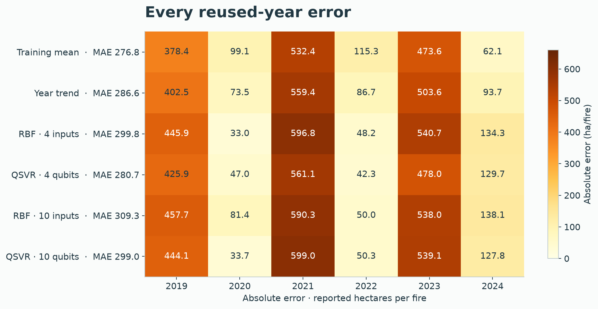
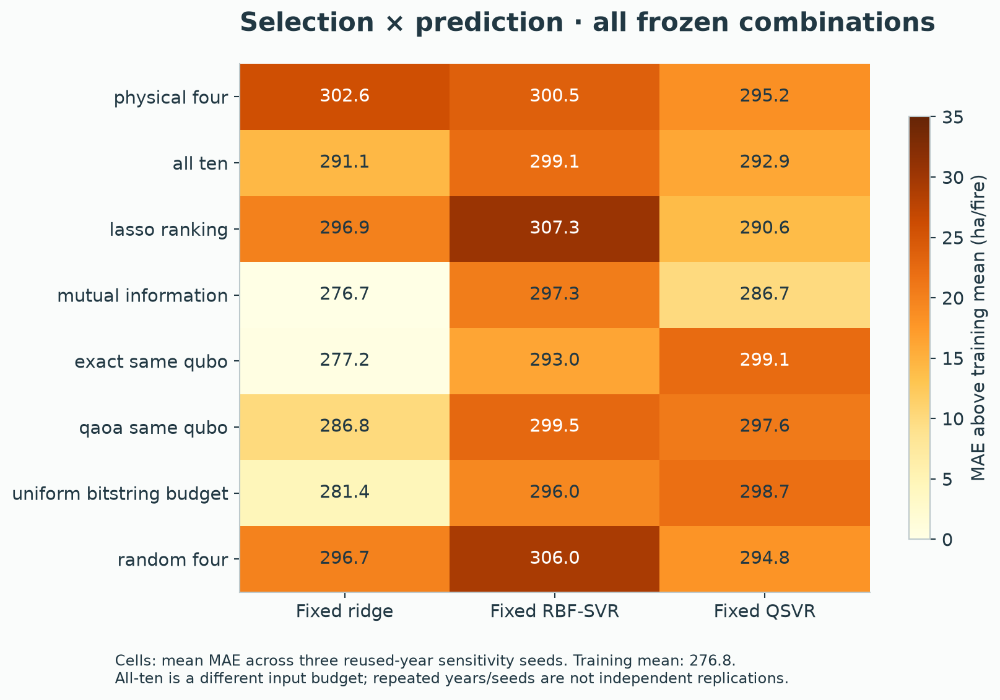
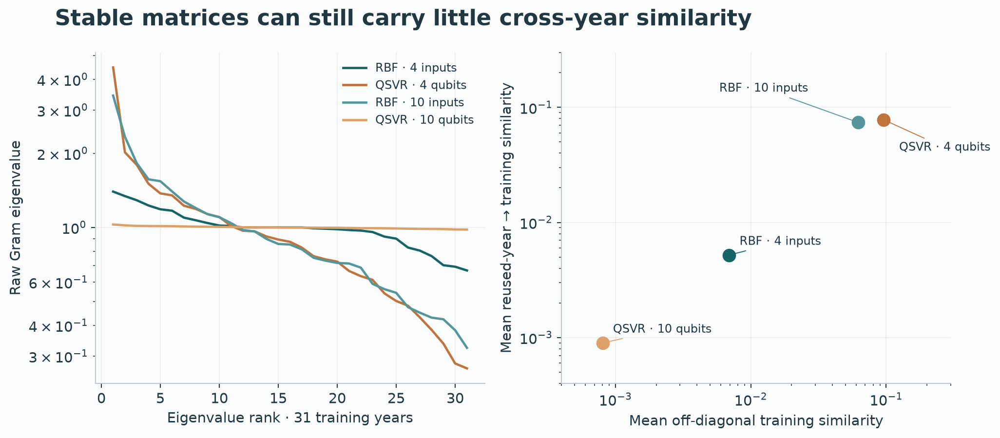

# Frozen annual evaluation

Ontario annual mean agency-reported fire size, in hectares per size-observed incident. Training uses 1988–2018; the six 2019–2024 evaluation years overlap the earlier incident study and are explicitly reused. Same-year climate makes this retrospective annual estimation.

## Training freeze

The plan is [`annual_final.json`](../experiments/annual_final.json). All parameter choices and learned model states were saved before evaluation in [`annual-final-training.json`](results/annual-final-training.json), with the byte-pinned [receipt](data/annual_final_training_receipt.json). Training completed in **93.75 s**, with 80 final predictor fits, 288 classical inner fits and 216 quantum inner fits. Reusing identical kernels across C/epsilon and repeated feature subsets required 36 quantum matrices, below the cap of 50. QAOA used 109 optimizer calls, below 120. Execution was local analytic simulation; no hardware jobs.

Each kernel family had 36 chronological inner candidates per width. Selected configurations:

| Model | Four inputs | Ten inputs |
|---|---|---|
| Ridge alpha | 10 | 10 |
| Linear SVR C / epsilon | 0.1 / 0.5 | 0.1 / 0.2 |
| RBF C / epsilon / gamma multiplier | 10 / 0.5 / 16 | 10 / 0.05 / 4 |
| QSVR C / epsilon / repetitions / angle amplitude | 10 / 0.5 / 2 / pi/2 | 10 / 0.5 / 1 / pi/4 |

The three expanding inner folds use only training years. Feature order is canonical across selectors; no test-based subset or circuit choice is allowed. Train-mean, train-median and calendar-year controls remain in the comparison.

The original milestone placed evaluation at 4:25 PM. Training completed ahead of that estimate, so evaluation moves earlier without changing its recipe, budget or model choices. The remaining time goes to saved-evidence audit, reproduction, year-specific figures and reporting.

## Evaluation and collection

The exclusive evaluation completed in **9.63 s**, with **zero predictor fits**. The collector independently reconstructs all **83 predictions** and checks **24 unique training/cross kernel pairs**, without fits, shots or new quantum states. The main models all lose to the training-mean baseline. Every planned selector/predictor combination is retained; a best row is not independent confirmation.

```sh
uv run --no-sync python scripts/run_annual_final.py train --output .cache/wildfire/annual-qsvr/final-v1
uv run --no-sync python scripts/run_annual_final.py evaluate --output .cache/wildfire/annual-qsvr/final-v1
uv run --no-sync python scripts/collect_annual_final.py --run .cache/wildfire/annual-qsvr/final-v1 --output .cache/wildfire/annual-qsvr/final-v1/audit.json
```

These are the original execution commands. Existing training/evaluation intents block replay into the same namespace. Collection verifies saved matrices and prediction equations; it performs no fits, shots or new quantum states.

## Literature steering

The QSVR guide supports the frozen train-only scaling, joint C/epsilon tuning, shallow maps and matched RBF budget. Condition number, eigenspectrum and concentration will be reported from saved matrices. Per-feature scale tuning and trainable alignment are future work: they would expand this frozen search without independent validation. Sampled PSD repair and duplicate-skipping apply to a future shot-based study; this exact simulation validates raw PSD and has no sampled-kernel repair. Six reused years support descriptive model gaps, not significance or quantum-advantage claims.

## Reused-year results

All errors are reported hectares per fire. The training-mean predicts 124.63 each year; observed annual means average 329.97 over the six reused years.

| Model | MAE | RMSE | Bias |
|---|---:|---:|---:|
| training_mean | 276.81 | 336.12 | -205.34 |
| training_median | 287.03 | 355.68 | -236.00 |
| linear_year_trend | 286.58 | 353.63 | -233.16 |
| ridge_4 | 301.08 | 379.17 | -269.43 |
| linear_svr_4 | 299.88 | 382.90 | -276.70 |
| matched_rbf_svr_4 | 299.81 | 380.52 | -272.74 |
| matched_fidelity_svr_4 | 280.68 | 352.51 | -250.92 |
| ridge_10 | 294.98 | 372.24 | -261.27 |
| linear_svr_10 | 294.50 | 370.68 | -256.58 |
| matched_rbf_svr_10 | 309.25 | 382.01 | -265.45 |
| matched_fidelity_svr_10 | 298.99 | 380.05 | -271.00 |

Four-input QSVR improves on matched RBF by 19.13 MAE, but loses to the training mean by 3.87. Ten-input QSVR improves on matched RBF by 10.26 but loses to the mean by 22.18. These descriptive pairwise gains do not establish useful forecasting, statistical superiority or quantum advantage. All main bias values are negative.


### Annual values and denominators

| Year | Size-observed fires | Mean ha/fire | Recorded hectares | Identity exclusions |
|---|---:|---:|---:|---:|
| 2019 | 536 | 503.05 | 269,633.90 | 2 |
| 2020 | 605 | 25.51 | 15,436.40 | 4 |
| 2021 | 1,194 | 656.99 | 784,447.00 | 6 |
| 2022 | 274 | 9.34 | 2,560.10 | 2 |
| 2023 | 738 | 598.20 | 441,471.50 | 10 |
| 2024 | 481 | 186.72 | 89,812.70 | 10 |

Unknown/negative size is excluded only from the size denominator; this snapshot has no unknown sizes in these six years. These are recorded source values, not a complete final-area census.



### Fixed selector crossover

Mean MAE across three sensitivity seeds on the same years. Fixed ridge alpha=1, RBF C=1/epsilon=.2, and QSVR C=1/epsilon=.2/reps=1/amplitude=pi/2.

| Selector | Ridge | RBF-SVR | QSVR |
|---|---:|---:|---:|
| physical_four | 302.64 | 300.51 | 295.19 |
| all_ten | 291.12 | 299.07 | 292.94 |
| lasso_ranking | 296.85 | 307.27 | 290.64 |
| mutual_information | 276.67 | 297.26 | 286.70 |
| exact_same_qubo | 277.22 | 293.02 | 299.13 |
| qaoa_same_qubo | 286.80 | 299.51 | 297.55 |
| uniform_bitstring_budget | 281.44 | 296.01 | 298.74 |
| random_four | 296.67 | 306.04 | 294.79 |

Mutual-information ridge is only 0.14 ha/fire below the training mean. This best-looking combination is not meaningful independent confirmation. QAOA ridge loses to exact QUBO and uniform sampling; with QSVR, QAOA is slightly below those two controls. Selector ranking depends on the predictor; no consistent QAOA benefit emerges. All-ten has a different input/qubit budget.



## Every selected kernel

Main kernels: kernel-000 (RBF four), 001 (Q four), 002 (RBF ten), 003 (Q ten). Remaining rows are unique fixed-crossover kernels; repeated subsets share matrices. All pass symmetry, unit-diagonal and raw PSD checks. Full eigenvalue lists and model mappings are in the [audit](results/annual-final-audit.json) and [training states](results/annual-final-training.json). Effective rank is entropy-based, exp(-sum p log p); the guide also suggests the distinct participation ratio. Condition numbers below refer to raw, unregularized matrices.

| Kernel | Family | Inputs | Min eigenvalue | Max eigenvalue | Condition | Effective rank | Mean off-diagonal | Mean cross-year |
|---|---|---:|---:|---:|---:|---:|---:|---:|
| kernel-000 | rbf | 4 | 0.6682 | 1.399 | 2.094 | 30.538 | 0.006929 | 0.005208 |
| kernel-001 | quantum | 4 | 0.2671 | 4.475 | 16.75 | 25.147 | 0.09586 | 0.07794 |
| kernel-002 | rbf | 10 | 0.3238 | 3.438 | 10.62 | 26.314 | 0.06207 | 0.0739 |
| kernel-003 | quantum | 10 | 0.9801 | 1.028 | 1.049 | 30.998 | 0.0008052 | 0.000899 |
| kernel-004 | rbf | 4 | 0.001371 | 13.28 | 9688 | 7.536 | 0.3826 | 0.3763 |
| kernel-005 | quantum | 4 | 0.2835 | 2.908 | 10.26 | 27.329 | 0.05874 | 0.05361 |
| kernel-006 | rbf | 10 | 0.0302 | 12.72 | 421.3 | 9.311 | 0.3735 | 0.4011 |
| kernel-007 | quantum | 10 | 0.9565 | 1.046 | 1.093 | 30.997 | 0.0008591 | 0.0008506 |
| kernel-008 | rbf | 4 | 0.001261 | 13.26 | 1.051e+04 | 7.539 | 0.3828 | 0.3578 |
| kernel-009 | quantum | 4 | 0.2412 | 2.88 | 11.94 | 27.194 | 0.05893 | 0.05606 |
| kernel-010 | rbf | 4 | 0.001002 | 13.58 | 1.355e+04 | 7.694 | 0.3777 | 0.3274 |
| kernel-011 | quantum | 4 | 0.2056 | 3.08 | 14.98 | 26.770 | 0.06314 | 0.06037 |
| kernel-012 | rbf | 4 | 0.0007696 | 13.83 | 1.798e+04 | 7.407 | 0.3985 | 0.3725 |
| kernel-013 | quantum | 4 | 0.2795 | 2.938 | 10.51 | 27.338 | 0.06057 | 0.06127 |
| kernel-014 | rbf | 4 | 0.0001389 | 13.33 | 9.596e+04 | 8.092 | 0.3759 | 0.3691 |
| kernel-015 | quantum | 4 | 0.09167 | 3.144 | 34.3 | 26.769 | 0.05842 | 0.07149 |
| kernel-016 | rbf | 4 | 0.00293 | 13.11 | 4476 | 7.091 | 0.3818 | 0.4355 |
| kernel-017 | quantum | 4 | 0.1646 | 3.062 | 18.61 | 26.407 | 0.06516 | 0.07418 |
| kernel-018 | rbf | 4 | 0.0008327 | 13.71 | 1.646e+04 | 7.811 | 0.3922 | 0.3941 |
| kernel-019 | quantum | 4 | 0.3094 | 3.005 | 9.713 | 26.955 | 0.06349 | 0.05473 |
| kernel-020 | rbf | 4 | 0.001008 | 13.64 | 1.353e+04 | 7.093 | 0.3984 | 0.4491 |
| kernel-021 | quantum | 4 | 0.3682 | 2.694 | 7.316 | 28.013 | 0.05482 | 0.06923 |
| kernel-022 | rbf | 4 | 0.0006611 | 14.04 | 2.123e+04 | 6.831 | 0.4079 | 0.4474 |
| kernel-023 | quantum | 4 | 0.2044 | 2.99 | 14.63 | 26.540 | 0.06283 | 0.05249 |

Selected ten-qubit eigenvalues span 0.980–1.028, with condition number 1.049 and effective rank 30.998/31. Cross-year fidelity averages .000899. Numerical stability does not imply useful similarity: the six predictions span only 57.98–59.60 ha/fire. Four-qubit similarity is larger (.07794), but annual prediction remains poor. The [bandwidth paper](https://arxiv.org/html/2206.06686v3) motivates examining scale/spectrum; it does not prove advantage on this task.



## Guide adoption and deferral

The full QSVR guide was read. No evaluated predictor changed.

| Guide section / recommendation | Status | Evidence or reason |
|---|---|---|
| Qiskit implementation: precompute kernels | Covered | Actual FidelityQuantumKernel/QSVR; reuse across C/epsilon and subsets |
| Tune bandwidth first | Covered in bounded form | Fold-local scaling, common amplitudes pi/4 and pi/2; later input-only scale probe, no per-feature predictive grid claimed |
| Tune SVR jointly | Covered | C/epsilon crossed with every map/bandwidth inside chronological CV |
| Prefer shallow maps | Covered | Linear ZZ, reps 1/2; four/ten inputs |
| Align to regression targets | Deferred | Extra optimization budget and independent validation needed |
| Diagnose the Gram matrix | Adopted | All selected spectra, condition, concentration and PSD checks; support counts in saved states |
| Repair sampled kernels | Deferred | Exact simulation has no shot corruption; raw PSD verified |
| Allocate shots / landmarks | Deferred | Only 31 rows; hardware outside scope |
| Stage A classical controls | Covered in bounded form | Constant/trend/ridge/linear/RBF; equal 36 candidates for RBF/Q |
| Stages C/D alignment and noise | Deferred | No circuit training, noise or hardware transfer claimed |

### First future improvements, not executed

1. **Per-feature scales:** preregister four vectors on the four-input head, e.g. (.25,.25,.25,.25), (.5,.5,.5,.5), (.25,.25,.5,.5), (.5,.5,.25,.25), multiplying the fixed pi/2 tanh encoding. Cross each with the nine C/epsilon pairs; RBF gets four bandwidths with the same nine pairs. Fit all scalers inside chronological inner folds and choose by validation MAE: 36 candidates per family. Disclose that these development years are already inspected.
2. **Trainable alignment:** freeze a two-parameter rotation layer and optimizer-call cap. Fit centered log-target alignment only on each inner-training block; select by inner validation MAE. Include equally budgeted classical anisotropic-kernel optimization, reporting optimizer calls/circuits separately. Freeze the complete budget before execution and obtain an uninspected later-period evaluation before promotion.
3. **Sampled PSD repair:** keep the exact map fixed; compare raw versus symmetric/PSD-projected matrices at preregistered shots/seeds with evaluate_duplicates=none, preserving raw counts. Compare against the exact reference and equal-budget RBF on the same chronological folds. Any rank truncation needs a defined train-to-test extension and training-only selection; never choose rank from final errors or a noiseless test reference. No hardware spending follows. [API behavior](https://qiskit-community.github.io/qiskit-machine-learning/stubs/qiskit_machine_learning.kernels.FidelityQuantumKernel.html).

All four planned development followups are complete. No post-final predictive search is run during this goal; it could create attractive reused-year results without independent evidence. A separately frozen input-only bandwidth diagnostic changes no predictor or chosen scale. Reporting and reproducible collection take priority.

## Portable collection

The [267 kB evidence package](data/annual_final_evidence.zip) includes learned states, training/cross matrices, receipts and the six-row table. No raw downloads, credentials, predictor fits or quantum execution are needed. The preferred one-command front door is:

```sh
uv run python scripts/pipeline.py annual collect --output .cache/wildfire/annual-public --execute
```

It checks the bundle checksum and refuses existing output paths. The two specialist commands remain available:

```sh
uv run python -m zipfile -e docs/data/annual_final_evidence.zip .cache/wildfire/annual-public
uv run python scripts/collect_annual_final.py --run .cache/wildfire/annual-public --output .cache/wildfire/annual-public/audit.json
```

Use new extraction/output paths; production intents remain intact. Collection verifies pinned code, tables, prediction equations, chosen inner minima and metrics. A clean GitHub clone has reproduced all twelve matched development records using the existing locked venv. That checks code/data portability, not a fresh dependency installation. Final clean-clone collection reproduced all 83 predictions and 24 matrix diagnostics exactly, without fits/new quantum states. [Portability receipt](data/annual_portability_receipt.json). Final source verification passed **142 tests / 68 CLI help paths** at 3fae875; whole-goal documentation and handoff review continue. [QA receipt](data/annual_final_repository_checks.json).

## Saved-model signal check

The [additional descriptive receipt](results/annual-kernel-signal.json) reconstructs each main SVR output as intercept plus cross-kernel weighted support coefficients. Ten-qubit QSVR predicts **59.01 ha/fire** at zero cross similarity; actual kernel contributions change it by only **-1.03 to +0.59**. Four-input RBF is also nearly flat: zero-cross output **57.51**, with changes **-5.06 to +2.70**. This is not uniquely quantum. Four-input QSVR has larger contributions (**-8.54 to +59.97**) but still misses annual extremes.

The receipt also supplies training-only centered log-target alignment, participation-ratio rank, symmetry/diagonal error, negative-eigenvalue mass and off-diagonal quantiles for all 24 selected kernels. It performs no fits, optimization or quantum execution and makes no new model choice. The 80 final predictor fits count sklearn/QSVR fits; one separate polynomial year-trend fit and two deterministic constants supply the remaining controls.

## Post-final input-only bandwidth mechanism

The separate frozen geometry probe tests five global amplitudes on the unchanged 31 training-input rows at four/ten qubits. Ten-qubit rank moves from 30.998 (pi/4) to 5.187 (pi/32); similarity rises from .000805 to .538897. Four-qubit pi/32 conditioning deteriorates to 4.58e7. No targets, test rows, predictor fits or model selection: per-feature predictive scale tuning/alignment/shot repair remain deferred. This adds 4,650 analytic pair circuits in 48.89 s; main final states/predictions remain unchanged.
