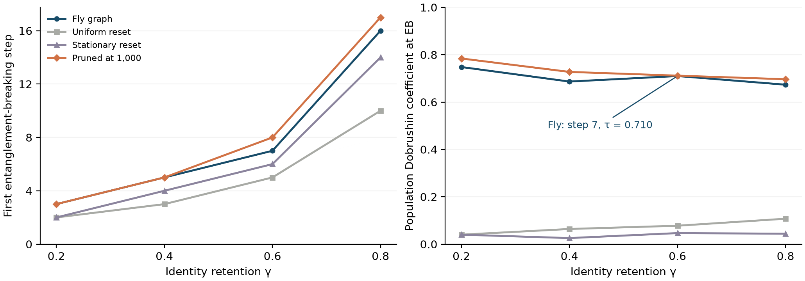

# When entanglement disappears before classical memory

For the eight-population MaleCNS graph, the ideal identity-retention channel with γ = 3/5 becomes entanglement breaking at **step 7**. The preceding step has a negative partial-transpose determinant; step 7 admits an explicit finite mixture of product states. Both statements are checked in exact rational arithmetic, beyond floating-point negativity alone.

At step 7 the population Dobrushin coefficient is **0.7100**. This coefficient measures worst-case contraction between initial population distributions. It shows that entanglement breaking and completion of classical mixing are different events; it is not a claim that every initial distribution remains equally distinguishable.



## Controlled comparison

| Identity retention γ | Fly graph: exact EB step | Uniform reset: exact EB step | Pruned at 1,000: exact EB step |
| --- | ---: | ---: | ---: |
| 0.2 | 3 | 2 | 3 |
| 0.4 | 5 | 3 | 5 |
| 0.6 | 7 | 5 | 8 |
| 0.8 | 16 | 10 | 17 |

A reset to the fly graph's stationary distribution has matching numerical NPT/separability thresholds at steps 2, 4, 6 and 14. It is a floating-point control, not one of the twelve integer-weight rational certificates. At γ = 0.6 its threshold is step 6, versus step 7 for the fly graph, so the stationary distribution alone does not account for the observed difference.

Threshold-1,000 pruning delays EB by one step at γ = 0.6 and 0.8. Threshold-5,000 pruning creates zero-outdegree rows and is explicitly excluded without repairing them or silently selecting another component. The pruning result is qualitative agreement with the boundary-trap motivation of [Kopel's spectral mixing study](https://arxiv.org/abs/2609.33054), not replication of its full-CNS experiment or attribution of this effect to a specific biological mechanism. Changing row normalization can change both classical and quantum results.

These are exploratory comparisons. The original board prediction anticipated delayed entanglement loss for sparse transitions, but the numerical sweep and certificate development are not a preregistered replication. There is no general monotonicity theorem for pruning, no inferred neuronal quantum processing, and no quantum advantage claim.

## Model and proof

Let P be the directed, row-normalized population adjacency matrix. Define the measured-and-prepared channel

D_P(ρ) = Σᵢⱼ Pᵢⱼ ρᵢᵢ |j⟩⟨j|,

and E = γ Id + (1 − γ) D_P. This model has no Hamiltonian term. After r compositions, its populations follow B = [γI + (1 − γ)P]ʳ and its off-diagonal coherences are multiplied by c = γʳ. Replacing B by Pʳ is incorrect.

In input–output order, the normalized Choi matrix has diagonal entries Bᵢⱼ/n and coherences c/n between |ii⟩ and |jj⟩. Each partial-transpose pair block is [[Bᵢⱼ, c], [c, Bⱼᵢ]]/n. Thus BᵢⱼBⱼᵢ < c² supplies an entanglement witness and rules out EB. Vanishing negativity supplies no general separability proof in this 8 × 8 bipartition.

For the upper bound, find positive scales v such that Bᵢⱼ ≥ c vᵢ/vⱼ for every ordered pair, including the diagonal. For each vector of phases θᵢ ∈ {0, 2π/3, 4π/3}, form the unnormalized product vectors

- aᵢ = √vᵢ exp(iθᵢ),
- bᵢ = √(c/vᵢ) exp(−iθᵢ).

Average |a ⊗ b⟩⟨a ⊗ b| over all 3ⁿ phase choices, with weight 1/(n3ⁿ). This leaves diagonal entries c vᵢ/(n vⱼ) and the required |ii⟩⟨jj| coherences c/n; independent three-phase sums cancel the other coherences. Add the nonnegative residue [Bᵢⱼ − c vᵢ/vⱼ]/n as computational-basis product states. The result is the complete Choi matrix, expressed as a separable mixture.

The equivalence between a separable Choi state and an entanglement-breaking channel is established in [Horodecki, Shor and Ruskai](https://arxiv.org/abs/quant-ph/0302031). Phase-invariant separability constructions belong to an existing literature, including [Johnston and MacLean](https://arxiv.org/abs/1807.06897). We claim a checked application to this model, not a new general separability theorem.

The scale search maximizes common logarithmic slack using linear programming. Solver success is never accepted on its own: all residues are checked. For the fly, uniform-reset and threshold-1,000 graphs, integer weights and decimal γ define exact rational matrices. The stored rational scales produce nonnegative residues, while a negative determinant at r − 1 proves the matching lower bound. Once a channel is EB, composition cannot restore reference–system entanglement, so these two certificates determine the first EB step.

## Reproduce and inspect

```sh
uv run python -m flybrain.channel_certificates
uv run python -m unittest discover -s tests -p test_channel_certificates.py -v
```

[Saved evidence](../artifacts/channel-certificates-20261003/) contains the sixteen numerical profiles, twelve exact rational certificates, a compact generator for the default 6,561-term product mixture and a SHA256 manifest. The default mixture was reconstructed explicitly, with maximum entrywise error 2.1 × 10⁻¹⁴. The analytic Choi construction is also tested against actual Qiskit SuperOp composition on random two-, four- and eight-state chains.

The certificates establish facts about the specified ideal channel. The existing IBM X/Z witness experiment tests pairwise reference–system entanglement after a unitary walk. It does not implement this multi-step measured-and-prepared channel and does not validate the step-7 EB threshold on hardware.
