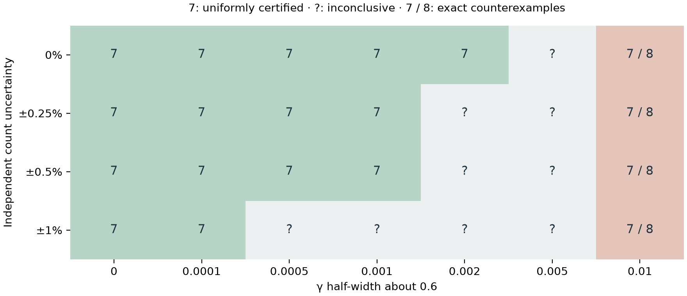

# Joint count and coherence sensitivity

The exact EB index 7 survives joint uncertainty, not just fixed γ. We certify every graph and parameter value in these closed boxes:

| Independent uncertainty in each count | Coherence-retention interval | Uniform EB index |
| --- | --- | ---: |
| Counts fixed | γ ∈ [0.598, 0.602] | 7 |
| ±0.25% | γ ∈ [0.599, 0.601] | 7 |
| ±0.5% | γ ∈ [0.599, 0.601] | 7 |
| ±1% | γ ∈ [0.5999, 0.6001] | 7 |

These are the largest certified half-widths on our tested grid, not maximum robust radii. The model's γ is dimensionless and has no measured neuronal or hardware calibration here.



## Rigorous enclosure

The [count-box normalization bounds](CHANNEL_ROBUSTNESS.md) supply bounds on P. For M = γI + (1 − γ)P, diagonal entries increase with γ and off-diagonal entries decrease with γ. Consequently, use γ_min for the diagonal lower bound and γ_max for its upper bound; reverse the endpoints off the diagonal. Integer arithmetic propagates all matrix-power bounds with outward rounding on a denominator-10¹² grid.

At step 6, a negative bound on upper(Bᵢⱼ)upper(Bⱼᵢ) − γ_min¹² proves NPT throughout a box. At step 7, nonnegative lower(Bᵢⱼ) − γ_max⁷vᵢ/vⱼ supplies a common scale vector for the finite-phase separable decomposition. The actual coherence coefficient γ⁷ can vary within the box; the proof uses its worst-case upper endpoint. Every actual channel remains CPTP because its underlying P is row-normalized, although the entrywise enclosure matrices need not themselves be stochastic.

Both inequalities hold over the entire parameter box, with all rounding error included. Interior Monte Carlo checks are supplementary, not the basis of the guarantee.

## Real model sensitivity versus failed certificates

Exact rational point certificates give:

| γ | 0.58 | 0.59 | 0.60 | 0.61 | 0.62 |
| --- | ---: | ---: | ---: | ---: | ---: |
| EB index, unchanged counts | 7 | 7 | 7 | 8 | 8 |

Thus EB=7 is genuinely false throughout the full interval [0.59, 0.61]: it contains both index-7 and index-8 channels. This is a certified counterexample to uniformity for that interval. Higher retention delaying entanglement loss is expected; the important result is quantifying this dependency rather than attributing the index only to connectome structure.

For narrower boxes that fail our sufficient interval certificate, we do not claim a counterexample unless one was independently certified. Their failure may reflect conservative propagation of correlated transition entries.

## Reproduce

```sh
uv run python -m flybrain.channel_parameter_boxes
```

[Saved evidence](../artifacts/channel-parameter-boxes-20261003/) contains 28 tested boxes, five exact point certificates and source/artifact hashes. All proofs were reloaded; 100 sampled interior graphs and γ values agree with the ±0.5%/[0.599,0.601] certificate. Tests exhaust count corners and γ endpoints of a small graph and verify that fixed-γ boxes reduce to the earlier count-only certificate. The full 66-test suite and local FlyWalk run passed.

The related [Kopel feedback paper](KOPEL_FEEDBACK_CONNECTION.md) motivates keeping fixed-point, contraction and entanglement properties separate. Our model and certificate are different; no feedback-paper replication or biological quantum claim is made.
