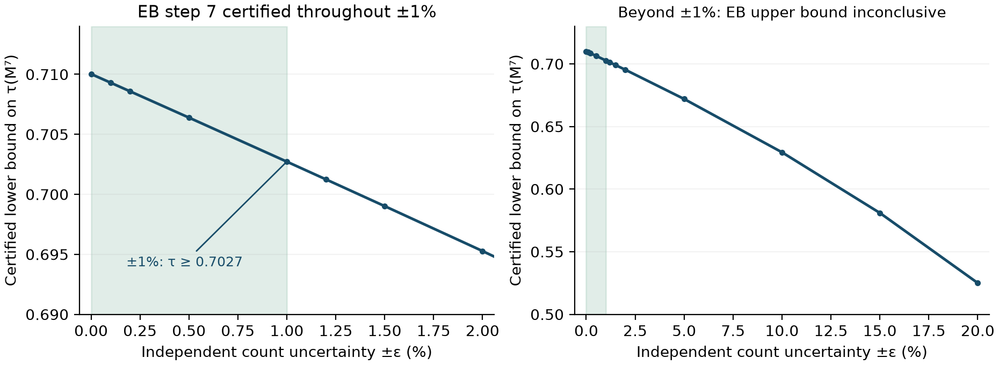

# Exact step-7 result under count uncertainty

At fixed γ = 3/5, **every graph within independent ±1% changes to all 64 synapse-count entries has entanglement-breaking index 7** in the identity-retention channel. For the same graphs, the step-7 population Dobrushin coefficient is guaranteed to be at least **0.702721451330**. The separation between entanglement loss and classical forgetting therefore survives this explicitly defined uncertainty box.

This is a conditional worst-case sensitivity result. The ±1% assumption was not estimated from reconstruction quality, and the sweep was exploratory, not preregistered. It does not establish a confidence interval for the actual brain or a hardware noise bound.



## What the proof covers

Each original weight wᵢⱼ may independently take any real value between (1 − ε)wᵢⱼ and (1 + ε)wᵢⱼ. Row normalization is recomputed, with no symmetry or conserved-strength assumption. For row total sᵢ, the exact entrywise probability bounds are

- Lower: (1 − ε)wᵢⱼ / [(1 − ε)wᵢⱼ + (1 + ε)(sᵢ − wᵢⱼ)].
- Upper: (1 + ε)wᵢⱼ / [(1 + ε)wᵢⱼ + (1 − ε)(sᵢ − wᵢⱼ)].

Combine these with M = γI + (1 − γ)P. Since all entries are nonnegative, lower and upper matrix powers enclose Mʳ entrywise. We round each entry outward to an integer grid with denominator 10¹², then round each multiplication outward again using integer arithmetic. The rounding error is included in the bounds, rather than hidden in a floating-point tolerance.

At r = 6, an upper bound on BᵢⱼBⱼᵢ − γ¹² remains strictly negative for one fixed pair throughout the box. The corresponding partial-transpose block is therefore indefinite, ruling out EB for every admissible graph.

At r = 7, one common positive rational scale vector satisfies lower(Bᵢⱼ) − γ⁷vᵢ/vⱼ ≥ 0 for every ordered pair. The [finite-phase product-mixture construction](CHANNEL_CERTIFICATES.md) proves separability for every admissible actual Choi matrix. Together, these certificates give exact EB index 7 throughout the box. At ±1%, the smallest certified residue is approximately 7.54 × 10⁻⁵ before Choi normalization by n = 8.

A source-pair/subset certificate also bounds population contraction from below: sum the positive lower bounds on Bᵢⱼ − Bₖⱼ over a fixed destination subset. This bounds total variation between two initial populations for every graph in the box. Maximizing over candidate source pairs gives the reported uniform lower bound; the comparison is for Mʳ, not the raw synapse-flow Pʳ.

## Where the sufficient certificates stop

| Assumed count uncertainty | Step 6 uniformly NPT | Step 7 uniformly separable | Uniform lower bound on τ(M⁷) |
| --- | --- | --- | ---: |
| ±0% | Yes | Yes | 0.710025 |
| ±0.5% | Yes | Yes | 0.706391 |
| ±1% | Yes | Yes | 0.702721 |
| ±1.2% | Yes | Not certified | 0.701243 |
| ±2% | Yes | Not certified | 0.695272 |
| ±5% | Yes | Not certified | 0.671968 |
| ±15% | Yes | Not certified | 0.580959 |
| ±20% | Not certified | Not certified | 0.525016 |

“Not certified” is not a counterexample. The interval-power bounds deliberately ignore correlations between row-normalized entries and can become conservative. The first failed sufficient certificate does not identify the true maximum robust radius or prove that any graph changes its EB index.

The result assumes fixed γ and unchanged population membership. It excludes missing/additional populations, structural zeros gaining new edges, arbitrary additive count errors and uncertain γ. For this snapshot all 64 entries are positive. Those are different uncertainty models and require separate tests.

## Reproduce

```sh
uv run python -m flybrain.channel_robustness
```

[Public certificates](../artifacts/channel-robustness-20261003/) contain all twelve tested boxes, exact rational scales, integer transition/power enclosures, determinant/residue bounds and hashes. All saved proofs were reloaded and recomputed. Tests check all normalization corners of a small graph and power enclosures against exact rational multiplication. One hundred random interior graphs also satisfy the certificates; these checks supplement the universal interval argument. The 63-test suite and local FlyWalk run passed.

This adds a reconstruction-sensitivity control to our coarse-grained connectome experiment, informed by the uncertainty concern in [Kopel's spectral mixing study](https://arxiv.org/abs/2609.33054). It is not a full-CNS replication, biological quantum claim, new separability theorem or new hardware measurement.
