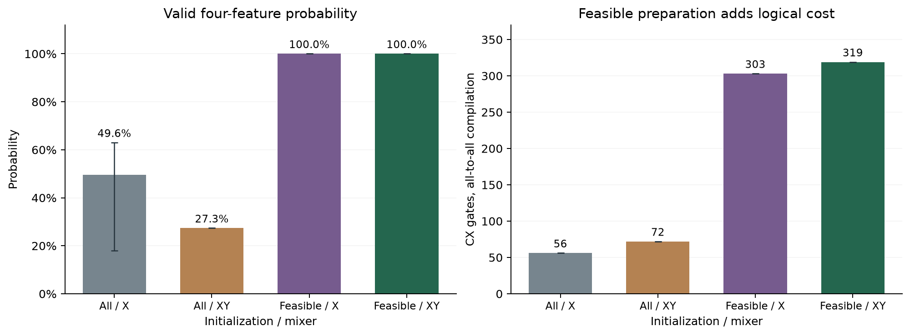

# Feasible quantum selection versus useful feature selection

This constraint diagnostic uses individual-fire binary labels. It does not evaluate feature selection for annual macro outcomes. [Scope correction](SCOPE_CORRECTION.md).

**A cardinality-preserving ansatz fixes invalid subset draws, but adds no gain over classical feasible sampling. L1 exceeds those exact-QUBO choices in both sample groups.** This separately frozen training-only study tests a specific constraint mechanism, not another final model or a new quantum algorithm.

The [plan](../experiments/constrained_selection.json) freezes eight geography/season/cover inputs, four selected features, one layer, identical optimizer starts, at most 40 exact-state objective calls and 512 synthetic draws. All selectors use the same 256 labelled training rows per seed and one fixed logistic predictor; validation uses the same 256 incidents. Both seed groups reuse 1988–2014 → 2015–2018. [Collected evidence](results/constrained-selection.json) verifies source/recipe/sample hashes, probabilities, sampled subsets, logical circuits, train-only transforms and stored predictor coefficients. No optimizer or predictive model is refitted during collection.

## Initialization and mixer are separate

[Constrained alternating operators](https://arxiv.org/abs/1709.03489) are established methods. We compare uniform initialization over all bitstrings with uniform initialization over the 70 four-of-eight subsets, then cross each with an X mixer or fixed even/odd ring of [XXPlusYY gates](https://quantum.cloud.ibm.com/docs/en/api/qiskit/qiskit.circuit.library.XXPlusYYGate). The full penalty QUBO stays identical across all conditions. Generic Qiskit StatePreparation constructs the feasible initial state; enumeration and preparation cost are explicit.

The number operator is N=Σⱼ(I−Zⱼ)/2. Both diagonal cost phases and XX+YY exchanges commute with N, so each cardinality sector retains its probability. Consequently:

$$
P(N=4\mid \text{all-state initialization, XY})=
\frac{\binom{8}{4}}{2^8}=0.2734375,\qquad
P(N=4\mid \text{feasible initialization, XY})=1.
$$

The experiment verifies these invariants in every condition. XY mixing alone does not repair an infeasible initialization. Feasible initialization with X has no such guarantee; here its optimizer settles near zero or π/2 mixing, retaining nearly uniform feasible probabilities. That is an observed behavior, not a general theorem about X mixers.

| Quantum initialization / mixer | Mean feasible probability, diagnostic / sampling check | Optimizer successes, out of 3 / 3 | Logical CX / depth |
|---|---:|---:|---:|
| All / X | .4771 / .5139 | 1 / 2 | 56 / 47 |
| All / XY | .2734 / .2734 | 0 / 0 | 72 / 63 |
| Feasible / X | ≈1 / ≈1 | 3 / 3 | 303 / 1275 |
| Feasible / XY | 1 / 1 | 0 / 0 | 319 / 1291 |

The generic initializer adds **247 CX gates** under the specified all-to-all basis compilation. These counts include initialization; they are not device depth/runtime or an optimum for dedicated Dicke preparation. Equal optimizer-call budgets do not equalize gate costs. Fifteen of 24 optimizations exhaust the call budget; guaranteed feasibility does not establish optimizer convergence.



## The classical controls decide the interpretation

| Selector, same logistic predictor | Mean AP, diagnostic | Mean AP, sampling check | Mean QUBO gap, diagnostic / sampling check |
|---|---:|---:|---:|
| L1 ranking | .31081 | **.36311** | .16824 / .30270 |
| Exact classical QUBO | .29955 | .34545 | 0 / 0 |
| Uniform feasible-subset draws | .29955 | .34545 | 0 / 0 |
| Uniform all-bit draws, reject wrong cardinality | .31095 | .34545 | .01568 / 0 |
| All / X | .29955 | .35236 | 0 / .00041 |
| All / XY | **.33417** | .34545 | .02886 / 0 |
| Feasible / X | .29955 | .34545 | 0 / 0 |
| Feasible / XY | .29955 | .34545 | 0 / 0 |

Means weight three sampling conditions equally, not independent temporal replications. Feasible/XY and classical feasible-uniform sampling find the same exact-optimal subsets in all six samples. Their downstream predictions therefore agree. A classical draw directly samples one of 70 valid subsets without a quantum circuit; exact search checks all 70. More reliable feasibility is not an optimization advantage at this size.

L1 has a **worse proxy objective but better mean AP than the exact-QUBO choices in both groups**. All/XY has the highest diagnostic mean AP; L1 has the highest sampling-check mean. The suboptimal all/XY subset raises diagnostic AP and loses that effect on the later sampling group. These observations reinforce the objective/prediction mismatch: optimizing estimated relevance minus pairwise redundancy is not equivalent to optimizing held-out classification. They do not prove L1 wins every sample or create a new independent test. Initializing directly in the feasible space removes one bottleneck but does not fix the statistical objective.

## Cost and stopping decision

The runner takes **3.54 seconds**, including local preparation/optimization/sampling, compilation and 48 predictor fits plus six L1-selector fits. It performs **911 exact-state evaluations** (887 objective calls and 24 final sampling states), with **12,288 synthetic quantum draws** and 6,144 classical-control draws. The current collection takes **0.81 seconds** and reconstructs 24 additional states, without optimization or predictor fitting. Startup/preflight hashing are excluded. Hardware jobs and physical shots are zero; full exact-state expectations are not shot-based device estimates.

Keep the factorial constraint demonstration and classical controls. Prune predictor promotion, deeper circuits or more shots from this result. The prototype's generic preparation is a correctness reference, not a hardware preparation recommendation. The frozen final evaluation remains unchanged.

```sh
uv run --no-sync python scripts/collect_constrained_selection.py
```

Preserve `.cache/wildfire/constrained-selection` and its exclusive intent. Independent copies with the exact training table can pin opening recipe `ba09a49` and run `scripts/run_constrained_selection.py`; later collectors may compact the public JSON without changing measured outcomes. See [reproduction guidance](REPRODUCIBILITY.md).
