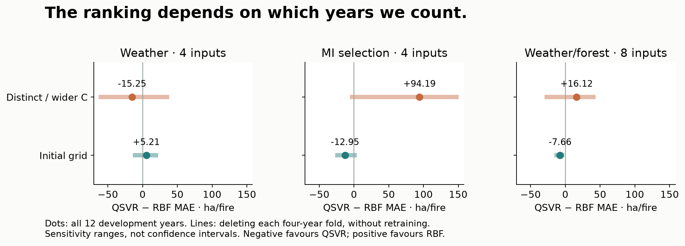
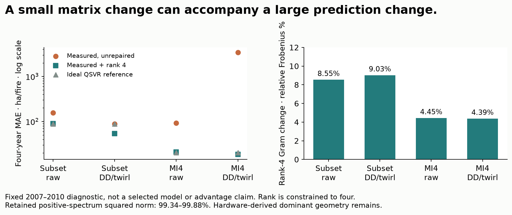

# Response to the scientific critique

**The useful contribution is a measured diagnostic benchmark, not quantum advantage.** We accept the six concerns in [the peer critique](SCIENTIFIC_CRITIQUE_20261006.md). This response adds saved-evidence checks and corrects several factual statements in that review and its [work synthesis](WORK_ANALYSIS_20261006.md). The original review bodies remain available unchanged; response annotations point here.

The new [frozen plan](../experiments/critique_diagnostics.json) uses existing development predictions and hardware counts. It makes **zero predictor fits, zero new quantum states and zero hardware submissions**. All choices/results remain frozen. This is analysis of previously inspected evidence, not new predictive confirmation.

## 1. Small samples and unstable selection

31 training years become only 12 outer-development predictions, grouped into three four-year blocks. Compare paired absolute errors on the same years, rather than treating folds or sampling seeds as independent replications. The new deletion ranges simply omit weights from saved errors; they do not retrain or provide confidence intervals.

| Study / inputs | QSVR − RBF MAE | Range omitting one year | Range omitting one four-year block |
|---|---:|---:|---:|
| Initial / weather4 | +5.21 | -3.28 to +12.71 | -11.14 to +19.27 |
| Initial / mi4 | -12.95 | -17.44 to -5.94 | -24.15 to +1.20 |
| Initial / interleaved8 | -7.66 | -14.61 to -0.28 | -12.33 to -4.49 |
| Distinct / wider C / weather4 | -15.25 | -31.07 to +12.18 | -60.08 to +35.09 |
| Distinct / wider C / mi4 | +94.19 | +52.52 to +107.69 | -2.95 to +147.75 |
| Distinct / wider C / interleaved8 | +16.12 | -9.02 to +30.62 | -26.97 to +40.25 |

Negative favours QSVR; positive favours RBF, in ha/fire. Initial MI4's aggregate lead survives every single-year deletion, so it is inaccurate to dismiss it as one outlier alone. Omitting 2015–2018 reverses that lead. One year supplies 52.3% of that model's total absolute error. The distinct/wider-$C$ search is worse on MI4 and shows severe later-fold sensitivity. Neither study establishes independent generalization.

Deleting one inner-validation score weight changes the chosen QSVR specification in **69/135** cases in the first grid, **57/135** in the distinct grid and **98/225** in station/calendar controls. The underlying fitted predictions are unchanged; this is **cached score-weight sensitivity**, not leave-one-out cross-validation or a retraining experiment. Original duplicate geometries also make literal parameter-choice changes different from changes of kernel geometry. No replacement model is selected.



**Action:** stop expanding the grid; report both searches and dependence on individual blocks. A new prospective target and independent observations are needed before promotion. A Bayesian or resampling confidence claim is not justified by these three reused, temporally structured folds.

## 2. Exact classical selection is the reference

A warm benchmark enumerates every feasible subset, evaluates the existing objective and obtains its minimum. Each pool has one unreported warmup followed by 31 retained timings on this arm64 Mac/Python 3.12. Imports, mutual-information/objective construction, QAOA mixer setup and predictor fitting are excluded. It measures solving the supplied QUBO, not the entire ML pipeline.

| Candidates / choose four | Feasible states | Median CPU ms | 10th–90th percentile CPU ms |
|---|---:|---:|---:|
| 10 | 210 | 0.078 | 0.075–0.082 |
| 16 | 1,820 | 0.866 | 0.856–0.889 |
| 20 | 4,845 | 3.074 | 3.047–3.116 |

The review's “under 10 ms” claim is supported by these median timings for this implementation and machine; it is not a universal bound. With fixed cardinality four, the space is $\binom{n}{4}\sim n^4/24$, not $2^n$ feasible subsets. Increasing selector qubits here investigates implementation/noise limits; it is not a compelling classical-complexity advantage target. Diagonal SQD still returns the best sampled objective value and adds no unsampled state.

**Action:** display exact enumeration and full-budget uniform-feasible controls beside QAOA/SQD. Explain their small classical cost. Quantum demonstration does not require pretending the reference task is hard.

## 3. Hardware snapshots are not causal rankings

[The shot sweep](SHOT_SWEEP.md) contains six independent jobs per device, one per arm/shot level. [The three-device study](IBM_PIPELINE_MITIGATION.md) has one raw/combined pair per device. These lack repeated randomized blocks. Counts, binomial uncertainty, queue time and charge are measured; a causal processor ranking or an isolated DD benefit is not.

Raw 20-feature yields stay around 13–14% on Marrakesh and below 1% on Quebec as shots increase. More shots collect candidates; they do not eliminate invalid outputs. Simple basis controls have higher yield, suggesting substantial circuit-dependent loss beyond measurement error. They do not isolate depth, coherent errors, routing or decoherence as the single cause. Combined DD/twirling is worse on Marrakesh's 16/20 pools in the sweep; that does not establish a universal harm from either mechanism individually.

**Action:** keep the published snapshot interpretation; do not spend more shots to claim replication. A causal followup would need predeclared randomized/interleaved repetitions, independently measured calibrations and isolated arms, not another single high-shot job.

## 4. Objective quality and prediction are separate

The [multi-start study](RESEARCH_FINDINGS.md#deeper-multi-start-qaoa) finds the 20-feature objective optimum in 60/60 ideal sampling trials at depths 1, 2 and 4, against 10/60 uniform. Yet its representative fixed QSVR error is **85.35**, versus **75.74** for uniform. These comparisons use the same folds/predictor recipe; optimization targets marginal relevance/redundancy, not chronological prediction error. The [objective-weight controls](RESEARCH_FINDINGS.md#selection-objective-alignment) also have mixed outcomes.

Optimizing a proxy more accurately is not proof of predictive overfitting by itself. It demonstrates a mismatch between that proxy and observed downstream usefulness. Sampling seeds share the same climate observations; 60 trials are not 60 predictive datasets.

**Action:** show objective gap and downstream error as separate panels. Do not select an objective or hardware subset from outer evaluation error. Further depth alone is pruned.

## 5. Quantify classical repair rather than rename it

The [hardware recipe](../experiments/tuned_kernel_hardware.json) **declared six repair arms before acquisition**. The tempting 18.57 MAE is a post-acquisition observation of one cell, not a repair invented after inspecting it. Choosing it as the winning model would still be invalid. Keep all 24 outcomes and same-input ideal/classical references visible.

For positive training eigenpairs, rank-four repair uses

$$K_4=V_4\Lambda_4V_4^\top,\qquad K_{*,4}=K_*V_4V_4^\top.$$

It constrains the empirical kernel representation to four coordinates. These coordinates remain derived from the measured quantum-overlap matrix; they are not the original four climate variables or a proof that quantum-derived geometry disappears.

| Panel / measured arm | Gram change: relative Frobenius | Positive-spectrum squared norm retained | Raw → rank-four MAE |
|---|---:|---:|---:|
| hardware_fixed4 / raw | 8.55% | 99.42% | 157.04 → 90.19 |
| hardware_fixed4 / dd_twirl | 9.03% | 99.34% | 88.63 → 53.47 |
| mi4 / raw | 4.45% | 99.88% | 92.46 → 21.07 |
| mi4 / dd_twirl | 4.39% | 99.85% | 3390.90 → 18.57 |

The changed rank is substantial, while the changed Frobenius norm is modest and dominant positive-spectrum mass remains. The MI combined case changes by 4.39% in Gram norm while its fixed four-year error changes from 3,390.90 to 18.57. This is a sensitivity/regularization diagnosis. It does not prove that the classical repair alone causes the gain, that all residual quantum geometry helps, or that these four inspected years generalize.



**Action:** label it a **hardware-derived kernel with classical spectral regularization**; report raw, PSD, rank-four and readout combinations. A matched classical low-rank predictive ablation would be needed to attribute benefits, and is not supplied by these no-refit diagnostics.

## 6. Reporting/time controls challenge the physical story

[Station/calendar controls](RESEARCH_FINDINGS.md#time-station-controls-and-source-integrity) use the same nested grid/folds: station-only QSVR 83.08, calendar-only QSVR 88.61 and weather/calendar ridge 67.97 ha/fire, versus training mean 92.00. Four station-count columns measure different eligible climate reporting counts; this is not a single scalar station feature. Weather/calendar ridge improves these reused folds, but does not isolate a causal reporting bias or establish combustion physics.

**Action:** put these controls next to the richer models. Describe same-year annual retrospective estimation, reporting coverage and reconstructed forest inputs plainly. Neither a good administrative proxy nor a quantum loss proves whether physical information is absent.

## Corrections to the peer synthesis

| Review statement | Source-grounded qualification |
|---|---|
| Strictly sealed 2019–2024 holdout | Six years were previously inspected in the incident branch. Frozen final artifacts remain unchanged, but evaluation is reused. [Disclosure](ANNUAL_FINAL.md). |
| 39 total jobs; 297 seconds in the opening | Before the sweep: 29 accepted / 27 successful / 2 failed, 297 seconds. Including it: **41 accepted / 39 successful / 2 failed**, 1,106,432 shots, **405 charged seconds**. The selector/shard stream alone has 14 accepted / 12 successful / 2 failed. [Receipts](data/comprehensive_handoff.json), [sweep](data/shot_sweep_handoff.json). |
| Quebec is Eagle revision 3 | Read-only live IBM backend metadata on October 6 reports **Heron revision 2, 156 qubits for both Marrakesh and Quebec**. [Sanitized metadata receipt](data/critique_backend_metadata.json). This is a current snapshot, not proof of earlier processor generations. |
| Corrupted 2011 stand-age layer/method shift | No 2011 epoch was acquired. Age epochs 2005/2010/2015 lack advertised NEAREST resampling metadata and remain descriptive; missing metadata does not prove corruption or a confirmed change of method. [Source audit](FOREST_CONTEXT.md). |
| Every readout result degrades prediction | This matches the original three-device fixed pipeline comparison, not all later measured-kernel cells. MI4 raw readout improves 92.46 to 88.71 and combined improves 3,390.90 to 2,021.91, still poor. [All repairs](RESEARCH_FINDINGS.md#real-device-confirmation-and-measured-prediction). |
| Depth dominates; shots conclusively cannot rescue circuits | Counts support circuit-dependent loss and a coverage/cost tradeoff. No isolated depth/noise-mechanism intervention or randomized calibration replication establishes that universal causal statement. |
| Rank-four repair was not declared beforehand | The acquisition recipe declares all six arms. The best observed cell cannot be promoted after inspection. |
| Full 20-input QSVR failed | It was **pruned without execution**, not measured to fail. Eight-input instability and older ten-input concentration motivated the decision. |
| Publishable/world-class/gold standard | These are appraisals, not measured findings or a novelty review. We claim a reproducible applied diagnostic benchmark. |

## Judge-facing delivery and replay

Lead with the annual sustainability task, audited source construction, matched classical/Qiskit models and three measured lessons: **encoding changes similarity; better selection energy need not improve prediction; mitigation must be checked downstream**. Keep the reused-year negative result and strongest classical controls visible. Device snapshots and the extra tuning remain question material.

```sh
uv run python scripts/collect_critique.py
```

The collector checks all saved sensitivity/repair equations and exact costs, and summarizes retained timing samples without rerunning the benchmark. [Numerical evidence](results/critique-diagnostics.json) includes every panel, deletion choice and all 31 timing samples per pool. It runs from a tracked tree with no source cache or credential. Arithmetic replay does not independently validate the original fits or authenticate CPU clock measurements.

[Completion and verification receipt](data/critique_response_handoff.json): 219 tests, source-free replay, actual twelve-point browser appendix and preserved final artifact hashes. The main talk remains five minutes; offline exports retain their declared earlier snapshot.
