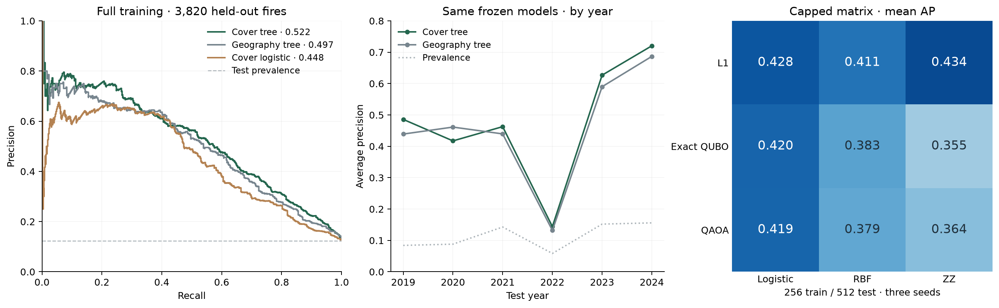

# Frozen incident-classification evaluation

This is the final evaluation of the supporting **incident** branch. Annual macro prediction and continuous size regression were not run. Per-year scores below summarize incident predictions; they are not predictions of annual averages. [Corrected scope](SCOPE_CORRECTION.md).

**Static forest context improves the held-out classical model. A four-qubit ZZ kernel has a small capped-sample lead, with large seed variation; QAOA selection adds no useful gain.** These are retrospective comparisons of recorded fire size, not ignition forecasts or quantum computational advantage.

The [protocol](../experiments/final_evaluation.json) and recipes were committed before one opening of **2019–2024**. Training uses **1988–2018**. The opening commit is `30b90f9`; the exclusive intent and full prediction scores remain in ignored `.cache/wildfire/final-test/`. [Audited evidence](results/final-evaluation.json) contains hashes, budgets, selected features and all frozen comparisons. No test-driven model changes follow this evaluation.

## Data and task

Classify **agency-reported size ≥10 ha conditional on an eligible recorded Ontario fire**. NFDB dates/sizes are agency-associated; they are not guaranteed ignition dates or final burned areas. Missing incidents never become negative labels. Identity collisions and nonblank prescribed-fire codes are quarantined.

| Eligible cohort | Fires | Positive labels |
|---|---:|---:|
| Training, 1988–2018 | 37,801 | 7.51% |
| Test, 2019–2024 | 3,820 | 12.33% |

Test exclusions include 34 identity-collision rows and 15 prescribed-code rows; source reasons can overlap. Four further fires fail the weather join and four fail woodland coverage. The primary model uses geography, season and buffered native **1984** cover throughout. Lagged ECCC weather joins determine cohort eligibility but raw weather predictors were pruned during discovery. Annual cover's training-validation gain missed its declared promotion threshold. Product dates, approximate coordinates, completeness and unresolved publication latency limit interpretation.

## Full-training classical controls

Each model trains on all 37,801 eligible historical fires and predicts the same 3,820 test fires. AP is average precision; larger is better. Brier is mean squared probability error; smaller is better. No classification threshold is selected from test scores.

| Inputs | Logistic AP | Tree AP | Tree ROC-AUC | Tree Brier |
|---|---:|---:|---:|---:|
| Geography / season | 0.4303 | 0.4970 | 0.8406 | 0.08124 |
| + forest proportions | 0.4254 | 0.5216 | 0.8496 | 0.08022 |
| + forest and water proportions | 0.4478 | **0.5219** | **0.8564** | **0.07948** |

The predeclared primary cover tree gains **0.02495 AP** over the geography/season tree. Forest-only context nearly matches it; the extra water term adds only 0.00030 AP on this test. These are predictive associations, not evidence that vegetation causes the reported-size difference.

| Test year | Fires | Positive fraction | Geography tree AP | Primary cover tree AP |
|---|---:|---:|---:|---:|
| 2019 | 535 | 8.41% | 0.4391 | 0.4859 |
| 2020 | 602 | 8.80% | 0.4613 | 0.4173 |
| 2021 | 1,191 | 14.27% | 0.4396 | 0.4627 |
| 2022 | 274 | 5.84% | 0.1320 | 0.1439 |
| 2023 | 737 | 15.20% | 0.5900 | 0.6268 |
| 2024 | 481 | 15.59% | 0.6867 | 0.7204 |

Cover improves AP in five of six years and loses in 2020. Performance and label prevalence vary by year; pooled AP is not the mean of year APs. The low 2022 score and higher test prevalence remain visible rather than being explained away as a trend in true fire risk.

A later [descriptive probability audit](PROBABILITY_REPORT.md) preserves these predictions and adds fixed bins: the primary mean probability is 10.20% versus 12.33% observed. Its Brier improves on the geography tree, but its count-weighted absolute bin gap is slightly larger (2.44 versus 2.26 pp). In 2022 its Brier .05941 loses to the unchanged training-prevalence constant .05526. No calibration fit or model change follows; ranking and probability reliability are different properties.

## Equally capped selector / predictor matrix

Every selector and predictor sees the **same 256 training labels per seed**, chooses four of eight inputs, and evaluates the same 512 test fires. Seeds are 211, 307 and 401. Exact QUBO and depth-one QAOA solve the same training-derived relevance/redundancy objective; L1 ranks a different predictive surrogate. ZZ and RBF share robust scaling, tanh-bounded inputs, train-only kernel centering/variance normalization and fixed C=1. ZZ uses four qubits, depth two and the frozen angle scale 0.05. See [quantum methods](QUANTUM_METHODS.md).

| Selector | Logistic AP | RBF AP | ZZ AP |
|---|---:|---:|---:|
| L1 ranking | 0.4282 | 0.4110 | **0.4342** |
| Exact classical QUBO | 0.4199 | 0.3828 | 0.3553 |
| QAOA, same QUBO | 0.4191 | 0.3792 | 0.3641 |

Cells average three sampled evaluations, not three independent temporal replications. For L1, paired **ZZ − logistic AP** is **+0.0691, +0.0158, −0.0667**, averaging **+0.0060**. ZZ beats RBF in all three samples, but its small mean lead over logistic is unstable. The discovery ZZ lead had already failed a frozen fresh-seed check on earlier validation years; this held-out result is reported separately, without pooling favorable samples or restarting search.

The full-training tree and this capped matrix have different training-label/input budgets. Their scores do not constitute a matched quantum-versus-tree contest. Selection stability is limited at the small cap: L1 chooses geography/season in two seeds and swaps month cosine for conifer fraction in the third. QAOA and exact QUBO share subsets in two seeds; the third changes one feature, without a useful downstream gain. All three QAOA optimizations hit the 40-function-evaluation budget without reporting convergence. Each then prepares one final sampling state (41 circuit calls per seed). The third produces only 10 feasible draws out of 512 and an objective gap of 0.0612; those failures remain in the evidence.



[Figure provenance](figures/final-evaluation.json) records the audited outcome and plotting hashes. Year curves show heterogeneity, not confidence intervals. Full-training and capped panels have separate budgets.

## Cost and verification

| Measured final stage | Seconds |
|---|---:|
| Source/training preflight | 0.20 |
| Held-out feature joins | 2.58 |
| All full/capped model comparisons | 2.14 |
| Total runner wall time | 5.34 |

Total includes gate/recipe checks and excludes interpreter/library startup, raw acquisition and earlier feature preparation. Simulation caches **5,376 exact state preparations** across distinct subsets. A naive hardware fidelity implementation would require **1,145,984 pair circuits**, before multiplying by shots and adding QAOA optimization queries; this is a query count, not a measured hardware runtime. **No hardware jobs were submitted.** Small exact-state QAOA optimization and synthetic draws do not demonstrate computational speedup.

The audit recomputes AP, ROC-AUC and applicable Brier scores from saved predictions, including year-specific metrics. It verifies disjoint identities/years, exact sample hashes, feature/label budgets, source/table hashes and recipes at the opening commit. It does not validate historical coordinate accuracy, source completeness or causal/operational validity. [Historical clean-environment verification](data/repository_checks.json) pins 42 tests/19 help checks to `921c33d`; [expanded tracked-source QA](data/expanded_repository_checks.json) pins 90/52 to `9fa3127` without production inputs or another predictive run. The earlier [84/49 receipt](data/current_repository_checks.json) remains preserved.

The [source-method audit](SOURCE_ASSUMPTIONS.md) confirms forward–backward temporal processing of the land-cover product. Even static 1984 context is not certified independent of later information; the forest gain supports retrospective association, not historical forecast availability. The frozen prescribed-code rule retains unspecified blanks and quarantines `PB` records in the inspected snapshot; no explicit `0` values occur in either requested window.

To collect and verify the existing final outcome without refitting:

```sh
uv sync --locked --group data --group analysis --group quantum
OMP_NUM_THREADS=1 OPENBLAS_NUM_THREADS=1 MKL_NUM_THREADS=1 uv run --no-sync python scripts/audit_final_evaluation.py
```

The final runner refuses another opening. [Exact reproduction steps](REPRODUCIBILITY.md) pin preparation and evaluation commits in a separate copy; they are not another adaptive test for this project. The required annual modelling table and macro baseline comparison remain unrun; continuous incident-size regression also remains unrun. Source/coordinate/publication auditing and presentation work are additional requirements, not the only remaining work. These results support a controlled Qiskit comparison and forest-context analysis, not a breakthrough or deployment claim.
