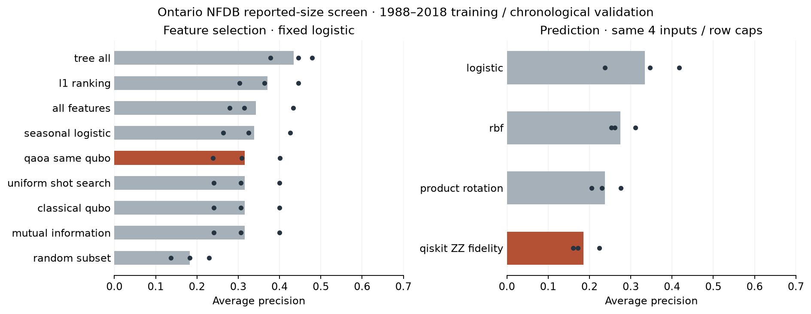
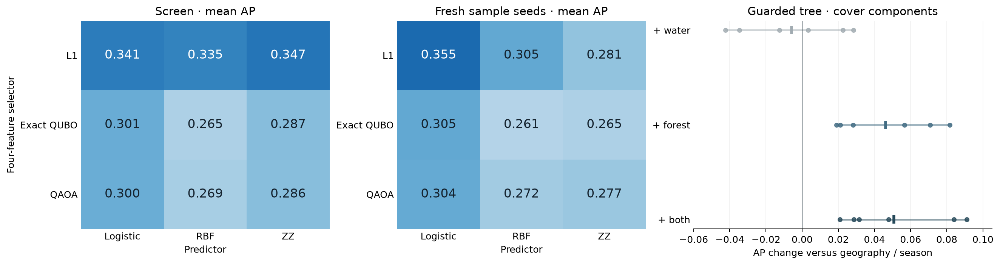
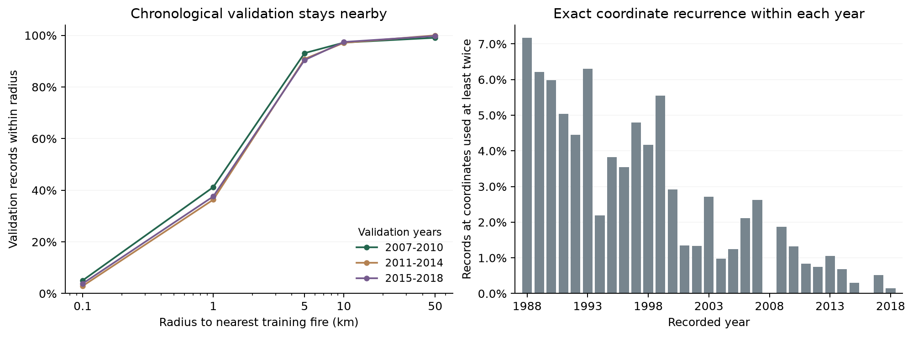

# Findings and next decisions

Partial incident-branch findings · October 5, 2026. The run ended at 1 PM without annual aggregate modelling or continuous size regression. [Scope correction](SCOPE_CORRECTION.md). **Forest context improves spatial transfer and the frozen held-out classical model. The capped ZZ kernel has a small, sample-sensitive final lead; QAOA adds no useful gain.** The single 2019–2024 evaluation is complete: [final results and verification](FINAL_EVALUATION.md). No new hardware jobs were submitted. Sections below preserve the discovery history rather than pool it with final-test scores.

## Data now usable

The selected historical source is the audited NRCan NFDB point snapshot dated 20260811. Its dates and sizes are agency-associated/reported values, not guaranteed ignition times or final burned area. One conditional classification label per eligible recorded fire: reported size >=10 ha.

38,581 Ontario incidents span every requested training year 1988–2018, with 7.46% positive labels. Identity collisions and invalid dates/prescribed codes are excluded; reasons overlap. 1,028 otherwise eligible incidents fail the lagged weather join. Raw values and exclusion counts remain traceable. Two/three-month weather lags use the nearest station within 150 km; 1987 data supply early-1988 context without adding training-label years. [Dataset manifest](data/historical_features.json).

Woodland acquisition keeps native 30 m integer classes and regional crops, processing national ZIPs sequentially. A static 1984 context join now retains 37,801 fires, dropping 778 for insufficient classified coverage. It flags 4,872 centers on mapped water without snapping them to land. [Joined manifest](data/historical_woodland_features.json). Approximate fire coordinates require buffer/coverage sensitivity checks before spatial interpretation. The operational-update source remains a separate diagnostic; its sparse years must not become no-fire labels.

## Full historical screen

Frozen expanding folds: 1988–2006 → 2007–2010, 1988–2010 → 2011–2014, 1988–2014 → 2015–2018. Seeds 7/19/31. All fitted preprocessing and feature selection use each training fold only. Scores below average fold/seed AP equally; prevalence averages 8.67% across full validation folds. Seeds reuse years and do not establish nine independent replications.

| Four-feature selector, same logistic predictor | Mean AP |
|---|---:|
| L1 coefficient ranking | 0.3709 |
| QAOA relevance/redundancy QUBO | 0.3161 |
| Exact classical QUBO | 0.3157 |
| Mutual information | 0.3157 |
| Uniform 512-draw subset search | 0.3157 |
| One random subset | 0.1831 |

L1 selects latitude, longitude and lag-three precipitation in every fold; its fourth feature is month cosine in the first two folds and lag-three snowfall in the third. The QUBO consistently chooses latitude, lag-two precipitation and lag-two/three heating degree days. That difference motivates a covariate-group comparison; it does not establish causality. QAOA's mean objective gap to exact enumeration is 0.0447. Its 0.0004 AP difference over exact QUBO is too small and confounded by the proxy/subset choice to claim a useful benefit. Uniform sampling finds a QUBO-optimal subset in this screen; that is not predictive optimality.

Auxiliary full-input controls: twelve-feature logistic AP 0.3423, geographic/seasonal logistic 0.3383, full-input tree 0.4342. The tree uses different input/training budgets from the capped kernel comparison; these are not matched quantum-versus-tree results.

| Same four inputs and sampled rows | Mean AP |
|---|---:|
| Logistic regression | 0.3340 |
| Classical RBF SVM | 0.2750 |
| Product-rotation kernel SVM | 0.2370 |
| Qiskit ZZ fidelity SVM | 0.1852 |

These predictors share latitude, month sine, lag-two temperature and precipitation, 256 training/512 validation caps and train-only transforms. Kernel SVMs use C=1. The fixed default ZZ map loses to logistic in every fold mean. This rejects promotion of that default map; it does not settle all quantum-kernel designs. QAOA uses exact-state optimization/synthetic shots, and fidelity kernels use exact simulated overlaps. Timings exclude preparation/imports: 10.80 s for the selector matrix, 2.23 s for the capped predictor matrix. No hardware speedup follows.



[Compact measured evidence](results/historical-weather-screen.json) records hashes, fold metrics, selected inputs and quality gates. [Operational pilot](PILOT_REPORT.md) is separate evidence on a different label/source/window. Its metrics must not be pooled with this historical task.

## Refinements: covariate value and kernel scale

The same-model group ablation is the clearest finding so far: geographic/seasonal tree AP **0.4463** exceeds the weather-plus-geography tree **0.4342** in every fold mean. Weather-only tree AP is **0.1973**; weather-only logistic is **0.1187**. Combined logistic AP **0.3423** only slightly exceeds geographic/seasonal logistic **0.3383**, with mixed fold effects. Two/three-month raw weather context has not shown a reliable gain for this conditional reported-size proxy. This says nothing about daily drought indicators or ignition forecasting. Spatial/reporting structure could contribute; a spatial holdout and woodland covariates remain necessary.

An equal-size scale grid improves ZZ AP from **0.1852** (angle scale 0.5) to **0.2423** (scale 0.05), still below the best RBF scale **0.2788** and the unchanged logistic **0.3340**. Four RBF bandwidths and four ZZ angle scales were screened on identical rows. These are selected validation scores, not independent confirmation or final-test performance. The scale result supports rejecting the default map; it does not support promoting a quantum winner.

[Measured refinement evidence](results/historical-refinements.json) records both attempts, hashes and fold means. Run times: 8.55 s for the scale grid and 11.90 s for group ablations, excluding preparation/imports. At that stage the proposed incident refinements were woodland context and antecedent weather; their completed studies appear below. They did not implement annual macro prediction.

## Spatial transfer and matched training counts

A chronological checkerboard holdout uses 200 km EPSG:3978 blocks in both directions, with at least 50 km between retained training points and held-out validation points. Guarded training retains 3,859–6,617 fires per condition, so the original full-row score cannot isolate geographic separation from sample loss.

The equal-row control samples the same number of training fires from the full historical training fold and evaluates **exactly the same validation fires**. Geographic/seasonal tree AP is **0.3525** under guarded blocks versus **0.4061** under the equal-row time-only control. Combined weather/geography tree AP is **0.3330** versus **0.3817**. Geographic/seasonal logistic is steadier: **0.3459** guarded versus **0.3420** in the equal-row control. The tree's local predictive structure does not transfer as well as its ordinary chronological score suggests. This is a checkerboard interpolation test within Ontario, not an external-province result.

[Measured spatial-control evidence](results/historical-spatial-matched.json) records six fold/direction conditions and three seeds. The corrected outcome measures control geometry independently; an earlier ignored outcome carried a copied cell-count field and is annotated to exclude that field. Scores and row counts were unaffected. These checks keep the geographic/seasonal baseline, motivate spatial confirmation of new covariates and reject a province-wide deployment claim from ordinary validation alone.

## Antecedent weather check

Adding lag-one measurements retains 38,579 eligible fires (two fewer than the lag-two/three cohort). The same-row geographic/seasonal tree reaches **0.4410 AP**. Adding lag-one raw weather gives **0.4365**, all raw lags **0.4342**, and estimated station/month anomalies **0.4210**. Geographic/seasonal logistic **0.3382** also exceeds lag-one raw **0.3376** and anomalies **0.3244**. These controlled refinements do not support a weather improvement on the current proxy.

Station/month baselines use only raw weather through the training-fold end, require five observations per variable and fall back to a provincial calendar-month mean when insufficient. Temperature differences and log-precipitation differences are recorded separately; fallback counts travel with the outcome. They are estimated training baselines, **not official climate normals or a fire-weather physics model**. [ECCC's official normals](https://climate.weather.gc.ca/climate_normals/index_e.html) have their own period and completeness rules; those tables were not added as predictors.

[Measured antecedent-weather evidence](results/historical-antecedent-weather.json) preserves fold means and the outcome hash. Woodland and spatial confirmation remain higher priorities than expanding the raw-weather feature list.

## Bounded encoding and preprocessing

A 2.85-second diagnostic fixes four inputs, three common seeds and three chronological folds, with caps of 128 training/256 validation fires. Compare standard scaling + tanh, standard scaling + clipping, and robust scaling + tanh. Imputation/scaling fit only training rows. Each kernel receives the same bounded vectors; train-only centering and mean-diagonal normalization match centered kernel variance at C=1. RBF uses one training-median distance rule, not a validation bandwidth grid. ZZ remains four qubits/depth two with angle scale 0.05 selected in prior validation.

| Matched capped predictor | Mean AP |
|---|---:|
| Standard-scaled logistic | 0.3601 |
| Robust + tanh RBF | 0.3345 |
| Robust + tanh ZZ | 0.3254 |
| Standard + clipping ZZ | 0.3087 |
| Standard + tanh ZZ | 0.3031 |

Robust preprocessing improves the simulated ZZ score within this screen, but matched RBF and logistic remain ahead. It does not establish an optimal encoding or justify more qubits/depth. The previous raw-kernel screen used different sample caps and normalization; its scores cannot isolate a normalization effect. [Measured encoding evidence](results/historical-encoding.json) retains every transform/control. Treat robust+tanh as the candidate for a bounded confirmation, not a quantum winner.

The diagnostic computes 10,368 simulated state preparations. A naive hardware implementation of the same ZZ matrices would require **1,104,192 pairwise fidelity evaluations** before finite-shot repetition, rather than one hardware query per cached state. Zero hardware jobs were submitted. Keep the simulator feasible and reserve any authorized hardware check for a much smaller selected subset.

## Woodland context

The same-row 1984 woodland screen gives tree AP **0.4682** for geography/season + lagged weather + cover, **0.4587** for geography/season + cover, **0.4535** for geography/season alone, and **0.4313** for geography/season + weather. The combined cover/weather gain over geography alone is **0.0147** averaged across folds; it loses in the first fold and wins in the later two. Logistic improves from **0.3426** to **0.3651** with cover, winning in all three fold means. These are adaptive validation findings, not final-test results or causal vegetation effects.

[Measured woodland evidence](results/historical-woodland-groups.json) records identical eligible rows, fixed model settings and a 9.34-second execution. Static 1984 proportions provide coarse historical context; they are neither annual event-year vegetation nor tree density. Spatial and center-water sensitivity now support retaining cover, with the qualifications below. No reliable province-wide deployment claim follows from this improvement.

## Woodland sensitivity gates

With 200 km blocks and a 50 km guard, geography/season + cover tree AP rises from the same-row baseline **0.3636** to **0.4143**, improving in **all six fold/direction conditions** (gains 0.0209–0.0911). Geography/season + weather + cover gives **0.4178**, but loses to geography alone in one condition. The simpler cover augmentation is more consistent. Equal-training-count random controls score **0.4141** without cover and **0.4353** with cover, so geographic separation still matters. Guarded logistic also improves from **0.3533** to **0.3735** with cover in all six conditions. This supports cover as transferable context within the Ontario checkerboard task, not vegetation causality or external-region performance.

Excluding all 4,872 mapped-water centers leaves **32,929 fires**. Within that identical-row cohort, geography/season tree AP is **0.4570**, with cover **0.4665**, and with weather + cover **0.4728**. Logistic improves from **0.3468** to **0.3672** with cover. A context gain survives this coordinate/map sensitivity; the different cohort’s absolute score is not evidence that removing water centers improves prediction. Approximate points remain uncorrected.

[Measured sensitivity evidence](results/historical-woodland-sensitivity.json) preserves both frozen attempts, eligibility counts and paired fold scores. Execution took 74.45 s and 51.70 s while both processes ran concurrently; these are observed wall times, not isolated throughput benchmarks. Fresh random-control seeds 42/73/101 reuse the same years and cannot establish independent temporal replication. Retain the simpler cover branch for matched feature selection; prune more raw-weather variants unless a specific mechanism justifies them.

## Selection with woodland candidates

A four-of-eight screen restricts candidates to geography/season and the four cover proportions. With the same full-training logistic predictor, L1 AP **0.3711** exceeds mutual information **0.3561**, QAOA **0.3236**, and exact QUBO/uniform equal-shot search **0.3179**. All eight inputs score **0.3651**. L1 selects **latitude, longitude, surrounding water fraction and month sine** in every fold and seed; water fraction is a contextual proxy, not evidence of a fire on water. The QUBO selects latitude, month sine, broadleaf and mixed-cover fractions instead.

QAOA finds a QUBO optimum in eight of nine runs; its only nonoptimal subset creates the small downstream AP difference over exact enumeration. That is a mismatch between the surrogate objective and prediction, not evidence of a quantum optimization advantage. This tiny eight-variable problem is exactly enumerable. [Measured selector evidence](results/historical-woodland-selection.json), 4.75 seconds with native numeric threads capped, supports retaining L1 and exact classical controls. That four-input list defined the subsequent bounded incident predictor comparison.

## Predictor check on the retained cover inputs

Fix latitude, longitude, surrounding water fraction and month sine, with 256 training/512 validation caps and fresh common seeds. On identical rows, standard logistic AP **0.3751** exceeds robust+tanh RBF **0.3408** and robust+tanh ZZ **0.3346**. Standard+tanh ZZ is **0.3154**. The two-transform check took **3.81 seconds**; it does not support quantum promotion after introducing useful cover context. [Measured evidence](results/historical-woodland-encoding.json) records all classical controls and costs. The full-input tree is a separate budget, not a matched quantum comparison.

## Joined measurement quality

The [incident-weighted quality audit](data/feature_quality.json) traces every incident's station-month join. Median station distance is about **38.4 km**, the 90th percentile about **84.2 km**, and the 99th about **130.2 km**. Depending on lag, temperature is missing in **6.5–6.9%** of rows, precipitation in **4.9–6.6%**, and snowfall in **27.0–27.4%**. Thousands of incident joins refer to months with nonzero missing-day counts; these are not counts of distinct station-months. Train-only imputation preserves the distinction from genuine zeroes, but does not recover local weather. Monthly/coarse station context and measurement coverage limit any conclusion about weather’s physical importance.

Five centers are unclassified despite adequate surrounding coverage. The water-exclusion sensitivity removes only mapped-water centers, so these five remain; that cohort is “not mapped water”, rather than certified land. Native CRS/grid validation and explicit flags address transform integrity, not historical coordinate accuracy. No quality-filtered model is evaluated by this audit.

## Crossed pipeline and fresh-seed check

The crossed matrix fits selection on precisely the **same 256 labelled training fires** used by each predictor, rather than letting the selector use the full historical fold. All combinations select four of eight inputs and evaluate the same 512 validation fires. Exact-QUBO and QAOA use the same objective; every selector feeds standard logistic, matched robust+tanh RBF and four-qubit ZZ. Identical selected subsets reuse their evaluations.

The first three seeds give L1 + ZZ **0.3468 AP**, L1 + logistic **0.3407**, and L1 + RBF **0.3352**: a small simulated lead worth checking. A frozen fresh-seed check, with no tuning changes, gives **0.2811**, **0.3550**, and **0.3050**, respectively. The ZZ lead fails sampling confirmation. These are reused years with new samples, not independent temporal replication. Do not pool or select the favorable seed group to claim a quantum improvement. QAOA combinations also remain below the L1 + logistic pipeline.

[Screen evidence](results/historical-woodland-combinations.json), **4.57 s**, and [fresh-seed evidence](results/historical-woodland-combinations-confirm.json), **4.43 s**, keep both results. This comparison completes the stage-controlled crossed diagnostic and retains classical prediction. It also shows why a selector with extra labelled rows is a different data budget from an end-to-end capped pipeline.

## Forest versus water context

On identical guarded rows, forest proportions without water give tree AP **0.4098**, versus geography/season **0.3636** and water-only augmentation **0.3578**. Forest augmentation improves in all six fold/direction conditions; water-only effects are mixed. All cover proportions reach **0.4143**. For logistic, water is useful (**0.3705** versus **0.3533**), while forest-only **0.3592** is weaker. Thus the tree’s transferable cover gain is not explained by water fraction alone, although the linear selector favors that proxy.

[Component evidence](results/historical-cover-components.json), **1.25 s**, is a controlled feature-group ablation, not a vegetation-causality test. Static mapped classes can encode regional/reporting structure as well as physical cover. Preserve this distinction when interpreting the spatial gain.



The matrix colors share one scale; individual values are measured AP. Spatial dots/ranges show the six dependent fold/direction conditions, **not confidence intervals**. The [figure provenance](figures/woodland-comparisons.json) links source summaries, frozen attempts and plotting code hashes.

## Evidence audit

The [independent input/budget audit](data/experiment_audit.json) checks **20 completed attempts** against the actual immutable cached tables: labels, validation counts, sampled-row hashes, declared folds/seeds and feature/label budgets. Every frozen evaluator file hash matches its recorded reservation commit; all 20 recipes are recoverable in Git. The earlier spatial cell-count annotation remains explicit. Total observed attempt wall time is **281.03 seconds**, excluding acquisition, feature preparation and imports; concurrent attempt times are not isolated benchmarks. This audit does not recompute predictions, confirm coordinate accuracy or certify hardware performance.

The [broader goal audit](GOAL_AUDIT.md) separately accounts for the final opening and post-final follow-ups/repairs: **28 saved runner intervals total 669.84 seconds**, including two preserved failures. This is not elapsed project time or a complete compute bill; downloads, preparation, startup and repeated collection/QA are excluded. Completed library/landmark runs record 99,960 local pair circuits and 190,660,608 synthetic shots; shared PSD measurements are counted once. Final-selector mean pairwise Jaccard overlap is **.7333 (L1)** versus **.3587 (exact QUBO/QAOA)** across three samples, a descriptive stability measure without independent-replication guarantees. The pure-season baseline gap is now addressed below; the legacy `seasonal_logistic` identifier includes geography and remains preserved in its original receipts.

## Annual versus static cover

The [matched comparison](data/historical_context_year_screen.json) uses the same **37,801 incidents** for both maps, with zero intersection losses. Previous-year annual context gives tree AP **0.46825** versus fixed-1984 context **0.45869**, winning all three chronological folds. The mean gain **0.00955** falls just below the predeclared **0.01** promotion threshold. Logistic likewise improves modestly, **0.36511 → 0.37098**. This is a small positive effect, not evidence of no effect; it does not clear our quality/cost rule. Retain static cover and skip the conditional spatial follow-up rather than relax the threshold after seeing the result.

The model check took **1.45 seconds**; annual feature preparation took **15.32 seconds**, excluding national archive acquisition and source hashing. All required 1987–2017 native maps are cached. Earlier map years do not establish historical publication availability or freedom from the retrospective product's temporal smoothing. [Annual feature provenance](data/historical_annual_woodland_features.json) and [common-row provenance](data/context_comparison_features.json) retain the comparison.

The [final protocol](../experiments/final_evaluation.json) froze fixed-1984 context and a geography/season/cover tree as the primary full-training model. Its single opening evaluates 3,820 eligible 2019–2024 fires: primary tree AP **0.5219** versus geography/season **0.4970**. Separately, the equally capped L1 matrix gives ZZ **0.4342**, logistic **0.4282** and RBF **0.4110**, with large paired seed variation. [Final report](FINAL_EVALUATION.md) preserves all comparisons, model budgets, failures and recomputed metrics. No model is retuned from those test scores.

## Training-only library and numerical follow-ups

After final opening, the owner requested bounded Qiskit-library/design exploration. [FidelityQuantumKernel](QISKIT_FOLLOWUP.md) agrees with cached exact states and exposes indefinite finite-shot matrices. Actual SQD projection on the diagonal feature-selection QUBO equals the best sampled energy; no added optimization benefit is found. Four fixed-policy history replays demonstrate a small query/quality tradeoff, not a full Dream-RSI reproduction.

The [landmark SVM screen](QUANTUM_LANDMARKS.md) saves 12.19× pair queries but fails quality gates. A [convergence audit](KERNEL_CONVERGENCE.md) finds ZZ ranking sensitivity and tighter fits hitting the fixed iteration limit. The subsequent separately frozen [kernel-ridge study](KERNEL_RIDGE.md) verifies double-precision coefficient equations and primal/dual agreement; ideal ZZ-16 passes approximation thresholds on diagnostic and fresh sampling groups. Dense RBF still leads: **.4086/.4734** versus ZZ **.3995/.4588**. Keep this feasible compression reference and the failed SVM comparisons; do not infer quantum superiority, finite-shot ridge accuracy or independent temporal replication. All work uses training-period inputs; the final outcomes stay immutable.

A [labels-free shot diagnostic](SHOT_FEASIBILITY.md) also qualifies hardware feasibility. On three existing 256/256 sampling cohorts, α=.05 has expected dense cross-matrix RMS relative error **20.64%/7.30%** at 512/4096 independent shots; narrowing to .01 increases it to **98.16%/34.71%**. Exact matrices, covariance formulas and source/sample hashes are checked without fitting a predictor or executing shots. The 1.97-second diagnostic measures encoding/noise sensitivity, not accuracy or a new angle choice. Fixed exact normalization excludes PSD repair, denominator noise and device errors; fewer landmark queries alone do not guarantee hardware quality.

A [fixed-cardinality selector ablation](CONSTRAINED_SELECTION.md) separates initialization from mixer choice. Feasible initialization plus XY mixing gives unit valid-subset probability, while all-state initialization plus XY remains at 70/256. Both feasible quantum variants and classical feasible-uniform sampling choose the same exact-QUBO subsets in all six samples. L1 has worse proxy energy but higher mean AP in both groups (.3108/.3631 versus .2996/.3454), reinforcing the objective/prediction mismatch. Generic feasible preparation adds 247 logical CX gates in this prototype. The 3.54-second training-only study changes no final model and supports keeping the constraint demonstration, not quantum selector promotion.

A [local kernel-geometry check](LOCAL_GEOMETRY.md) reuses those matrices to test the expected small-angle limit. At .01, a four-dimensional classical tangent kernel has only **1.40% mean normalized cross shape error**, while the inherited 512-shot RMS error is **98.16%**. Four eigen-directions contain 99.73% of exact training variance. The approximation deteriorates to 15.30% at .05 and fails at wider scales. Twenty-seven anchor states take .14 seconds; collection uses no new states or fitting. Keep this local explanation/control candidate without inferring equal predictive rankings or a new optimum.

## Pure seasonal control

The goal audit identified that the original `seasonal_logistic` also used latitude/longitude. A [separately frozen training-only plan](../experiments/seasonal_baseline.json) now compares the intercept, calendar sine/cosine, geography and their combination on the same 37,801 eligible fires and original three chronological folds. All available training rows enter each fold; these are full-row feature-group controls, not equal-feature selector comparisons or capped quantum baselines. C=1 and preprocessing are unchanged; one deterministic fit per fold avoids counting repeated random-state settings as replications.

| Control | Mean AP | Mean ROC-AUC | Mean Brier |
|---|---:|---:|---:|
| Training-prevalence intercept | .08629 | .50000 | .07910 |
| Month sine/cosine | .09334 | .55006 | .07898 |
| Latitude/longitude | .37102 | .80772 | .06473 |
| Geography + season | .34260 | .82444 | .06720 |

Means weight the three fold conditions equally; they are not pooled AP. Pure season is only slightly above the prevalence ranking baseline. Geography has the highest AP here; adding season raises ROC-AUC but reduces AP and worsens Brier. The original combined AP reproduces exactly in each fold. This clarifies the earlier control's inputs and metric dependence; spatial/reporting associations do not establish physical causality or operational forecasting. It does not select a replacement final model.

Nine logistic fits and three constant controls take **1.09 seconds**, including local table loading/preprocessing and in-run checks, excluding interpreter startup/preflight source checks. [Collected evidence](results/seasonal-baseline.json) reconstructs saved parameters, verifies train-only statistics and metrics without fitting, and preserves all twelve conditions. No test-period rows, quantum circuits, shots or hardware jobs are used. Existing final/scientific outcomes remain unchanged.

## Coordinate quality and geographic novelty

A labels-free audit of the same 37,801 training fires finds 36,143 exact coordinate pairs. **7.61% of records share a coordinate with another incident**, counting every member of each repeated group. Only five records align on both axes to a .01-degree grid, and 419 to a .001-degree grid. Numeric alignment does not measure location accuracy; transformed coordinates can hide an original coarse resolution. Distinct fires can recur at the same location, so these findings do not justify deduplication or snapping.

| Validation years | Exact coordinate seen in training | Median nearest training distance | 90th percentile | Within 5 km |
|---|---:|---:|---:|---:|
| 2007–2010 | 2.35% | 1.30 km | 4.01 km | 93.13% |
| 2011–2014 | 0.00% | 1.47 km | 4.72 km | 90.85% |
| 2015–2018 | 0.45% | 1.45 km | 4.93 km | 90.44% |

Ordinary chronological validation mostly evaluates fires near previous records. Exact coordinate reuse is much less common. This clarifies the distinction between within-region interpolation and the 50 km guarded spatial test; it does not invalidate chronological validation or explain a model's AP causally. The recurrence chart depends on annual counts and spatial concentration, so its decline is not evidence that GPS accuracy improved.



[Collected geometry evidence](data/coordinate_quality.json) pins source/recipe hashes and reads only identities, years and coordinates. The source geometry is NAD83 Canada Atlas Lambert; latitude/longitude attribute definitions do not explicitly identify their datum. Comparing the inherited WGS84 interpretation with NAD83 produces identical projected coordinates under the installed GDAL operations, without altering features. This is a local sensitivity check, not an accuracy certificate; see [source assumptions](SOURCE_ASSUMPTIONS.md). No model fit, label use, test-year access or hardware call occurs.

## Reported-size boundary and cohort selection

A [training-only label audit](LABEL_QUALITY.md) shows that weather matching excludes **14.35% of eligible ≥10 ha fires versus 1.51% of smaller fires**. It lowers prevalence from 8.48% to 7.45%; the cover join leaves 7.51%. Scores describe this selected recorded-incident cohort, not all Ontario fires. Exactly 10 ha accounts for 220 retained records, **7.75% of positives**; the frozen ≥10 rule stays unchanged. Stored decimal tails and repeated values do not establish measurement precision or label error. No model fit or final-year size access occurs.

## Keep, refine, prune

The [fixed landmark-ridge shot model](LANDMARK_SHOT_RIDGE.md) qualifies ideal compression. Mean ZZ-16 AP .40265 drops to .29053 at 512 modeled shots and .37611 at 4096. The predeclared 4096 mean-loss/cohort gate passes, but two of nine individual replicates lose >.05 AP, and exact RBF-16 remains stronger on mean (.43489). All solves are numerically adequate. These aggregate Binomial counts model independent pair estimates, not Qiskit sampler execution or device shots; a 4096-shot realization would still imply 33.00 million shots per cohort. Retain the conditional feasibility reference without hardware promotion or repair tuning.

The [matched tangent-predictor diagnostic](TANGENT_PREDICTION.md) connects local geometry to actual rankings. At α=.01, exact ZZ versus its four-feature classical tangent mean absolute AP difference is .00960, with all prediction Spearman correlations ≥.99840; the predeclared operational tolerances pass. At wider scales the approximation deteriorates. RBF mean AP .40857 exceeds every inherited ZZ scale here, though individual samples vary. This retains a useful classical control and the opposing geometry/shot-noise tradeoff, with no new angle choice or final-test change. The generic deterministic prediction bound is valid but too loose to establish useful closeness.

- **Keep:** chronological validation, L1 and tree baselines, explicit source semantics, exact classical solver and matched sampling controls.
- **Required and unrun:** build the annual climate/fire table, freeze its primary annual quantity and run macro baselines before more incident-kernel diagnostics. Acquisition is complete; [source assumptions](SOURCE_ASSUMPTIONS.md) remain relevant. Annual-context branches only changed the input map for individual-fire classifiers. The incident test is already opened; disclose reuse in later overlapping evaluations.
- **Prune for now:** deeper QAOA or a hardware submission justified solely by the tiny AP difference; default ZZ-map promotion; daily or pixel ignition claims; zero-filled count targets without source-completeness evidence.

Kernel scale and sample-cap changes must receive matched classical tuning budgets. New-seed confirmation measures sampling/optimizer stability, not a new unseen time period. The final protocol was frozen before the single 2019–2024 opening; its scores cannot guide further model choices. Unknown publication latency limits these analyses to retrospective conditional classification.

## Reproduce

```sh
uv sync --locked --group data --group analysis --group quantum
uv run --no-sync python scripts/audit_experiment_evidence.py
uv run --no-sync python scripts/audit_final_evaluation.py
```

These commands collect existing ignored evidence without fitting another model. New adaptive reservations are closed after the final opening. [Independent reproduction](REPRODUCIBILITY.md) pins the original preparation/evaluation commits and source hashes in a separate copy. The five-minute presentation remains an [evidence plan](../web/presentation/README.md), updated with the frozen findings.
