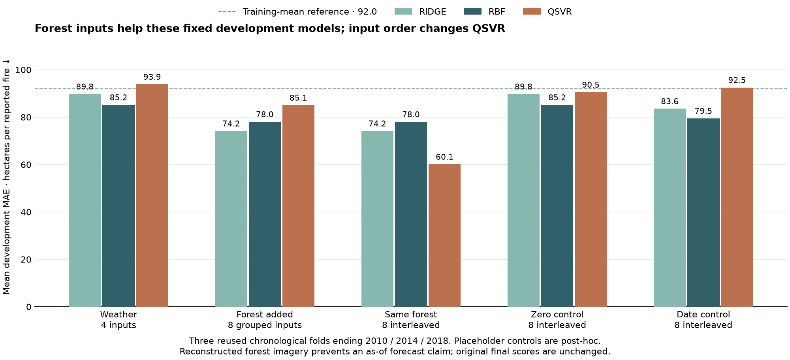
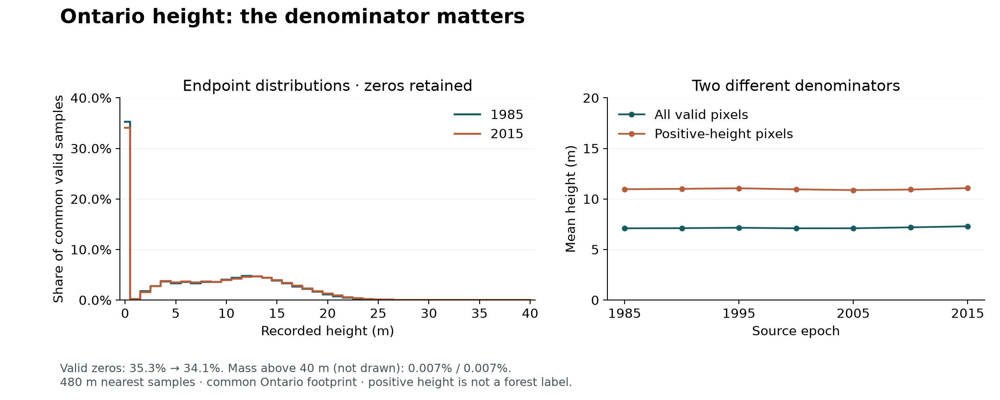
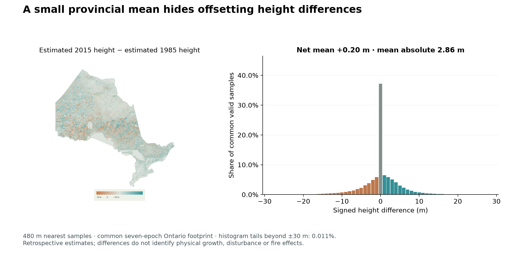
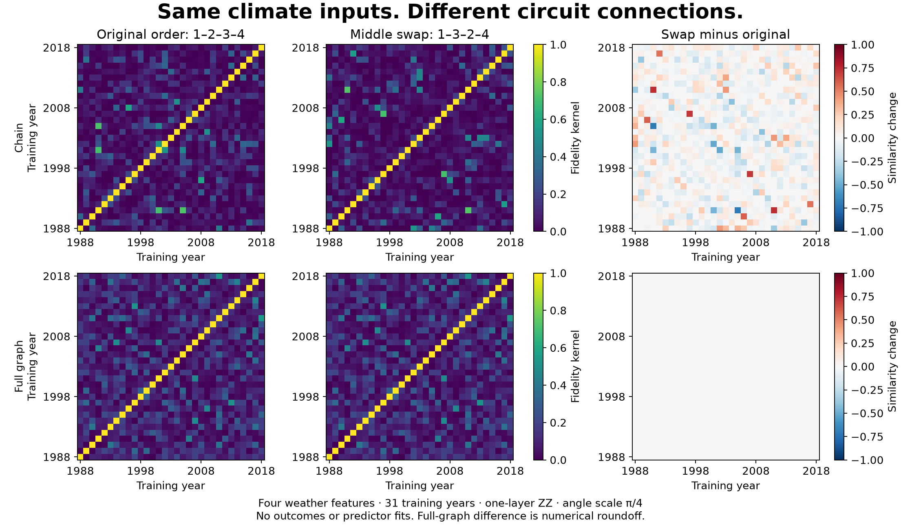

# Forest context: numerical sources and matched annual experiments

## Broader source expansion — October 6

The earlier canopy-height pilot did not test the broader forest feature space. We have now acquired and numerically aggregated **six additional layers × seven 1985–2015 epochs** under the full Ontario polygon: **556.1 MB** of bounded source reads. The successful acquisition/aggregation took **111.5 seconds**; earlier metadata-only attempts encountered a disconnected request and missing resampling tags. Their ignored records remain intact. No native multi-gigabyte raster was downloaded.

| Layer | Units | Coarse resolution | Model eligibility |
|---|---|---:|---|
| Total crown closure | % | 480 m | Seven advertised-NEAREST epochs |
| Aboveground biomass | ton/ha, publisher units | 480 m | Seven advertised-NEAREST epochs; signed nodata −32768 |
| Stand age | years | 960 m | 1985/1990/1995/2000 advertise NEAREST; 2005/2010/2015 omit the resampling tag and remain descriptive only |
| Broadleaf crown closure | absolute % | 480 m | Seven advertised-NEAREST epochs |
| Black spruce crown closure | absolute % | 480 m | Seven advertised-NEAREST epochs |
| Jack pine crown closure | absolute % | 480 m | Seven advertised-NEAREST epochs |

Metadata checks preserve each source's signed datatype, nodata and native custom-LCC geometry. Selected compressed coarse-frame bytes are downloaded with exact HTTP ranges, then repacked without changing pixel payloads. The 1985 age frame uses **6.4 MB**, versus a **367 MB** overview; its coarse resolution differs from the other variables. Masks are independent per variable/epoch rather than an intersection with future epochs. Zero remains a valid measurement, and these are province-wide coarse valid-sample means, not native-area-weighted forest-only inventories.

Species fields in SCANFI v2 are **absolute crown closure**, not relative proportions. Our dated composition proxy is spruce+pine divided by broadleaf+spruce+pine on the same epoch's shared valid footprint. It omits other species and is not tree density, a complete conifer fraction, a fuel class or fire hazard. Prior-epoch biomass change uses the shared footprint of two earlier epochs; it is reconstructed structural change, not measured spectral recovery. Previous-year recorded fire area is a separate memory proxy; the first training-year lag is missing and will be imputed inside training folds.

All annual joins take the latest epoch **strictly before** the example. Stand age uses the latest eligible age epoch, which remains **2000 after 2005**; its staleness is recorded. SCANFI's full-series reconstruction still uses later imagery: these additions support a **retrospective descriptive study**, not an as-of forecast. Static2026 FBP, Quebec-only vegetation/hazard layers and same-event eventual recovery maps are excluded. Missing method metadata is not silently treated as NEAREST.

[Acquisition plan](../experiments/forest_expansion_acquisition.json) · [Range/header/array proofs](data/forest_feature_sources.json) · [42 numerical summaries](data/forest_feature_summary.json) · [Composition/change joins](data/forest_feature_derived.json) · [31-year training table](data/forest_expansion_training.csv).

## Broader panel — executed

The fixed primary panel completed **108 ridge/RBF/actual FidelityQuantumKernel-QSVR fits, 36 matrices / 12,612 analytic overlaps in 50.00 s**, plus 3,072 actual local StatevectorSampler selector shots. It uses the same three previously inspected chronological development folds and fixed models/angles as the height pilot, not the original tuned final recipe. A separately frozen **post-hoc** order diagnosis adds 18 fits / six matrices / 2,102 overlaps in 11.31 s. No final2019–2024 evidence is opened.



Mean development MAE, **ha per reported fire**, lower is better:

| Inputs | Ridge | RBF | QSVR |
|---|---:|---:|---:|
| Four weather summaries | 89.78 | 85.19 | 93.89 |
| Four structure summaries | 68.73 | 67.98 | 89.54 |
| Weather + structure, grouped eight | 74.16 | 78.05 | 85.07 |
| Same eight, interleaved | 74.16 | 78.05 | **60.12** |
| Weather + interleaved zeros | 89.78 | 85.19 | 90.55 |
| Weather + interleaved calendar controls | 83.56 | 79.51 | 92.53 |
| All ten, including memory proxies | 87.40 | 75.75 | 77.20 |
| Exact/SQD/uniform-selected four | 68.90 | 73.08 | 70.88 |

The no-input mean reference is **92.00**. Broader forest structure helps the fixed classical models too; this changes the earlier height-only diagnosis, not the frozen annual final result. QSVR's unchanged eight inputs improve when interleaved on the linear ZZ graph; classical predictions remain unchanged. Zero/date placeholders under that same graph do not recover the forest score, supporting an information contribution in these **reused development folds**. Controls were specified after inspecting the primary result, so this is exploratory diagnosis rather than independent confirmation, an optimized comparison against classical models, or a quantum advantage.

All primary SQD/uniform selectors find the exhaustive minimum of the 210-state objective; no selection gain is demonstrated. The owner-requested [10/16/20-feature scaling study](SELECTOR_SCALING.md) then tests optimized sampling and finds an important mismatch: better objective optimization need not improve prediction. Its scores are separate and all outcomes are retained.

Keep these inputs for **retrospective development investigation**; do not promote stale age, missing-resampling epochs, selected-species ratio or biomass change as verified fuel/forecast measurements. Full-series reconstruction and coarse province aggregation remain limitations; no crown-closure/biomass source confirms a causal fire mechanism. Current FBP, same-event recovery and Quebec-only layers remain excluded.

The [offline source audit](data/forest_source_verification.json) verifies all 42 saved compressed/header/ROI hashes, signed values/nodata, full-province masks, means/percentiles, byte caps and four city controls without requests. It does not independently re-decode native pixels. [Primary plan](../experiments/forest_expansion.json) · [Primary metrics/raw bundle](results/forest-expansion.json) · [Post-hoc control plan](../experiments/forest_order_controls.json) · [Control metrics/raw bundle](results/forest-order-controls.json).

```sh
uv run --no-sync python scripts/pipeline.py annual forest-collect --output .cache/wildfire/forest-public --execute
uv run --no-sync python scripts/pipeline.py annual forest-orders-collect --output .cache/wildfire/order-public --execute
```

Public collection needs only committed evidence and the data/analysis/quantum dependency groups, not raw rasters or credentials. It verifies saved preprocessing/prediction equations without fits, states, draws or requests. `forest-source-collect` separately needs completed ignored source caches and an output **file**. Fresh `forest` and `forest-orders` execution require new namespaces; order execution also pins the original saved primary parent. Source acquisition recipes under `scripts/context/` preserve header/range proofs and require the audited directory/README/boundary inputs; they are not a source-free replay.


Coarse SCANFI height did **not** consistently improve annual Ontario fire-size estimates. It remains useful dated map context. This descriptive pilot does not change the submitted models or their final predictions.

## What we acquired

Seven advertised [SCANFI v2](https://open.canada.ca/data/en/dataset/07653869-f303-46c2-a04e-9ab479b73cbf) height overviews cover 1985–2015 in five-year steps: **86.7 MB total**, rather than seven multi-gigabyte national rasters. Native headers were inspected with bounded HTTP ranges. Each overview was checked against its own native grid, byte type, nodata `255`, unit scale and `NEAREST` resampling tag.

The native grid is 30 m; these overviews retain sparse nearest samples at **480 m**. Their standalone files omit georeferencing. Extraction explicitly uses the native tiepoint, pixel scale ×16 and the publisher's [README CRS](https://ftp.maps.canada.ca/pub/nrcan_rncan/Forests_Foret/SCANFI/v2/_SCANFI_v2_read_me.txt), whose latitude of origin differs from EPSG:3978. The official Ontario polygon is transformed independently. Toronto/GTA, Ottawa, Windsor and Thunder Bay controls fall inside the mask and round-trip within $1.5\times10^{-14}$ degrees.

The common valid footprint contains 4,528,955 samples, 99.9767% of polygon samples. Province-wide mean height varies from 7.0949 to 7.2951 m across the epochs. The polygon includes water: valid zeros remain valid; they do not automatically mean absent trees. This is a coarse structural summary, **not** a forest-only or native 30 m area-weighted inventory.

Receipts: [downloads](data/scanfi_overviews.json), [native/overview checks](data/scanfi_layouts.json), [extraction and city controls](data/scanfi_height_context.json).

## What the height mean measures

A [source-only distribution audit](data/height_distribution.json), frozen before calculation, separates the denominator from conditional height. On the common footprint, valid zeros decline from **35.28% in 1985 to 34.10% in 2015**. Positive-height pixels average **10.96 to 11.07 m**, while all valid pixels average **7.10 to 7.30 m**. Positive-height p10/median/p90 remain **4/11/18 m** at all seven epochs. Positive height is not a forest-cover label, and zero is not nodata.

The identity $\bar h=p_{h>0}\,\bar h_{h>0}$ decomposes the endpoint mean increase of **0.1995 m**: **0.1302 m** comes from the positive-share term and **0.0693 m** from the conditional-height term, using symmetric averages. These are arithmetic contributions, not causal explanations. About 52% of samples change integer height between adjacent epochs, despite small changes in the provincial distribution; aggregation hides spatial rearrangement. These are reconstructed source values, not independent measurements of growth or disturbance.



Only **0.015–0.035%** of valid samples exceed the map's 30 m colour ceiling; the numeric arrays retain them. The [full integer histogram](data/height_distribution_histogram.csv) includes every valid value through 254 m. Published hashes, grids, counts and means agree with the extraction receipt; a separate comparison with the original arrays agrees for all seven epochs and six transitions. No outcomes, predictor fits, new quantum states or downloads enter this audit. It does not establish that a different height summary would improve prediction.

Recalculate from a prepared replica with `uv run --frozen --group data --group analysis python scripts/context/distribution.py --figure`; results go to ignored `.cache/context/height-distribution-v1`. The [plan](../experiments/height_distribution.json) pins the published parents. The figure is descriptive context, outside the five-minute main deck.

## Spatial differences behind a small mean

The [fixed endpoint recipe](../experiments/height_spatial_change.json) compares 2015 minus 1985 on the same seven-epoch footprint. Earlier endpoint means were already inspected, so this is exploratory source interpretation. The net mean difference is **+0.1995 m**, but the mean absolute difference is **2.8629 m**: positive and negative contributions of **1.5312 and 1.3317 m** largely cancel. **28.61%** of common samples are lower, **37.21%** unchanged and **34.17%** higher. These describe reconstructed estimates, not observed growth, disturbance or fire effects.



The optional demo difference view keeps the default cover map and gameplay unchanged. Colour saturates at ±10 m; signed numeric differences retain the full **−74 to +90 m** range. Grey is missing, neutral is zero. [Results](data/height_spatial_change.json) · [complete histogram](data/height_spatial_change_histogram.csv) · [original-array and data-only reproduction](data/height_spatial_verification.json) · [three-view controls](data/height_spatial_view_verification.json). Subtraction uses signed integers, and projecting the difference agrees with subtracting the separately projected endpoints.

Rebuild from cached arrays with `uv run --only-group data --frozen python scripts/context/change.py --map`; add the analysis group and `--figure` for the chart. `pipeline.py prepare --include-change` adds this derivation without extra source requests and refuses sources that differ from the pinned plan. Optional `change/` assets are separately typed and hash-checked by the prepared manifest. This view proves no predictive improvement and stays outside the five-minute main deck.

## Fixed annual comparison

The [plan](../experiments/coarse_height_context.json) was committed before execution. Observation unit and target remain **Ontario province-year, mean reported hectares per accepted fire**. Three existing chronological development folds end in 2010, 2014 and 2018. No 2019–2024 rows were opened.

We compare four fixed inputs: annual/summer mean temperature and annual/summer precipitation; then add either a zero column, calendar year, or the latest height epoch strictly before each year. Imputation and scaling use each fold's training rows. Ridge, RBF-SVR and actual `FidelityQuantumKernel` QSVR use fixed parameters, with no tuning. QSVR uses a one-layer linear ZZ map with angles $\theta_j=(\pi/32)\tanh(z_j/2)$. These are separate fixed recipes, so their weather-only scores need not match earlier tuned development scores.

Mean development MAE, hectares per fire; lower is better:

| Inputs | Ridge | RBF-SVR | QSVR |
| --- | ---: | ---: | ---: |
| Four weather inputs | 89.78 | 85.19 | 93.89 |
| Weather + zero column | 89.78 | 85.19 | 93.39 |
| Weather + year | 97.80 | 92.69 | 87.86 |
| Weather + prior-epoch height | 95.32 | 91.01 | 93.10 |

The no-input training-mean reference scores **92.00**. Height worsens mean error by 5.54 ha/fire for ridge and 5.82 for RBF against their zero controls. QSVR improves by only 0.30 against its same-width zero control; height helps it in one fold and hurts in two. Its year control performs better than its height input. Twelve already-inspected validation years do not support significance or a new model-selection claim.

## The useful encoding finding

A constant fifth input leaves ridge/RBF predictions unchanged to numerical tolerance, but changes the ZZ kernel: the largest matrix-entry changes are **0.109, 0.116 and 0.121** across folds. Adding a qubit also changes ZZ interactions, even when its standardized input is zero. Therefore, comparing four-input weather against five-input weather/forest mixes **information** with **encoding architecture**. The same-width zero control separates those effects. This is a design diagnostic, not quantum advantage or an architectural breakthrough.

### Why the constant qubit changes similarity

For this **one-layer, linear** map, the effect has a closed form. [Qiskit's default pair phase](https://quantum.cloud.ibm.com/docs/en/api/qiskit/qiskit.circuit.library.zz_feature_map) is $(\pi-\theta_a)(\pi-\theta_b)$. Appending a zero-angle qubit adds the last edge with phase $\pi(\pi-\theta_4)$. Taking the overlap across its constant $|+\rangle$ state gives

$$K_{5,0}(x,y)=K_4(x,y)\cos^2\!\left[\pi\bigl(\theta_4(x)-\theta_4(y)\bigr)\right].$$

Here $\theta_4$ is the encoded fourth weather input. The extra factor is itself a classical kernel: the dot product of $r(\theta)=[1,\cos(2\pi\theta),\sin(2\pi\theta)]/\sqrt{2}$. No new forest information is required to change similarity.

This factor explains all **1,619 saved training-matrix entries** across the three folds to a maximum residual of **$1.27\times10^{-11}$**. A separate fixed Qiskit tensor control on eight saved training inputs generates sixteen statevectors: adding a **disconnected** $H/P(0)$ qubit changes their Gram matrix by only **$6.7\times10^{-16}$**. This isolates the added coupling as the cause rather than the mere existence of a fifth qubit. [Control result](results/constant-ancilla-control.json) · [no-state collection](data/constant_ancilla_verification.json).

The saved-matrix identity was inspected before the [control plan](../experiments/constant_ancilla_control.json) was frozen; this is post-hoc diagnosis, not independent discovery. The tensor control ran in 0.003 seconds after setup, with no sampler calls, shots, fits or hardware. Collection checks stored amplitudes and parent hashes without regenerating states. The derivation relies on one diagonal evolution layer and the appended linear edge; intervening Hadamards in repeated layers prevent this argument from transferring unchanged. It does not characterize every quantum kernel or prove a novel architecture.

Practical lesson: match both input width and coupling when comparing feature additions. Keep a zero-column placebo and a factorized-ancilla sanity check; a changed quantum kernel alone is not evidence that a new dataset adds predictive information.

## Input order is also architecture

The [fixed labels-free diagnostic](../experiments/context_input_order.json) reorders the same four climate inputs across a one-layer ZZ map: identity, reversal, middle swap and rotation; chain/full graphs; angle scales π/4 and π/32. All 31 training-year inputs use the same median imputation and scaling. Outcomes and 2019–2024 inputs are not loaded. This checks geometry, not predictive performance.

Changing chain neighbours changes similarity. Swapping the middle features produces a maximum kernel-entry change of **0.735 at π/4** and **0.699 at π/32**, with relative Frobenius changes of **60.1%** and **22.9%**. Reversing the chain preserves its edges. All tested full-graph permutations also preserve similarity; expected-symmetry residuals stay below **9×10⁻¹⁶**. Classical RBF is invariant to every tested order, within **1.2×10⁻¹⁶**. These symmetries were expected before execution; the measured changes expose an encoding confound, not a new algorithm.



For the [Qiskit one-layer map](https://quantum.cloud.ibm.com/docs/en/api/qiskit/qiskit.circuit.library.zz_feature_map), the computational-basis amplitude has a direct expression. With bit vector $b$, graph edges $E$ and the fixed parameter $\alpha=2$:

$$
\psi_\theta(b)=\frac{1}{4}\exp\!\left(2i\left[\sum_j\theta_j b_j+\sum_{(a,c)\in E}(\pi-\theta_a)(\pi-\theta_c)(b_a\oplus b_c)\right]\right).
$$

A post-hoc NumPy bit/parity calculation reproduces all 496 saved Qiskit amplitudes and their kernels within **4.2×10⁻¹⁵**, without a circuit simulator or the collector's shared helpers. The frozen collector separately verifies preprocessing, saved states, matrices and metrics without new states or fits. [Results](results/context-input-order.json) · [both verification receipts](data/context_input_order_verification.json).

The run used **496 local state preparations, 16 matrices, 0.124 seconds** after imports/preflight, zero predictor fits/shots/hardware. One state-preparation circuit contains **6 CX gates for the chain versus 12 for the full graph** before transpilation; these are not routed-device costs. The formula audit adds 496 classical amplitude reconstructions and zero Qiskit calls. Neither graph is selected as better. No submitted model changes follow from this diagnostic.

Practical lesson: keep feature-to-qubit assignment fixed and disclosed. When changing inputs or order, separate the data change from changed coupling. A full graph removes the tested order dependence at a higher untranspiled gate count, but does not establish a forecasting or quantum advantage.

With the original ignored run retained, `uv run --no-sync python scripts/context/ordering.py collect` checks saved evidence. `uv run --frozen --group analysis python scripts/context/ordering_audit.py --figure` repeats only direct arithmetic and plotting. The original exclusive runner and frozen collector remain unchanged.

## Limits and reproduction

SCANFI reconstructs historical imagery using the full series, including later observations. A prior epoch label does not prove as-of availability. Common-footprint masking also uses all seven training-era epochs. Five-year carry-forward repeats values; it does not create independent yearly forest measurements. Folds had already been inspected, and this fixed pilot is descriptive.

Original run: **36 fits, 12 analytic kernels, 4,204 pair circuits, 4.81 seconds**, no shots or hardware. [Saved results](results/coarse-height-context.json) preserve predictions, contrasts, geometry and code hashes. [Collection receipt](data/coarse_height_verification.json) verifies saved metrics, joins, hashes and kernels without fits or new quantum states. It does not independently reproduce fitted parameters, which this small runner did not save.

For fresh context acquisition, use the replica front door. It writes only to ignored `.cache/context/source-replica` and `.cache/context/prepared-replica`, preserving published evidence and committed maps:

```sh
uv run --only-group data --frozen python scripts/context/pipeline.py plan --include-wms
uv run --only-group data --frozen python scripts/context/pipeline.py prepare --include-wms
```

The data group includes Pillow for rendering. Each overview is capped at 20 MB, native-header inspection at 4 MB, and WMS response at 8 MB. The 200 MB cache limit is checked after completed stages; it is not a global network byte counter. Partial downloads remain available for inspection and hash-checked reuse. No predictor or quantum circuit runs through this front door. Source bytes can drift: compare replica receipts before treating a new acquisition as equivalent.

Each prepared replica now has an `asset-manifest.json` separating seven numeric NPZ arrays from styled maps/legends, with relative paths, grids and checked hashes. [Schema](DATA_SCHEMA.md#prepared-forest-context-contract) · [handoff checks](data/context_manifest_verification.json). Existing outputs can be indexed without another acquisition using `uv run --only-group data --frozen python scripts/context/manifest.py --prepared .cache/context/prepared-replica`. Numeric values must be read from the arrays, not map colours.

Fresh network acquisition completed using a separate **119.5 MB cache**. Seven source overviews, native grids, extracted arrays/statistics/city controls and all **18 rendered images/legends** match the published context: [verification](data/context_replica_verification.json). A new data-only environment then rebuilt the same context from that cache: [isolated-runtime verification](data/context_data_runtime_verification.json). This proves the context path, not fresh network reproduction of the annual scientific dataset. `scripts/context/verify_replica.py` compares a prepared replica with the published context; exact array comparison additionally requires the original ignored `.cache/context/scanfi-height-v1` arrays retained in the audit checkout.

The first committed `height-series.json` contains an erroneous empty-file renderer hash. The active [height-series-v2.json](../web/demo/assets/context/height-series-v2.json) records a verified reproduction: all seven source/image records and eight PNG files are identical. The original stays unchanged for the frozen distribution plan. [Provenance checks](data/height_renderer_provenance.json) validate the replica producer and reject empty, missing or unrelated hashes; this does not recover the original execution identity.

Historical specialist commands, with original ignored inputs retained:

```sh
uv run --group data python scripts/context/bootstrap.py
uv run --group data python scripts/download_ontario_boundary.py
uv run --group data python scripts/context/overview.py
uv run --group data python scripts/context/layouts.py
uv run --group data python scripts/context/extract.py
uv run --group data python scripts/context/render_height.py
uv run --group data --group analysis python scripts/context/collect.py
```

`scripts/context/pilot.py` is an exclusive one-time runner; it refuses the existing namespace. Do not rerun or retune it to replace the published receipt. Acquisition scripts and prerequisites are described in the [source audit](FIRE_FEATURE_SPACE.md).

Recommendation: retain these maps for explanation, prune height from the main predictive claim, and retain the width placebo as an explicit encoding-ablation lesson. A future regional ecological-memory study needs a separate availability audit and new validation period.

The committed demo includes seven height images and a fixed-scale legend; viewing it needs no download. `scripts/catalogue/fetch.py --dry-run --cache .cache/catalogue/fresh-plan` previews all 458 IDs from the committed pagination manifest when the original CSV is absent. Metadata reacquisition can drift; it is not a new page audit. WMS preparation uses the committed display-grid recipe, requiring the Ontario boundary but not the large cover raster. Specialist commands retain their historical public-output defaults; prefer the replica front door for fresh acquisition.
