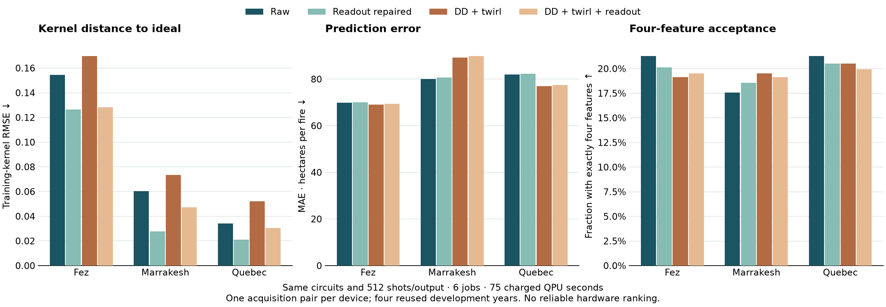

# IBM pipeline mitigation: three computers

**Six actual IBM jobs completed on Fez, Marrakesh and Quebec, using 75 charged QPU seconds total.** Each device ran the same raw and DD/twirled pipeline pair: 68 QSVR overlaps, one ten-feature QAOA/SQD circuit and four readout calibrations, all at 512 shots/output. All **438 outputs / 224,256 physical shots** are validated. Each pair charged 12 + 13 seconds, independently checked against `job.usage()`.



| Computer | Raw kernel RMSE | DD/twirl kernel RMSE | Raw QSVR MAE, ha/fire | DD/twirl MAE, ha/fire | Raw / DD turnaround |
|---|---:|---:|---:|---:|---:|
| Fez | 0.1543 | 0.1698 | 69.81 | 69.04 | 84.40 / 89.09 s |
| Marrakesh | 0.0602 | 0.0733 | 80.00 | 89.29 | 21.71 / 31.03 s |
| Quebec | 0.0341 | 0.0520 | 81.92 | 76.97 | 22.06 / 33.60 s |

Quebec produced the closest raw kernel to the noiseless reference, while Fez had the lowest prediction error in this four-year development diagnostic. **A more accurate kernel does not guarantee a better predictor.** Readout correction reduced kernel RMSE on every device/arm, yet increased QSVR MAE in every corresponding comparison. DD/twirling increased kernel RMSE on all three devices; prediction improved on Fez and Quebec, and worsened on Marrakesh. These single-pair differences establish no reliable mitigation gain or hardware winner.

## SQD selection and compiler cost

Raw / DD cardinality-four acceptance was **21.29% / 19.14%** on Fez, **17.58% / 19.53%** on Marrakesh, and **21.29% / 20.51%** on Quebec. Fez and Marrakesh selected the same raw subset with ridge MAE 92.56 ha/fire; Quebec's raw subset gave 107.26. Quebec's combined arm selected a different subset giving 49.36; it is an exploratory result on inspected development years, not a validated improvement. Corrected selection was unstable on Fez and Marrakesh, sometimes worsening ridge MAE to 484.02 and 387.21. Every condition remains in the evidence.

The actual selector compiled to **3,304 CZ gates and depth 8,424 on each device**. This generic initialization/routing is too deep to preserve ideal cardinality: most shots land outside the four-feature sector. SQD filters these outcomes and returns the minimum of the sampled diagonal objective; it does not establish optimization advantage. Same logical inputs, deterministic layout/seed, gate counts and depth do not make calibration or native gate durations identical. [Per-circuit compilation and mapping](data/mitigation_device_compilation.json) records the actual costs.

## Scope and reproduction

This is macro annual Ontario regression, with eight fixed training years and four **already-inspected development years, 2007–2010**. It never reads 2019–2024 or changes the final scientific models. The analytic reference MAE is 88.62, matched RBF 117.01 and training mean 117.43 on this cohort; this tiny diagnostic does not replace the full annual study or demonstrate quantum advantage.

Marrakesh used the personal IBM credential; Quebec used PINQ. Device, account, calibration and submission time differ, and there is one acquisition pair per computer. We did not repeat acquisitions, select a winning device, or isolate DD from twirling. Reported turnaround includes queues/service work; running status and submission API duration are separate from charged QPU seconds. Independent-qubit readout inversion is approximate and clipped quasi-probabilities add bias; this is suppression/mitigation, not logical QEC.

The owner explicitly extended the original two-job limit. After Fez spent 25 seconds, the four new jobs were capped at 23 each: worst-case cumulative reservation 117 seconds, actual cumulative usage **75 of approximately 120 seconds**. No sessions, failed-job replacements or ambiguous retries. Private intents and identifiers remain ignored.

[Matched summary and hashes](results/pipeline-mitigation-devices.json) · [Marrakesh counts/models](results/pipeline-mitigation-marrakesh.json) · [Quebec counts/models](results/pipeline-mitigation-quebec.json) · [Marrakesh plan](../experiments/annual_mitigation_marrakesh.json) · [Quebec plan](../experiments/annual_mitigation_quebec.json).

```sh
# Offline, from published evidence; no fitting or hardware calls.
uv run --no-sync python scripts/report_mitigation_devices.py
# Collect only accepted jobs; never submits.
uv run --no-sync --env-file .env python scripts/collect_mitigation_hardware.py --output results/annual-mitigation-marrakesh-v1-run
uv run --no-sync --env-file .env python scripts/collect_mitigation_hardware.py --output results/annual-mitigation-quebec-v1-run
```

## Original Fez pair

Two real **ibm_fez** jobs completed on October 6, using **25 charged QPU seconds: 12 raw + 13 suppressed**, below the owner-authorized 120-second cap. Usage comes from Runtime 0.50's `qpu_charge_time_seconds`, independently matched to `job.usage()`; it is not running wall time.

Each job returned all **73 outputs × 512 shots**, including 68 four-qubit QSVR overlaps, one ten-qubit QAOA/SQD-selection circuit and four assignment-calibration circuits. Total: **74,752 physical shots**. The second job used scheduled XpXm DD and Runtime gate/measurement twirling, four randomizations ×128 shots. Fixed layouts, preprocessing, features, parameters and development years match the [local pipeline study](PIPELINE_MITIGATION.md).

[Plan](../experiments/annual_mitigation_ibm.json) · [Actual counts, fitted models, geometry and timing](results/pipeline-mitigation-ibm.json).

| QSVR condition | Training-kernel RMSE vs ideal | Validation MAE, ha/fire |
|---|---:|---:|
| Hardware raw | 0.1543 | 69.81 |
| Raw + calibrated readout | 0.1264 | 70.05 |
| Hardware DD/twirling | 0.1698 | 69.04 |
| DD/twirling + calibrated readout | 0.1284 | 69.32 |
| Then PSD | 0.1284 | 69.32 |
| Then rank four | 0.1240 | 71.96 |

The analytic reference scores 88.62 and the matched RBF control 117.01 on this already-inspected four-year development cohort. These are exploratory comparisons, not new final results. Suppression gives a **0.77 ha/fire** difference in one paired acquisition, while moving the kernel farther from ideal; it establishes no reliable gain. Readout correction improves kernel accuracy but does not improve prediction here.

For selection, raw cardinality-four acceptance is **21.29%**, and DD/twirling gives **19.14%**. Both choose the same subset and ridge MAE **92.56**. The circuit's generic StatePreparation and routing are deep; this acquisition does not recover the ideal cardinality sector. SQD still equals the sampled diagonal minimum, not a new optimization advantage.

Independent-qubit readout inversion is approximate on hardware, especially with Runtime-managed measurement frames. Corrected selection requires clipping negative quasi-probabilities and fixed auxiliary resampling. In the combined arm it changes the selected subset and worsens MAE to **484.02**. This instability is reported, not discarded or tuned away.

Raw created-to-finished turnaround was **84.40 s**, including **82.51 s** in reported running status. Combined turnaround was **89.09 s**, with **32.32 s** running. Submission roundtrips were **1.38/12.18 s**; they include client preparation. Running status includes service work and is not charged QPU time.

The Fez plan had no replacement jobs, final-year access or logical QEC. Later Marrakesh/Quebec jobs have separate owner-authorized plans above. Raw private intents/IDs remain ignored; public evidence strips them. Two jobs do not provide replicated calibration blocks or isolate the hardware effect of DD from twirling.

```sh
# Recollect only the two existing jobs and refresh usage; never submits.
uv run --no-sync --env-file .env python scripts/collect_mitigation_hardware.py
```

The original final annual plans, six public artifacts and sixteen execution-source pins remain unchanged. The forest-feature expansion is a new development goal, not a reinterpretation of these outcomes.

