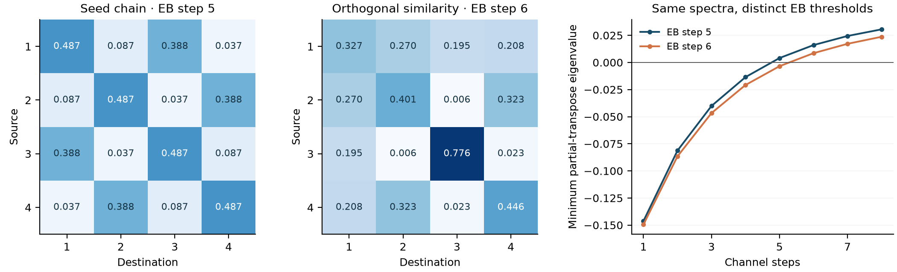

# Same spectrum, different entanglement lifetime

We constructed strictly positive, symmetric stochastic chains with identical spectra and uniform stationary distributions, but different exact entanglement-breaking indices for E = 0.6 Id + 0.4 D_P.

| Control dimension | Classical spectrum | Exact EB indices found |
| --- | --- | --- |
| 4 | 1, 0.75, 0.15, 0.05 | 5 and 6 |
| 8 | 1, 0.75, 0.15, 0.10, 0.08, 0.06, 0.04, 0.02 | 6 and 7 |



The full quantum-channel spectra also match: population eigenvalues are 0.6 + 0.4λᵢ, and every off-diagonal operator has eigenvalue 0.6. Thus neither the classical spectrum nor the complete channel spectrum alone determines the EB index in this family. This is a concrete checked counterexample, not a claim to have first discovered this general limitation.

## Exact construction

Start with P = H diag(λ) Hᵀ/n, where H is an integer Hadamard matrix. For a nonzero integer vector v with Σvᵢ = 0, construct O = I − 2vvᵀ/(vᵀv), then Q = OPOᵀ. Rational arithmetic verifies OᵀO = I, O1 = 1, exact row sums and symmetry. Reject Q if any entry is nonpositive. Orthogonal similarity preserves all eigenvalues; positivity and row sums make each accepted Q a valid Markov chain.

The four-state representative uses v proportional to (−1, 2, −3, 2). Its seed has EB index 5, and its transformed chain has EB index 6. The eight-state representative changes the index from 6 to 7. Saved endpoint certificates verify negative partial-transpose determinants at the preceding step and a separable phase-twirled product mixture at the claimed EB step, in exact rational arithmetic.

For these symmetric chains, an especially simple criterion explains the effect. B = [0.6I + 0.4P]ʳ is symmetric, and c = 0.6ʳ. PPT requires every off-diagonal Bᵢⱼ ≥ c. Also Bᵢᵢ ≥ c because the all-identity path contributes c. Consequently vᵢ = 1 satisfies the finite-phase separability construction whenever the channel is PPT. In this specific symmetric family, PPT and EB coincide; this does not make PPT a sufficient separability test for arbitrary 8 × 8 states.

Same eigenvalues can produce different smallest transition entries, changing the first step at which all pairs meet this criterion. Orthogonal similarity here mixes population coordinates; it is not a physical unitary change of basis for the entire channel. The resulting channels are not asserted to be unitarily equivalent.

## What was held fixed

All accepted controls are reversible, have stationary distribution 1/n, classical gap 0.25, population-channel gap 0.10, identical γ and identical full quantum-channel spectra. Their worst-case Euclidean population contraction is also identical: ‖Mʳ − 11ᵀ/n‖₂ = 0.9ʳ. Total-variation contraction and individual transition probabilities need not match.

The fixed-seed exploratory sweep tried 150 reflections per dimension. It accepted 37 four-state and 23 eight-state transforms; the original chain adds one baseline per dimension. All 240 excluded transforms are retained with their rejection reasons. We certify four representative endpoints, rather than presenting numerical thresholds for every accepted sample as rationally certified. This search was not preregistered.

## Connection to the fly project

The MaleCNS experiment connects classical forgetting to quantum-channel entanglement loss. These synthetic controls show why a measured change in |λ₂| alone cannot establish a change in entanglement lifetime. For the fly graph, retain transition-level and Choi evidence alongside spectral summaries. These controls do not demonstrate a new biological mechanism, quantum advantage or a replication of the full-CNS study.

Entanglement-breaking indices are an established subject; see [Lami and Giovannetti](https://arxiv.org/abs/1411.2517). The constructive Choi decomposition is described in [our certificate note](CHANNEL_CERTIFICATES.md), with its primary literature references. The application here is an audit of the spectral-to-quantum inference.

```sh
uv run python -m flybrain.isospectral_controls
```

[Saved evidence](../artifacts/isospectral-controls-20261003/) includes all attempts, four rational similarity/EB certificates and hashes. Reloaded proofs were checked against actual Qiskit SuperOp eigenvalues and composed Choi matrices. The 60-test suite and local FlyWalk run passed. No new hardware jobs were submitted.
