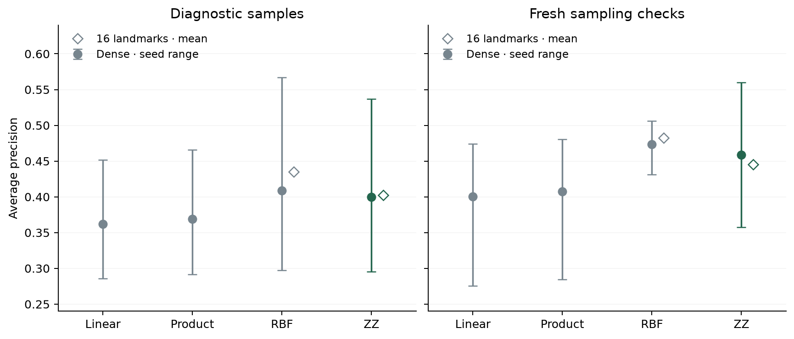

# Smooth kernel comparison

Despite the squared-error ridge objective, the fitted targets are binary fire-size labels, not hectares. No continuous-size or annual macro regression was run. [Scope correction](SCOPE_CORRECTION.md).

**Numerical adequacy and the ideal 16-landmark approximation pass; the quantum predictive comparison fails.** This separately frozen training-only study follows the [convergence audit](KERNEL_CONVERGENCE.md). It replaces hinge-loss SVM fitting with a fixed squared-error ridge objective; it does not alter the failed SVM landmark gate or the original final evaluation.

## Findings

| Kernel · mean AP | Diagnostic seeds | Fresh sampling checks |
|---|---:|---:|
| Linear · dense | .3620 | .4007 |
| Product rotation · dense | .3693 | .4073 |
| RBF · dense | .4086 | .4734 |
| ZZ · dense | .3995 | .4588 |
| RBF · 8 / 16 / 32 landmarks | .3796 / .4349 / .4251 | .3396 / .4822 / .4838 |
| ZZ · 8 / 16 / 32 landmarks | .3888 / .4027 / .4024 | .4196 / .4451 / .4514 |

ZZ-16 minus dense ZZ: diagnostic **+.0031** mean AP; fresh **−.0137**, with paired fresh differences **+.0007, −.0158, −.0259**. Both groups pass the predeclared mean/seed approximation thresholds. Dense ZZ beats linear and product controls, but loses to RBF by **.0090 / .0146** mean AP and wins only one of three samples in each group. The classical-comparison gate fails; do not promote ZZ as a predictive winner. RBF landmarks also retain useful rankings, so compression is not a uniquely quantum benefit.



All 60 dual fits and 42 available explicit-feature primal controls pass numerical checks. Independently reconstructed coefficient equations have maximum relative residual **3.34e-15** (dual), **5.85e-16** (primal), and maximum primal/dual prediction difference **6.56e-15**. Primary ZZ score standard deviations range **.160–.324**, well above the frozen 1e-5 adequacy floor. Runner **2.41 seconds / 3,072 exact-state preparations**; read-only reconstruction audit **.92 seconds / another 3,072**. No new pair circuits, shots, failed attempts, hardware jobs or final-year reads. Timing excludes interpreter startup, preflight source checks and prior acquisition. [Evidence](results/kernel-ridge.json) verifies saved coefficients as well as metrics, inputs and gates.

The original SVM ZZ-16 lost .1370 mean AP on the diagnostic cohorts; ridge retains its dense ranking. **The learning objective changed**, so this does not prove that solver tolerance alone caused the SVM loss. Together with the separate convergence audit, it shows that a small matrix approximation should be assessed through a numerically adequate learner before spending on wider circuits or more shots. The circuit count would remain 12.19× lower for a 16-landmark pairwise implementation, but this ideal ridge run does **not** validate finite-shot or device performance.

Retain ridge and shared landmarks as an implementable reference; prune claims of ZZ superiority, deeper circuits, extra shot spending and arbitrary SQD couplings. A later project can examine as-of source availability or genuinely independent years; this single-period sampling check cannot supply those guarantees.

The separately frozen [landmark shot-model check](LANDMARK_SHOT_RIDGE.md) now tests independent Binomial measurement noise without changing this ideal run. Its 4096 mean-loss gate passes, but 512 loses substantially, two of nine 4096 replicates lose >.05 AP and RBF remains stronger on mean. That is a conditional sampling-model result, not actual device or Qiskit-sampler ridge evidence.

## Protocol

[Plan](../experiments/kernel_ridge.json): 256 training / 256 validation fires per seed, 1988–2014 / 2015–2018, the same four features, robust-tanh inputs, angle scale .05 and depth-two ZZ map. Diagnostic seeds 811/821/823 reproduce the previous cohorts. Predeclared sampling checks 907/911/919 reuse the years but change the sampled fires; report the groups separately. No ridge, bandwidth, encoding or depth search.

All four dense kernels use the same bounded inputs: linear dot product, analytic product-rotation fidelity, RBF with training median-distance bandwidth and exact ZZ fidelity. Training-only centering and unit average centered variance match the kernel scale. Common nested training landmarks 8/16/32 give matched RBF/ZZ approximations using the existing .001 landmark ridge and positive-spectrum rule. The product kernel is an unentangled, classically computable control; exact four-qubit ZZ simulation is also inexpensive and is not evidence of quantum speedup.

## Fixed objective and checks

[Kernel ridge](https://scikit-learn.org/stable/modules/generated/sklearn.kernel_ridge.KernelRidge.html) is an established smooth predictor. Here targets are -1/+1; the intercept is their training mean. For centered training kernel K, fixed λ=1 and centered target t:

$$
\alpha=(K+\lambda I)^{-1}t,\qquad
\widehat y_V=K_{VX}\alpha+\overline y_{\rm train}.
$$

This minimizes **sum** squared errors plus λ times squared feature-weight norm; λ is not multiplied by sample count. Cholesky solves use double precision. For explicit feature matrices F, independently solve the primal equation and compare validation predictions:

$$
w=(F^\top F+\lambda I)^{-1}F^\top t.
$$

Numerical adequacy requires relative equation residuals ≤1e-10, primal/dual prediction differences ≤1e-9, and primary ZZ dense/16-landmark score standard deviations ≥1e-5. Scores are ranking outputs, not calibrated probabilities. Collection reconstructs inputs and verifies stored coefficients, predictions and residual equations without refitting or solving.

Approximation requires ZZ-16 mean AP loss ≤.02 versus dense ZZ and at least two of three seeds losing ≤.03, **in both seed groups**. Predictive comparison separately requires dense ZZ to gain ≥.02 mean AP against **each** linear/product/RBF control and beat RBF on at least two seeds, again in both groups. Passing approximation does not imply better prediction than classical kernels. Shared years and adaptive prior choices still limit inference; fresh sampling is not independent temporal replication.

Runner budget: 120 seconds and 3,072 exact-state preparations, with **zero new pair circuits, shots or hardware jobs**. Audit reconstruction prepares another 3,072 simulated states and reports that cost separately. Preserve exclusive intents and every condition rather than overwriting runs or selecting the most favorable method.

## Reproduction

```sh
uv run --no-sync python scripts/run_ridge_screen.py
uv run --no-sync python scripts/collect_ridge.py
```

The [retrospective source limitations](SOURCE_ASSUMPTIONS.md) remain applicable. No 2019–2024 data is used here.
