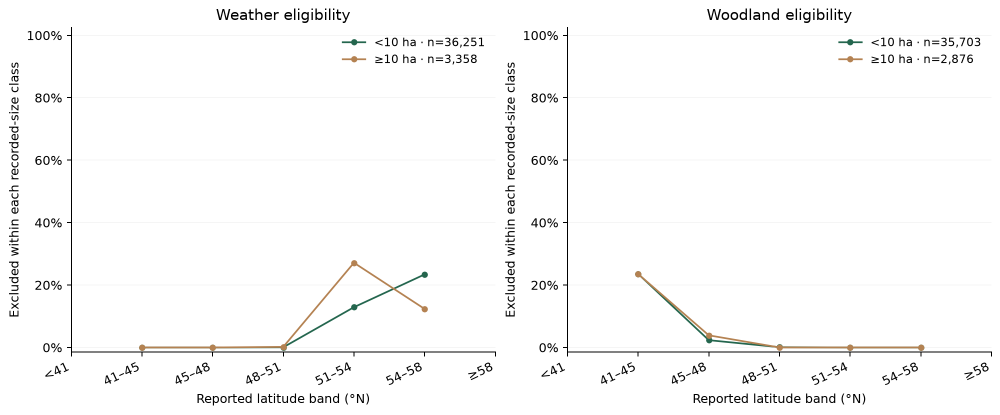

# Reported-size boundary and cohort selection

This audit describes the selected incident-classification cohort. Annual fire totals/means must be rebuilt from audited sources with macro-specific denominators rather than this weather-matched subset. [Scope correction](SCOPE_CORRECTION.md).

**Weather matching changes which fires the study represents.** The frozen target remains agency-reported size **≥10 ha**, conditional on an eligible recorded incident. This training-only audit describes the original cohorts; it changes no labels, predictors or final results.

[The committed recipe](../configs/wildfires/label_quality.json) fixes thresholds and boundary bands before collection. [Evidence](data/label_quality.json) pins source/table/recipe hashes, checks identities and labels, and records all 31 training years. No model is fitted and no 2019–2024 sizes are interpreted.

| Training cohort | Incidents | ≥10 ha | Positive fraction | Exactly 10 ha |
|---|---:|---:|---:|---:|
| Eligible NFDB | 39,609 | 3,358 | 8.48% | 255 |
| Weather matched | 38,579 | 2,876 | 7.45% | 226 |
| Fixed-cover matched | 37,801 | 2,838 | 7.51% | 220 |

Weather matching removes 1,030 incidents: **482 positives and 548 negatives**. This excludes **14.35% of eligible positives versus 1.51% of negatives**. Positives comprise 46.80% of excluded records, versus 8.48% of the original eligible cohort. The association is observed; it does not establish why particular fires lack a station within the configured distance/month constraints. Geography, fire size and reporting patterns can be related. Do not generalize the retained-cohort scores to every Ontario fire or treat exclusions as random.

The subsequent woodland coverage rule removes 778 incidents: 38 positives and 740 negatives, respectively **1.32% and 2.07%** of the weather cohort's classes. Its smaller, opposite prevalence shift does not cancel the weather selection effect. Preserve both stages rather than attribute all exclusions to cover.

## Geography of the exclusions

The [geographic recipe](../configs/wildfires/cohort_geography.json) was frozen at `4559194` before collection. It reuses the same source/cohorts, verifies identity/year/label/coordinate agreement and exactly reproduces every class-specific exclusion count above. [Aggregate evidence](data/cohort_geography.json) retains all latitude bands, including empty ones; no per-fire records are published.

| Stage | Retained median latitude | Excluded median latitude | Excluded records |
|---|---:|---:|---:|
| Weather | 48.71°N | 52.76°N | 1,030 |
| Woodland, after weather | 48.77°N | 44.75°N | 778 |

Weather exclusions occur at reported latitudes 49.667–56.049°N. In the predeclared 51–54°N band, 470/1,732 ≥10 ha records are excluded (**27.14%**), versus 527/4,085 smaller records (**12.90%**). Woodland exclusions instead span 42.253–48.593°N; in the 41–45°N band its class-specific rates are nearly equal, 24/102 versus 419/1,777. The stages remove geographically different populations.



**Training 1988–2018 only.** Left denominators are eligible NFDB incidents; right denominators are weather-matched incidents. Connecting lines guide the eye; they are not fitted trends or confidence intervals. Plotted ratios require at least ten records; all counts remain in the [evidence](data/cohort_geography.json), with [figure provenance](figures/cohort-geography.json).

These are associations in approximate reported coordinates, not verified fire locations, province boundaries or explanations of station/month availability. Bands combine years and locations. The observation does not justify inverse-probability weighting or changing the frozen model. A future study should reconsider inherited weather eligibility if weather predictors are removed, then freeze a new cohort and evaluation before fitting.

Collection took 1.99 seconds without fitting or quantum calls. Original label/final evidence and all 1,304 `data/`/`.cache/` files remain unchanged. [Fresh locked QA](data/cohort_repository_checks.json) pins 93 fixture tests/all 54 help paths to `4559194`; the earlier 90/52 receipt remains intact.

## Boundary and recording patterns

In the retained cohort, **220 records equal 10 ha exactly**: 0.58% of all incidents and **7.75% of positives**. The narrow band [9.9, 10.1) contains only those exact-10 records. The broader [9, 11) band contains 296 records: 64 below the target and 232 on/above it. Switching from ≥10 to >10 would remove 220 positives and lower prevalence to 6.93%; that is a definition contrast, **not a performed relabeling or an estimated error rate**.

The most frequent stored size is `0.100000001490000` ha (17,373 records); similarly long decimal tails occur at other small values. Exact decimal-multiple counts therefore describe stored numbers, not original measurement precision. Neither decimal digits nor repeated sizes certify uncertainty, censoring or an agency rounding policy. Five zero-size records survive the frozen nonnegative-size rule; this audit does not establish what their zero means. [Source metadata](SOURCE_ASSUMPTIONS.md) identifies agency-reported size without guaranteeing final burned area.

Annual retained positive prevalence ranges from **1.22% in 2004** (5/411) to **17.36% in 1996** (191/1,100). Different incident counts, reporting and physical conditions can contribute; this is not a causal attribution or completeness test. It reinforces reporting year-specific results and keeping class balance separate from ranking quality.

## Reproduce

```sh
uv run --no-sync python scripts/audit_label_quality.py --output .cache/wildfire/source-audits/label_quality.json
uv run --no-sync python scripts/audit_cohort_geography.py --output .cache/wildfire/source-audits/cohort_geography.json
uv run --no-sync python scripts/plot_cohort_geography.py --summary .cache/wildfire/source-audits/cohort_geography.json --output .cache/wildfire/source-audits/cohort-geography.png
```

Use the original source ZIP and exact training tables. The audits fail on changed source/table hashes, duplicate/unknown cohort identities, altered labels or non-training years; geography also checks coordinates and its immutable parent receipt. The explicit ignored output paths preserve published evidence. Threshold counts are descriptive and cannot choose a replacement target after the final opening.
