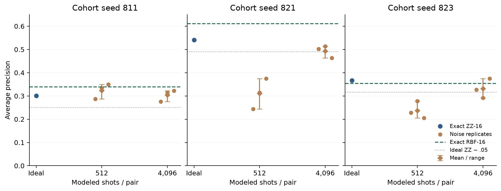

# Landmark ridge under an explicit shot model

The ridge targets here are binary incident labels, not continuous area or annual averages. Shot-cost findings are specific to this supporting branch. [Scope correction](SCOPE_CORRECTION.md).

**At 4,096 modeled shots per pair, ZZ-16 retains useful average approximation quality under ridge; at 512 shots it loses substantially. Neither condition beats matched RBF on mean AP.** Stable solves separate this measurement-model sensitivity from the earlier SVM convergence issue. This is a conditional simulation result, not a device guarantee or a causal comparison of objectives.

The [frozen plan](../experiments/landmark_shot_ridge.json), opening `b34d367`, uses the same three 256/256 training-period samples, inherited α=.05, 16 training-only landmark indices and four bounded inputs as [ideal ridge](KERNEL_RIDGE.md). Train 1988–2014, validate 2015–2018. Three fixed noise seeds at each 512/4096 count; retain all conditions. [Evidence](results/landmark-shot-ridge.json) pins the saved exact matrices, source/samples, recipes, count arrays and coefficients. No new states, final access, angle selection or hardware jobs.

## Measurement and objective

For each queried pair, draw **one aggregate count** C~Binomial(S,p), where p is its saved exact fidelity, and estimate C/S. Distinct pair counts are independent. Reuse the symmetric landmark block for its training rows and set known diagonal estimates to one. This is the ideal measurement distribution of an all-zero fidelity outcome, implemented directly with NumPy; it is **not actual FidelityQuantumKernel, Sampler or individual-shot execution**. Earlier [library](QISKIT_FOLLOWUP.md)/[landmark](QUANTUM_LANDMARKS.md) studies exercised those APIs separately.

Discard landmark eigenvalues ≤1e-10, apply fixed inverse scale 1/√(eigenvalue+.001), then share the resulting coordinates across train/validation. Center from training rows and normalize by their mean squared feature norm. This yields a joint PSD feature kernel; negative measured eigenvalues remain recorded. Predictor ridge is λ=1 with sum squared error, −1/+1 labels and the training-mean intercept. None of these settings is tuned here.

## Every cohort and noise replicate

| Cohort seed | Exact ZZ-16 AP | 512-shot AP: three noise seeds | 4096-shot AP: three noise seeds | Exact RBF-16 AP |
|---|---:|---|---|---:|
| 811 | .30100 | .28674 / .33390 / .34966 | .27592 / .31498 / .32230 | .33909 |
| 821 | .54070 | .24429 / .31404 / .37442 | .50163 / .51370 / .46354 | .61090 |
| 823 | .36626 | .22850 / .27768 / .20553 | .32723 / .29147 / .37421 | .35468 |

Noise seeds are 29/43/71 in that order. Means weight cohorts equally, then their three noise replicates equally; these are not nine independent temporal replications.

| Matched condition | Mean AP | Mean loss against ideal ZZ-16 |
|---|---:|---:|
| Exact RBF dense | .40857 | — |
| Exact RBF-16 | **.43489** | — |
| Exact ZZ dense | .39955 | — |
| Exact ZZ-16 | .40265 | — |
| Modeled ZZ-16, 512 shots | .29053 | .11213 |
| Modeled ZZ-16, 4096 shots | .37611 | .02655 |



The predeclared 4096 gate requires mean AP loss ≤.05 and at least two cohort means within .05. **It passes; all three cohort means are within tolerance**, with losses −.00340/.04775/.03529. Individual outcomes are less uniform: two of nine lose >.05, with the worst losing .07716. At 512, six of nine lose >.05 and the worst loses .29641. Occasional noisy gains are sampling outcomes, not an improved feature map. Do not hide these ranges behind the passing mean gate.

Measured landmark blocks have **5–6 negative eigenvalues at 512** and **4–6 at 4096**. Retained rank varies 10–11 / 10–12, versus 16 ideally. Raw pair RMSE falls from .01140–.01377 to .00403–.00500. Dropping negative directions and inverse scaling affect the resulting feature geometry, so lower raw RMSE alone is not an AP guarantee. All validation score standard deviations remain .1234–.1986; near-constant scores do not explain the observed losses.

Dense and landmark references reproduce the old ridge AP/ROC metrics within 1e-9. RBF-16's larger mean than dense RBF is a sample-specific approximation/regularization effect, not a new selected landmark count. The largest solve residual is 2.80e-15, with primal/dual prediction differences ≤4.67e-15. Earlier actual-sampler SVM scores use a different objective and different noise draws; their difference from this result cannot isolate a causal solver or loss effect.

## Cost and collection

Per noise condition: **8,056 independent pair estimates**, 12.19× fewer than the 98,176 dense-pair reference. A 4096-shot device realization would represent **32,997,376 shots per cohort/noise replicate**, excluding transpilation, queueing and device errors. That is still a substantial workload, even when a relative approximation gate passes.

The run records **145,008 aggregate Binomial estimates** and **334,098,432 modeled shot exposures** across all conditions. These are computational-model counts, not executed circuits or individually executed shots. Runtime is **.281s**, covering 30 dual predictor solves and 24 explicit-feature primal checks. Collection takes **.348s**, reconstructing saved counts and coefficient equations without new draws, solves or states. Recorded collection succeeds with all three operations patched to fail. Startup/opening-recipe checks and prior acquisition are excluded; source/sample reconstruction is included.

Three disposable fixtures check shared observations/diagonals/budgets, Binomial moments, reconstruction without drawing/solving and tamper rejection. Four affected pipeline fixtures pass. A collector does not independently redraw count arrays; it checks their hashes, structure and downstream equations.

```sh
uv run --no-sync python scripts/collect_shot_ridge.py
```

Keep the 4096 **conditional implementability reference**, the failed low-shot result and matched classical baselines. Prune repair/ridge/angle sweeps and hardware promotion: the current classical alternative is stronger and avoids quantum pair-shot estimation. This study improves budget interpretation, not the frozen final predictor. Preserve the exclusive `.cache/wildfire/landmark-shot-ridge` intent, all eighteen count arrays and outcome.
