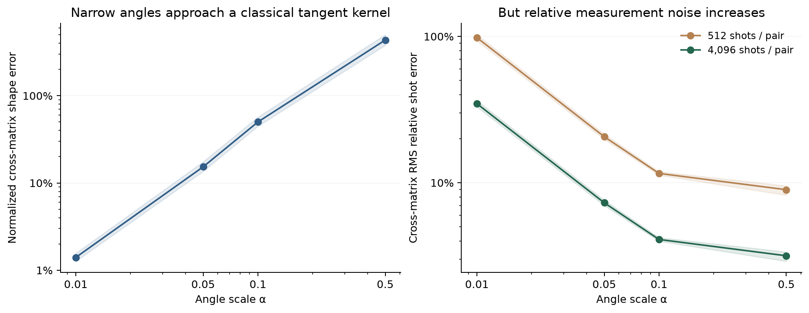

# A local classical regime of the quantum kernel

The geometry is measured on incident-derived feature samples; it is not a trained annual macro predictor or evidence of aggregate forecasting quality. [Scope correction](SCOPE_CORRECTION.md).

**At narrow angles, our centered ZZ kernel closely approaches a four-dimensional classical metric kernel while becoming harder to estimate with shots.** This explains a measured encoding/budget tradeoff; it is not a new quantum algorithm or a predictive comparison.

The [frozen plan](../experiments/local_geometry.json), opening `3f928ca`, reuses all twelve exact matrices from the [shot-budget diagnostic](SHOT_FEASIBILITY.md). Same three 256/256 training-period samples, four inputs, robust+tanh preprocessing and depth-two ZZ map. It adds only 27 anchor states, with no incident labels, new cohort states, pair circuits, shots or model fits. [Evidence](results/local-geometry.json) retains source/sample/matrix lineage and every scale.

## Derivation

Let b be the existing bounded, train-only transformed vector and θ=θ₀+παb, with θ₀=π/2 on all four coordinates. The real [quantum geometric tensor](https://qiskit-community.github.io/qiskit-algorithms/stubs/qiskit_algorithms.gradients.BaseQGT.html) removes the unobservable global-phase derivative:

$$
G_{ij}=\operatorname{Re}\left[
\langle\partial_i\psi|\partial_j\psi\rangle
-\langle\partial_i\psi|\psi\rangle\langle\psi|\partial_j\psi\rangle\right]_{\theta_0}.
$$

Our local Taylor expansion of squared fidelity gives, for fixed bounded inputs,

$$
k_\alpha(b,c)=1-\pi^2\alpha^2(b-c)^TG(b-c)+O(\alpha^3).
$$

Training centering cancels the constant and the separate quadratic norm terms. Write Xc for training vectors centered at their mean and Vc for validation vectors centered at that **same training mean**:

$$
K_c=2\pi^2\alpha^2X_cGX_c^T+O(\alpha^3),\qquad
B_c=2\pi^2\alpha^2V_cGX_c^T+O(\alpha^3).
$$

G is positive semidefinite, so these leading terms are classical linear kernels after a fixed metric transformation, with rank at most four. They are linear in **bounded transformed inputs**, not raw geographic variables. Exact training-variance normalization cancels their common α² scale. This is an asymptotic statement; it does not make the full ZZ map linear at arbitrary angles.

We estimate G numerically from central differences of exact Qiskit states, using the published definition rather than running the BaseQGT API. Steps 1e-4/1e-5/1e-6 agree: reference-to-finest relative difference **1.92e-9**. The four metric eigenvalues are **1.7415, 4.4563, 7.0960, 25.3304**. Disposable RY fixtures verify G=I/4, global-phase invariance and the centering factor of two.

## What the saved matrices show

| Angle scale | Mean normalized cross shape error | Mean raw centered cross error | Exact train variance in top four eigen-directions | Inherited 512-shot cross RMS error |
|---|---:|---:|---:|---:|
| .01 | **1.40%** | 1.78% | **99.73%** | 98.16% |
| .05 | 15.30% | 25.70% | 94.18% | 20.64% |
| .10 | 50.05% | 102.68% | 84.33% | 11.58% |
| .50 | 434.71% | 5,792.09% | 24.08% | 8.96% |

Means weight three inherited sampling conditions equally; these reuse years and are not independent temporal replications. Shape error separately normalizes exact/tangent matrices by their own training variances, while raw error retains the Taylor-predicted amplitude. Errors can exceed 100%. The top-four share measures variance, not an exact rank claim; tiny negative eigenvalue roundoff is ignored only for that share, without repairing any kernel.



At .01, cross Frobenius cosine averages **.99992**, and shape error ranges **1.27–1.57%**. This is a strong local classical approximation of the measured matrix. At the inherited .05, 15.30% mean shape error remains meaningful, so do not replace its predictor with this approximation or infer equal ranking quality. At .50 the approximation fails badly. All scales remain diagnostic; no angle is selected here.

Near unit fidelity, independent Bernoulli pair variance is p(1−p)/S. The local expansion makes this O(α²/S), so noise RMS is O(α/√S), versus O(α²) centered signal. For fixed nondegenerate cohorts, relative RMS therefore scales locally as **1/(α√S)**. The inherited .01/.05 RMS ratio at 512 shots is 4.76, near the small-angle prediction of five; wider angles leave this local regime. These estimates still exclude device errors, PSD repair and random variance normalization. Matrix resemblance/noise does not establish classifier accuracy or hardware runtime.

## Cost, collection and stopping decision

The diagnostic takes **0.14 seconds** and prepares **27 four-qubit anchor states**. Collection takes **0.26 seconds**, reconstructing metrics from the saved finite-difference vectors and rechecking matrix comparisons without new states. Both reconstruct train-only preprocessing from the original capped rows. Recorded collection succeeds with state preparation and predictive fitting patched to fail; hashes also recover the opening recipes. It does not freshly re-simulate the stored derivatives. Interpreter startup and opening-recipe checks are excluded; source/sample/matrix checks and preprocessing are included.

```sh
uv run --no-sync python scripts/collect_local_geometry.py
```

Keep this local geometric explanation and classical-control candidate. Prune global linearity and a new optimum inferred from the noise curve. The separately frozen [tangent-predictor control](TANGENT_PREDICTION.md) now measures operational closeness at .01 and its deterioration at wider scales; neither result changes a frozen model or final-test evidence. Preserve the exclusive `.cache/wildfire/local-geometry` intent, derivative vectors and original parent matrices.
