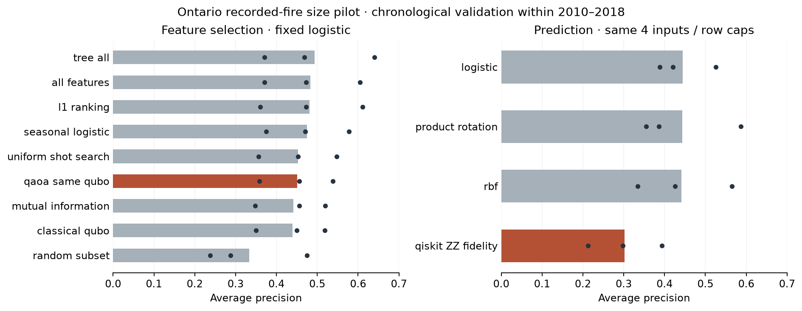

# Ontario recorded-fire size pilot

Historical supporting incident pilot. It does not implement the intended macro annual objective; the later incident test has since been opened. Statements about a sealed test below describe this pilot’s original timing. [Scope correction](SCOPE_CORRECTION.md).

Exploratory result, October 5, 2026. **No quantum advantage in the first screen.** At this pilot’s execution the 2019–2024 final test was sealed; it was subsequently evaluated by the incident branch. NFDB is now selected for the full requested 1988–2018 historical incident task; this narrower operational-feed pilot remains a separate diagnostic.

## Data and target

7,444 recorded Ontario fires in 2010–2018; 10.38% have peak reported size at least 10 ha in the frozen update snapshot. One row per identity uses its first observed date/location. Predictors contain no fire size, response or control status. Weather uses two/three-month lags and nearest stations within 150 km. Woodland uses 1 km buffers in the fixed 1988 map. At least half each buffer must have classified cover.

Approximate coordinates, sparse reporting years, censored updates and unknown weather publication dates constrain interpretation. The target is **conditional reported-size classification**, not ignition probability, verified final area or a deployable forecast. Monthly weather cannot support daily prediction. See [dataset manifest](data/operational_pilot.json).

## Frozen comparison

Three expanding folds: train 2010–2012 → validate 2013–2014; train 2010–2014 → validate 2015–2016; train 2010–2016 → validate 2017–2018. Seeds 7/19/31. Imputation, scaling and selection fit training rows only. Primary metric: average precision (AP), appropriate for the imbalanced label. Fold prevalence varies; AP is not accuracy.

Selectors choose four of twelve candidates and use logistic regression with C=1. QAOA and exact enumeration optimize the same relevance/redundancy/cardinality QUBO. Uniform search uses the same 512 bit-string draws and feasible-sample rule as QAOA. QAOA is a depth-one exact-state simulation with classical optimization and synthetic sampling. All-input and tree controls are separate from equal-budget selector comparisons.

Predictors share four fixed inputs—latitude, month sine, lag-two temperature and precipitation—and identical sampled rows: at most 256 train/512 validation. Kernel SVMs share C=1. The Qiskit map is a fixed two-layer linear-entanglement ZZ feature map; the product-rotation control has a classical analytic kernel. These are simulations, not hardware measurements.

| Equal-budget selector | Mean AP |
|---|---:|
| L1 coefficient ranking | 0.4813 |
| Uniform 512-draw search | 0.4525 |
| QAOA on same QUBO | 0.4508 |
| Mutual information | 0.4412 |
| Exact classical QUBO | 0.4394 |
| One random subset | 0.3335 |

The exact solver wins the optimization objective by construction; QAOA's mean objective gap is 0.0903. Its slightly higher AP than exact QUBO reflects the mismatch between the proxy objective and predictive quality, not a better optimizer. The equal-draw uniform control is slightly ahead of QAOA. Four-feature L1 ranking nearly matches twelve-feature logistic AP (0.4830). Full-input tree AP is 0.4932; geographic/seasonal logistic AP is 0.4743.

| Matched four-input predictor | Mean AP |
|---|---:|
| Logistic regression | 0.4446 |
| Product-rotation kernel | 0.4429 |
| Classical RBF kernel | 0.4413 |
| Qiskit ZZ fidelity kernel | 0.3016 |

The default ZZ map loses on all three fold means. On the first fold/seed its Gram effective rank is 57.35, versus 10.86 for RBF and 5.22 for product rotation. This suggests testing smoother angle scales; high rank alone is not evidence of useful representation. That is a proposed explanation, not a measured mechanism.



Bars average three folds and three seeds equally. Dots show fold means. Seeds reuse years and are not nine independent populations; no confidence or significance claim follows from this screen. Measured run times were 4.74 s for the selector matrix and 2.25 s for the capped predictor matrix on this workstation, excluding preparation/imports. Exact classical and quantum simulations are small here; these timings do not establish hardware speedup.

## Historical decisions after this pilot

These were incident-branch proposals at the pilot stage; acquisition and later studies are recorded in [findings](FINDINGS.md). They are not the current project priority. Annual macro modelling remains unrun.

- Test feature groups to determine whether lagged weather and woodland add value over geographic/seasonal structure.
- Screen matched kernel scale grids; retain strong classical baselines.
- Download 2009–2017 woodland sequentially to test prior-year context while keeping one national archive temporary.
- Validate the selected NFDB historical labels and joins before expanding to the full training period. Do not zero-fill absent incident records.

## Reproduce

```sh
uv sync --locked --group data --group analysis --group quantum
uv run --no-sync python scripts/build_operational_pilot.py
# Use the printed immutable dataset directory.
uv run --no-sync python scripts/run_pilot_screen.py selection --dataset .cache/wildfire/features/operational-pilot/ea987f7446b394bea6d4
uv run --no-sync python scripts/run_pilot_screen.py prediction --dataset .cache/wildfire/features/operational-pilot/ea987f7446b394bea6d4
```

Raw downloads and full attempt evidence remain ignored; [compact result evidence](results/operational-pilot-screen.json) includes outcome hashes, measured fold metrics and selected inputs. The mathematical kernel construction follows [Qiskit's fidelity-kernel tutorial](https://qiskit-community.github.io/qiskit-machine-learning/tutorials/03_quantum_kernel.html); the cost/mixer workflow follows [IBM's QAOA tutorial](https://quantum.cloud.ibm.com/docs/en/tutorials/quantum-approximate-optimization-algorithm). Their examples do not establish performance on these fire labels.
