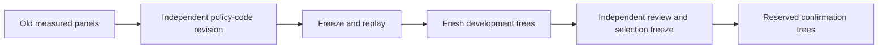

# Independently evolved experiment policy

This policy evolution searches incident-classification configurations. Its query savings do not demonstrate annual macro prediction or completion of the broader goal. [Scope correction](SCOPE_CORRECTION.md).

**A code revision kept reserved-sample predictive quality while using 43% fewer candidate queries.** This closes the gap in the earlier fixed-policy replay: an independent Codex agent wrote a new rule from old logs, we froze it, ran fresh development trees, independently reviewed the result, then froze selection before reserved confirmation.

This is a bounded adaptation of [Dream-RSI](https://arxiv.org/html/2609.14858v1). Its generator produces four fixed model/preprocessing configurations. It does not generate arbitrary architectures, evolve model weights or reproduce the paper's full discovery system.

## Protocol and lineage

The [plan](../experiments/policy_evolution.json) fixes the target, four inputs, evaluator, three-query cap and utility before fresh runs. Train 1988–2014; validate 2015–2018, with **256 training / 512 validation fires per world**. All preprocessing is fitted on training rows. Three fresh row seeds are reserved for development and three different seeds for confirmation; 2019–2024 remains untouched.

The independent `policy-agent`, configured as **gpt-6.1-sol**, reviewed six previously measured panels ending by 2014. Its [executable revision](../wildfire_lab/evolution_policy.py) was committed at `19f748d`; [provenance](../experiments/policy_evolution_provenance.json) and [offline selection](results/policy-evolution-offline.json) at `4cadf96` preceded development. The agent subsequently reviewed only fresh development scores, recommended retaining v1 without another revision, and identified a committed-evaluator-drift gap. The [selection freeze](../experiments/policy_evolution_selection.json) and fixed-component hash guard were committed at `5906f4f` before confirmation.

The common root is standard-scaled logistic regression. The original `classical_gate` probes robust/tanh RBF, then standard/tanh RBF; it also probes robust/tanh ZZ when an RBF beats the root. V1 first probes robust/tanh RBF. It stops when that improvement is at most the query charge; otherwise it probes standard/tanh RBF and stops. It omits the ZZ branch because that branch added no best AP in its permitted old development history. This omission is a search decision, not proof that quantum kernels cannot help elsewhere.

The fixed reward is

$$
J = \max_{n\in\text{revealed nodes}}\operatorname{AP}(n)-0.005q,
$$

where $q$ counts non-root candidate requests. The charge is declared utility; it is not measured runtime, hardware cost or a statistically calibrated threshold.



Policies see only their revealed tree. A requested child is generated/evaluated before its score is revealed; its actual parent is recorded. Historical panels remain flat. V1 runs first, and baseline requests reuse identical evaluator results only after choosing them. Each policy still pays its own query charge. Physical fits/states are counted once, with explicit sharing flags.

## Measured results

| Phase | Original AP | V1 AP | Original queries | V1 queries | V1−original reward |
|---|---:|---:|---:|---:|---:|
| Six old panels, replay | .330229 | .330229 | 2.500 | 1.500 | +.005000 |
| Three fresh development worlds | .478682 | .478201 | 2.667 | 1.333 | +.006185 |
| Three reserved confirmation worlds | .471666 | .471666 | 2.333 | 1.333 | +.005000 |

Development saved half the candidate requests, losing **.000482 mean AP**. One early stop missed a **.001445** rescue by standard RBF, below an extra query's .005 charge. Reward improved in all three worlds. Independent review retained the unchanged policy; the unused second-revision slot stayed unused.

Confirmation saved **42.86% of non-root queries** with identical best AP in every paired world. Including the common root, logical evaluations fall from 3.333 to 2.333, a 30% reduction. Reward improves by .005 in each reserved world. The one queried confirmation ZZ branch did not beat the observed classical best.

These are best-observed validation scores within each bounded search, not an unbiased estimate for a final deployed model. Fresh seeds resample overlapping rows from the same chronological eras. Three worlds do not support a confidence interval or independent temporal-generalization claim. Historical replay is development evidence, not independent confirmation. The declared query penalty favors savings; AP and request counts are therefore reported separately.

## Cost and audit

Development used **11 fits / 1,536 ideal quantum state preparations / .744 runner seconds**; confirmation used **10 / 768 / .555 seconds**. Combined: **21 fits, 2,304 ideal states, 1.29848 saved runner seconds**. Shared execution means these intervals do not directly measure separate policy wall-time savings. Startup, offline replay, agent reasoning, collection and QA are excluded. No pair circuits, shots or IBM jobs were executed.

The [saved-only audit](data/policy_evolution_audit.json) checks sampled row/label identities, prediction hashes and recomputed metrics, revealed-only decisions, stops, ancestry, duplicate sharing, costs, opening Git recipes and confirmation policy/evaluator inheritance. Fitting and quantum-state constructors were patched to fail during collection. All fit statuses are zero. The independent agent also audited public trees and recoverable recipes without scientific fits. [Isolated repository QA](data/policy_repository_checks.json) passes 103 fixture tests and all 55 help paths in a fresh locked environment; its current source pin is `8d6b7e9`, and the earlier 102-fixture receipt is preserved.

All **1,304 pre-existing data/cache files** retain size/mtime. Exactly six files were added under two exclusive namespaces; the final outcome and original fixed replay retain their hashes. No intent was reset and no scientific rollout was repeated. [Complete public trees](results/policy-evolution.json) · [development snapshot](results/policy-evolution-development.json).

## Reproduction

Collection requires the exact training cache, original saved intents/outcomes in both `policy-evolution-*` namespaces, unchanged offline evidence and recoverable opening Git commits. These ignored run records are not included in the public repository. With those prerequisites, collection leaves scientific outcomes unchanged; use a separate output file:

```sh
uv run --no-sync python scripts/run_policy_evolution.py collect --output /tmp/recollected-policy-evolution.json
```

For a separate replica checkout/cache, use `4cadf96` for `development`, then `5906f4f` for the frozen `confirmation`. The runner creates exclusive intents; do not rerun it against existing namespaces. The confirmation selection pins our original development outcome hash: an independently repeated development run needs its own explicit selection/provenance before confirmation, rather than relabelling its outcome as ours. Offline `replay` requires the pinned ignored original history, which public summaries do not contain. [Input reproduction](REPRODUCIBILITY.md).

Retain v1 as a narrow quality/query-cost result. Prune further revisions, candidate expansion and hardware promotion from this study. The reserved confirmation supplies no genuinely new chronological/task distribution. Before further policy evolution, complete the missing annual macro table and baseline; incident query savings do not justify deferring them.
