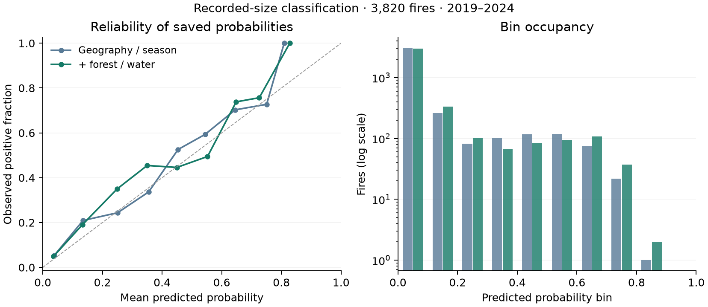

# Ranking, probability error and reliability

The annual bins summarize probabilities for individual fires. They are not predictions of yearly mean size, total burned area or counts. [Scope correction](SCOPE_CORRECTION.md).

**Forest context improves pooled ranking and Brier error, but does not improve every probability diagnostic.** This is post-final descriptive reporting from the six existing full-training classical models. No classifier, calibrator, threshold or input changes; the original final evidence remains byte-identical.

## Fixed reporting recipe

The [recipe](../configs/wildfires/probability_report.json) was committed at `82dbab3` before computing these new aggregates. Report ten uniform probability bins, [left,right), with one included in the final bin. For every model, preserve pooled and 2019–2024 annual counts, mean predicted probability, observed positive fraction, Brier error and count-weighted absolute bin gap. Empty bins remain explicit. The constant reference is the **7.5077% training positive fraction**, unchanged for every test year; it uses no test labels to set its probability.

Average precision measures ranking and differs from trapezoidal PR-AUC. Brier is mean squared probability error and mixes reliability, discrimination and outcome uncertainty; a lower score alone cannot certify better calibration. The fixed-bin gap averages absolute differences between each bin's observed fraction and mean probability, weighted by bin count. It is a binning-dependent empirical diagnostic, not an unbiased population calibration estimate. [AP definition](https://scikit-learn.org/stable/modules/generated/sklearn.metrics.average_precision_score.html) · [probability calibration](https://scikit-learn.org/stable/modules/calibration.html).

## Pooled saved probabilities

All rows predict the same **3,820 fires**, with **471 positives / 12.3298%**. The training-constant reference has Brier **.11042**.

| Inputs / model | Mean probability | Brier | Absolute bin gap |
|---|---:|---:|---:|
| Geography / season, logistic | 9.89% | .08858 | 3.08 pp |
| Geography / season, tree | 10.23% | .08124 | 2.26 pp |
| + forest, logistic | 9.91% | .08904 | 2.81 pp |
| + forest, tree | 10.06% | .08022 | 2.67 pp |
| + forest / water, logistic | 10.24% | .08723 | 2.76 pp |
| + forest / water, primary tree | **10.20%** | **.07948** | **2.44 pp** |

The primary tree reduces pooled Brier error **28.02% relative to the training constant**, but its bin gap is slightly larger than the geography tree's. All six mean probabilities underestimate the observed fraction; the primary difference is **2.1342 percentage points**. The higher held-out positive fraction and underprediction are observations, not an identified explanation involving climate, reporting changes or model failure.



The final occupied primary bin [.8,.9) contains only **two fires**, both positive; [.9,1] is empty. Its endpoint is not a reliable estimate of population behavior. The occupancy panel uses a log scale and accompanies every curve. [Figure provenance](figures/probability-report.json).

## Primary model by year

| Year | Mean probability | Observed fraction | Brier | Training-constant Brier | Absolute bin gap |
|---|---:|---:|---:|---:|---:|
| 2019 | 7.68% | 8.41% | .05921 | .07712 | 2.07 pp |
| 2020 | 9.02% | 8.80% | .06207 | .08046 | 1.86 pp |
| 2021 | 10.27% | 14.27% | .10086 | .12694 | 4.84 pp |
| 2022 | 4.78% | 5.84% | .05941 | .05526 | 3.76 pp |
| 2023 | 13.09% | 15.20% | .08430 | .13479 | 2.86 pp |
| 2024 | 12.91% | 15.59% | .07496 | .13815 | 2.71 pp |

In 2022, the primary tree loses to the unchanged training constant on Brier error. In 2020 its mean probability slightly exceeds the observed fraction; pooled underprediction does not describe every year. Keep the six years visible instead of treating pooled reliability as a deployment guarantee.

## Scope and verification

The [evidence](data/probability_report.json) retains all six models and every year's bins. Collection takes **.1356 seconds**, reproduces saved Brier scores within 1e-12 and succeeds with classifier/calibrator fitting patched to fail. Three fixtures check endpoints/empty bins/weighted totals, invalid inputs and the difference between calibration and zero prediction error. No predictive fits, quantum calls or hardware occur; all prior 1,736 production files are preserved. This collection time is separate from the existing 34 model-run outcomes.

Capped logistic/SVM decision scores are not treated as probabilities or compared on this diagnostic. No sigmoid transformation or probability fitting is introduced. Samples are temporally/spatially dependent; no independent confidence intervals or bin-count certainty are claimed. The retrospective woodland and source-coverage limits remain. Do not recalibrate on the final test, choose a threshold, change bins to favor a model or infer operational fire risk from these conditional recorded-incident probabilities.

```sh
uv run --no-sync python scripts/audit_probability_report.py
uv run --no-sync python scripts/plot_probability_report.py
```

Original final predictions, evidence and intents are read-only parents. A future calibrated model would need a separate training-period protocol and independent validation, outside this completed final opening.
