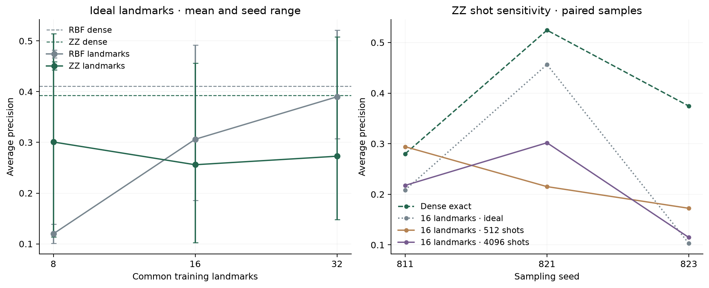

# Shared landmarks for quantum kernels

This compression study predicts individual-fire size class; it does not evaluate macro annual targets. [Scope correction](SCOPE_CORRECTION.md).

**The 16-landmark proposal failed its quality gates.** It reduces pair circuits 12.19×, but ideal and finite-shot ZZ lose substantial ranking quality under the frozen classifier settings. Retain the measured tradeoff; do not promote this configuration. Training-only, post-final exploration under [the frozen plan](../experiments/quantum_landmarks.json); the original final outcome remains unchanged. This study follows the [Qiskit library diagnostic](QISKIT_FOLLOWUP.md).

## Measured result

| Predictor | Mean average precision |
|---|---:|
| Logistic | .3530 |
| Tree | .3029 |
| Dense RBF | .4110 |
| Dense ZZ | .3930 |
| RBF · 8 / 16 / 32 ideal landmarks | .1198 / .3062 / .3899 |
| ZZ · 8 / 16 / 32 ideal landmarks | .3008 / .2560 / .2728 |
| ZZ · 16 landmarks · 512 / 4096 shots | .2272 / .2114 |

The three shared training samples contain **13/13/15 positives**, validation **27/26/24**, substantially more than the earlier 48-row pilot. Dense RBF beats dense ZZ on two of three samples. These seeds reuse one chronological fold and previously chosen inputs; the table does not establish a general model ranking.

Ideal-16 ZZ mean AP loss is **.1370**, with seed losses .0715/.0679/.2716; none passes the .03 seed tolerance. The 4096-shot mean loss is **.1816**. Query reduction passes; all three quality checks fail. Increasing ideal ZZ landmarks is not monotonic in AP. RBF-32 approaches its dense reference, but this unconfirmed condition does not change the frozen 16-landmark decision.



**137.01 seconds**, **48,336 measured local pair circuits**, **111,366,144 synthetic shots** and **1,536 cached exact-state preparations**. Per-seed Qiskit sampling takes about 11.4 seconds at 512 shots and 33.6 seconds at 4096. No failed production attempts, IBM jobs or final-year reads occurred. The runner excludes interpreter startup, initial recipe/source checks and prior acquisition. [Audited evidence](results/quantum-landmarks.json) recomputes saved prediction metrics and gates, validates committed recipes, sample/landmark indices and declared caps; it does not independently rerun all matrix diagnostics.

## What deserves investigation

For ideal ZZ-32, recorded normalized cross-matrix error is only **0.67%–1.32%** in relative Frobenius norm, yet ranking quality can change substantially. Small matrix error alone does not certify rare-event ranking stability. The measured 16-landmark blocks have 3–6 negative eigenvalues at 512 shots and 4–5 at 4096; larger shot count does not guarantee a better observed AP sample.

All kernel decision scores remain below zero; their usual SVM threshold predicts every sampled validation fire negative. Several ZZ landmark score standard deviations are below **.001**, the default SVC stopping tolerance. The completed [convergence diagnostic](KERNEL_CONVERGENCE.md) finds substantial ZZ ranking sensitivity and iteration-limited tighter fits, while RBF stays stable and equivalent landmark representations agree. This qualifies the mechanism of the AP loss without changing the failed gate. The subsequent [smooth ridge study](KERNEL_RIDGE.md) addresses the numerical objective separately; do not select a favorable tolerance. Further incident variants do not replace the required annual macro baseline.

## Frozen comparison

Use the same 256 labelled training fires and 256 validation fires per seed, train 1988–2014 / validate 2015–2018, seeds 811/821/823. Fixed inputs: latitude, longitude, water-cover fraction and seasonal sine. Fit imputation and robust scaling on training rows, then bound kernel inputs with tanh and use the existing four-qubit depth-two ZZ map, angle scale .05. Logistic and tree controls use the scaled, unbounded inputs. No test years or IBM calls.

Dense RBF and ZZ references use training-only centering and unit average centered variance. RBF bandwidth is the training median-distance heuristic. Common, nested uniform **training-only** landmarks: 8, 16 and 32. Fix SVC C=1, landmark ridge .001 and eigenvalue cutoff 1e-10. Run actual `FidelityQuantumKernel` sampling at 512 and 4096 shots only for 16 landmarks.

## Shared feature space

[Nyström approximation](https://proceedings.neurips.cc/paper/2000/file/19de10adbaa1b2ee13f77f679fa1483a-Paper.pdf) is an established method: approximate a kernel through a smaller landmark block. Here a fixed regularized positive-spectrum construction handles measured indefinite blocks. Write W=K(L,L), C=K(X,L), with eigendecomposition W=UΛUᵀ. Keep eigenvalues above the cutoff:

$$
B=U_+(\Lambda_++10^{-3}I)^{-1/2},\qquad \Phi_X=CB.
$$

Center features using the **training** mean and divide training/validation coordinates by the same square root of average training squared norm. Both train and cross kernels come from inner products in this common space:

$$
\widetilde K_{XX}=\Phi_X\Phi_X^\top,\qquad
\widetilde K_{VX}=\Phi_V\Phi_X^\top.
$$

Thus the combined train/validation Gram matrix is PSD by construction. Negative eigenvalues are discarded, not inverted. Ridge and centering are fixed for both RBF and ZZ. This differs from repairing a full training matrix while leaving the measured cross matrix untouched. The fixture checks exact full-basis reconstruction at zero ridge, joint PSD with an indefinite landmark block, validation independence and linear/precomputed classifier equivalence.

## Budget and gates

Reuse the symmetric landmark block for its training rows, with known unit diagonals. Pair circuits per shot condition:

$$
q(m)=\frac{m(m-1)}{2}+(n_{\rm train}-m+n_{\rm val})m.
$$

For n_train=n_val=256 and m=16: **8,056**, versus **98,176** for a dense reference, or 8.21% / **12.19× fewer pair circuits**. Three seeds and two shot conditions budget **48,336 actual local pair circuits** under a 50,000 cap; 600-second runner cap. Exact dense references use cached simulated states, not pairwise hardware executions. Synthetic-shot sampling cannot establish hardware time or quantum speedup.

Promotion requires all four precommitted checks: ideal-16 mean AP loss ≤.02 against dense ZZ; at least two seeds lose ≤.03; 4096-shot mean loss ≤.05; per-condition pair fraction ≤.1. These gates judge approximation to dense ZZ, **not superiority over RBF, logistic or tree**. Retain every condition and seed, even when a gate fails. No depth/bandwidth/ridge search follows a favorable sample.

## Reproduction

```sh
uv run --no-sync python scripts/run_landmark_screen.py
uv run --no-sync python scripts/collect_landmarks.py
```

The runner checks committed recipes and source hashes before creating an exclusive ignored intent. Never overwrite an existing run; collection recomputes metrics from stored predictions without fitting models. These seeds reuse the chronological period and previously chosen inputs, so this is exploratory stability/cost evidence rather than independent temporal replication.
