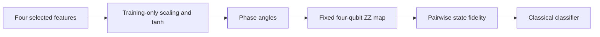

# Quantum components and compute budget

No quantum selector or kernel has been evaluated on annual macro climate/fire outcomes. The encoding below uses individual-fire feature rows. Its general utilities can be reused, but aggregate inputs, regression/count targets and matched baselines need a new frozen recipe. [Scope correction](SCOPE_CORRECTION.md).

The completed supporting incident branch tested two separate quantum components: **QAOA selects features; a fidelity kernel predicts the reported-size class.** The encoder, statistical objective, optimizer and SVM remain classical. Frozen experiments use cached Qiskit statevectors. The owner-requested [library follow-up](QISKIT_FOLLOWUP.md) also tests FidelityQuantumKernel with exact and finite-shot local samplers, SQD applicability and historical replay. No IBM jobs were submitted. Results and rejected candidates are in [FINDINGS.md](FINDINGS.md).

## Explain the encoding in 30 seconds

> We take four selected geographic, seasonal or forest features and scale them using training data. Those values become angles controlling phase gates in a four-qubit ZZ circuit. Gates coupling neighboring qubits introduce joint feature effects. We compare two resulting states by their fidelity, then give those similarities to a classical classifier. We test this against classical kernels on the same examples; the encoding has not shown a consistent predictive advantage.

This is **angle-parameterized phase encoding**: data control relative phases in superposition, with pairwise interactions in the fixed map. It does not load a 16-entry data vector directly into state amplitudes. The final map uses robust training-only scaling, `tanh` bounding, angle scale .05 and two repetitions; its parameters are data-derived, not learned quantum weights. The separately optimized QAOA selector chooses which four features enter this map.

The useful outcomes are distinct: forest context improves the full-training classical AP from .4970 to .5219; narrow-angle/shot studies explain a representation–measurement tradeoff; the capped quantum lead remains sample-sensitive. [Dream-RSI-inspired replay](QISKIT_FOLLOWUP.md#dream-rsi-scope) tests four fixed search policies over measured preprocessing/kernel panels, saving candidate queries at similar development quality. That initial replay was followed by [independent policy-code evolution](POLICY_EVOLUTION.md): a new stopping rule, fresh development and frozen reserved confirmation, retaining AP with 43% fewer candidate queries. The generator remains fixed; neither study establishes full architecture evolution or a self-improving quantum model.

## Feature selection

Choose four of eight geographic/seasonal/cover variables. Binary `b_j` records inclusion. Training-only mutual information supplies normalized relevance `r_j`; absolute Pearson correlation supplies redundancy `c_ij`:

$$
E(b)=-\frac{1}{4}\sum_jr_jb_j
+\frac{0.5}{6}\sum_{i<j}c_{ij}b_ib_j
+2\left(\sum_jb_j-4\right)^2.
$$

This objective rewards relevance, discourages redundancy and penalizes the wrong feature count. It is a surrogate; a lower value does not guarantee higher held-out average precision. Exact enumeration and QAOA solve **the same objective**, while L1 provides a different classical selector. Eight candidates yield only 70 feasible four-feature subsets, so classical enumeration is a strong control, not a scalability claim.

`wildfire_lab/selection.py` maps `b=(1-Z)/2` to a diagonal Ising Hamiltonian. `wildfire_lab/qaoa.py` alternates its cost evolution with X rotations from an initial uniform superposition. The screen fixes one layer, at most 40 classical COBYLA objective evaluations and 512 synthetic bit-string draws. [SciPy's COBYLA `maxiter`](https://docs.scipy.org/doc/scipy/reference/optimize.minimize-cobyla.html) limits function evaluations, despite its name. The final sampling-state preparation is one extra call, so completed final runs record **41 circuit evaluations per seed**, 123 total. A uniform 512-draw control uses the same feasible-sample rule. Tests match binary/Ising energies for every bitstring and verify the zero-angle circuit's uniform distribution.

The simulator evaluates the full exact-state energy expectation during optimization. Those optimizer calls are not finite-shot hardware estimates. The 512 draws describe the final synthetic subset extraction only. Report optimizer cost, feasible probability, exact-objective gap and downstream prediction separately.

The later [constrained-selector diagnostic](CONSTRAINED_SELECTION.md) crosses all-state/feasible initialization with X/XY mixing. Number-preserving XY plus feasible initialization guarantees four features in the ideal simulation, but the resulting subsets match classical feasible sampling; L1 exceeds these exact-QUBO choices in mean AP in both sampled groups. Generic preparation is explicitly costly and not a scalable hardware recipe. This known ansatz tests a constraint mechanism without changing the final selector or claiming quantum advantage.

## Prediction and encoding

Within each training fold, median imputation and standard/robust scaling fit the permitted training rows. Bound each selected coordinate with `tanh(z/2)` (or the declared clipping ablation), then use

$$
\theta_j=\pi [0.5+\alpha \tanh(z_j/2)],\qquad
k(x,y)=|\langle\phi(x)|\phi(y)\rangle|^2.
$$

The retained diagnostic uses four qubits, two repetitions, linear entanglement and `alpha=0.05`. Qiskit’s [ZZ feature map](https://quantum.cloud.ibm.com/docs/en/api/qiskit/qiskit.circuit.library.zz_feature_map) applies single-coordinate and pairwise Pauli-Z phases; its default pair map is `(pi-x)(pi-y)`. We use that library mapping without claiming it encodes a fire-physics equation. Angles/scales are classical preprocessing choices, not learned quantum weights.

`wildfire_lab/kernel.py` constructs exact states with [Statevector](https://quantum.cloud.ibm.com/docs/en/api/qiskit/qiskit.quantum_info.Statevector) and computes overlap matrices. A classical SVM consumes them. Matched RBF receives the same bounded vectors and one training-median distance bandwidth. The unentangled product-rotation control is analytic and verified against small Qiskit RY circuits. Tests check fidelity diagonals and positive semidefiniteness.

Training-only kernel centering removes the mean feature vector. Dividing by the mean centered training diagonal matches average kernel variance at fixed SVM `C=1`; cross-kernels use the same training statistics. This changes the effective kernel scale relative to the original raw-kernel screen. It is a declared matched comparison, not evidence that the chosen normalization is optimal.

The fidelity kernel also has an explicit classical feature interpretation. Define the density operator `rho(x)=|phi(x)><phi(x)|`. Direct expansion gives

$$
k(x,y)=\operatorname{Tr}[\rho(x)\rho(y)]
=\langle\operatorname{vec}\rho(x),\operatorname{vec}\rho(y)\rangle.
$$

Four qubits have 16 complex state amplitudes; Hermitian density operators span at most **256 real features**. At this width, exact simulation and density-feature dot products are tractable. More repetitions change the input-to-feature map without changing that feature-space upper bound. The independent density-operator identity check verifies the squared-overlap interpretation. A predictive difference is therefore evidence about this nonlinear feature map under the chosen controls, not evidence of speedup or a uniquely quantum learning mechanism. No fire-physics equation constrains this map.

A [local-geometric diagnostic](LOCAL_GEOMETRY.md) sharpens that classical interpretation. Around the common π/2 anchor, training-centered fidelity has a leading rank-at-most-four metric kernel in the bounded inputs. At α=.01, its separately normalized cross-matrix shape error averages 1.40%, and four eigen-directions contain 99.73% of exact training variance. The approximation deteriorates at wider angles; no predictive equivalence or new scale choice follows. This known local expansion also explains why shot noise shrinks more slowly than centered signal.

## Budget and interpretation

The separately frozen [tangent-predictor control](TANGENT_PREDICTION.md) measures that local regime: at .01, exact ZZ versus tangent mean absolute AP difference is .00960 and every prediction Spearman exceeds .998. Wider scales depart from the approximation; RBF has the highest mean AP in these three matched samples. The circuit-derived tangent metric is a useful classical control, without new states or hardware. This operational check does not select an angle or establish statistical equivalence.

For `n` training and `m` validation samples, simulation caches **n+m state preparations**, then computes overlaps classically. A naive hardware fidelity implementation needs **n(n-1)/2 + nm pair evaluations** per selected map, omitting known unit diagonals. At the retained 256/512 caps that is **163,712 pairs**, versus 768 cached preparations, before finite-shot repetition. Duplicate selected subsets reuse matrices; they are not independent runs.

These counts are different computational models. Four-qubit simulation is inexpensive and establishes no quantum speedup. Exact expectations also omit shot/device noise; a hardware implementation needs a separate accuracy and circuit-budget justification. Current evidence does not justify widening the circuit or submitting a large kernel matrix. An explicitly authorized hardware check should use a small selected set, not repeat the full screen.

The crossed matrix fits selection on the **same capped labelled rows** as prediction. Earlier full-training selection followed by a capped predictor is a different label budget. Fresh sample seeds rejected the first small ZZ lead. The [single frozen final evaluation](FINAL_EVALUATION.md) shows a small seed-sensitive ZZ lead and remains separate from adaptive tuning; no further model choices use its test scores.

Subsequent training-only diagnostics add a numerical constraint: [ZZ SVM rankings can depend on solver tolerance](KERNEL_CONVERGENCE.md), while a [fixed kernel-ridge solve](KERNEL_RIDGE.md) passes reconstructed coefficient/residual checks. Six sampling cohorts retain useful ideal 16-landmark ZZ rankings under ridge, but dense RBF remains stronger on average in both seed groups. This changes the objective rather than retroactively repairing the frozen final SVM; it supports a feasible compression reference, not quantum advantage. A later [independent Binomial measurement-model check](LANDMARK_SHOT_RIDGE.md) passes the fixed mean approximation gate at 4096, with two of nine individual replicates still losing >.05 AP, while 512 loses substantially. RBF remains stronger on mean AP. This explicitly modeled sampling result does not establish actual-sampler or device ridge performance.

A labels-free [shot-budget derivation](SHOT_FEASIBILITY.md) quantifies another constraint: narrower angles reduce centered signal, amplifying relative estimation error. At the inherited α=.05, dense cross-matrix RMS relative error averages 20.64% at 512 shots and 7.30% at 4096; at α=.01 it is 98.16% and 34.71%. Independent sampling, noisy training means and fixed exact variance normalization are explicit. These are matrix-error estimates, not classifier accuracy, landmark guarantees or actual hardware requirements.
