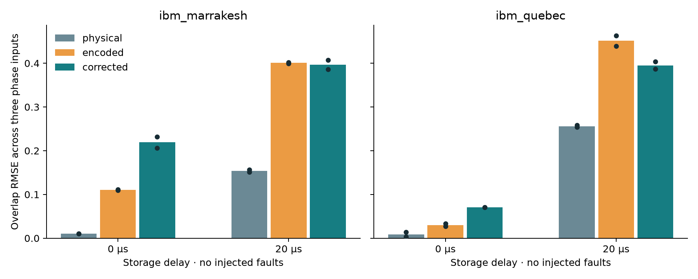

# Restricted repetition-code overlap benchmark

The October 7 hardware extension tests the deferred logical microkernel from [the error study](QSVR_QEC_ERROR_STUDY.md), using IBM Marrakesh and Quebec. This is a quantum-overlap diagnostic connected to QSVR kernels, not a retrained wildfire predictor.

## Task and controls

Prepare a phase state, then estimate its overlap with the zero-phase state:

$$k(\delta)=\cos^2(\delta/2).$$

The encoded circuit prepares $(|000\rangle+|111\rangle)/\sqrt2$, applies $R_Z(\delta)$ to one data qubit, extracts two parity checks, conditionally corrects one bit flip, decodes and measures **all three data qubits**. The all-zero frequency is the encoded overlap; reading only the first decoded qubit would ignore leakage outside the code subspace. The dynamic arm uses five physical qubits: three data and two syndrome ancillas.

Compare unencoded, encoded without correction and encoded with one dynamic correction round. Inputs are $\delta=0,\pi/4,\pi/2$; storage delays are 0 or 20 microseconds. Fault controls are none, each single-data-qubit X, and Z on data zero. Each device gets two blocks of 90 circuits, 4,096 shots each: four jobs and 1,474,560 planned shots. Block repetition samples shot/short-term variation; it is not independent calibration-day replication. Report extra depth, gates and charged time rather than claiming equal gate costs.

A physical X after phase encoding leaves this particular overlap probability unchanged. Therefore X-injection cells diagnose recovery from **encoded leakage**, not a generic advantage over the unencoded kernel. The no-injection idle cells address whether the overhead helps under actual device noise. Z is an explicit failure control: repetition coding does not correct phase errors. This restricted logical RZ construction does not implement the full ZZ feature map or fault-tolerant QSVR.

## Execution and evidence

[Frozen plan](../experiments/repetition_microkernel.json) · [circuits](../wildfire_lab/repetition_kernel.py) · [acquisition](../wildfire_lab/repetition_hardware.py).

```sh
uv run --no-sync python -m unittest tests.test_repetition_kernel -v
uv run --no-sync --env-file .env python scripts/run_repetition_microkernel.py collect
```

Local exact-state tests verify the single-X correction mapping, no-fault overlap and uncorrected phase-flip response. Device-native circuits have been prepared on both requested devices. All four blocks are collected and validated: 90 circuits per block, 4,096 returned shots per circuit, 1,474,560 shots total. Private intents, identifiers and acquisition metrics stay under ignored `results/repetition-microkernel-v1`; submission is exclusive per block and ambiguous submissions are never retried.

The public report will include every cell/block, overlap errors and shot uncertainty, syndrome frequencies, compiled resources and charged time. Neither postselection nor new predictive fitting is part of this study; 2019–2024 data are not read.

Method reference: [IBM repetition-code tutorial](https://quantum.cloud.ibm.com/docs/en/tutorials/repetition-codes). The tutorial teaches dynamic correction of bit flips; this extension tests coherent phase-overlap readout rather than only classical basis-state memory.

## Completed hardware results

Marrakesh returns 737,280 shots and consumes 208 charged QPU seconds; Quebec returns 737,280 shots and consumes 206 seconds. Total charged usage is 414 seconds (6 minutes 54 seconds). No injected fault, overlap RMSE across three phases:

| Device / delay | Physical (blocks 0 / 1) | Encoded | Dynamically corrected |
|---|---:|---:|---:|
| Marrakesh / 0 μs | 0.0105 / 0.0099 | 0.1118 / 0.1095 | 0.2321 / 0.2064 |
| Marrakesh / 20 μs | 0.1516 / 0.1566 | 0.3995 / 0.4023 | 0.3860 / 0.4071 |
| Quebec / 0 μs | 0.0142 / 0.0034 | 0.0332 / 0.0270 | 0.0708 / 0.0710 |
| Quebec / 20 μs | 0.2541 / 0.2580 | 0.4635 / 0.4394 | 0.4037 / 0.3869 |

Conditional correction reduces injected-single-X overlap error relative to the uncorrected encoded arm. Neither encoded arm beats the physical overlap on any no-fault device/block/delay cell. Quebec correction improves delayed overlap relative to uncorrected encoding in both blocks, while Marrakesh improves in one of two blocks. At zero delay, correction worsens encoding on both devices. This is evidence of mechanism recovery with substantial overhead, not a predictive improvement. Z remains uncorrected. Two adjacent blocks do not resolve calibration stability.

[Every measured cell, raw overlap and syndrome counts, resources and usage](results/repetition-microkernel.json). All four measured blocks are included. Device differences are descriptive: different native compilation, layout and calibration times prevent attributing them to processor architecture alone.


