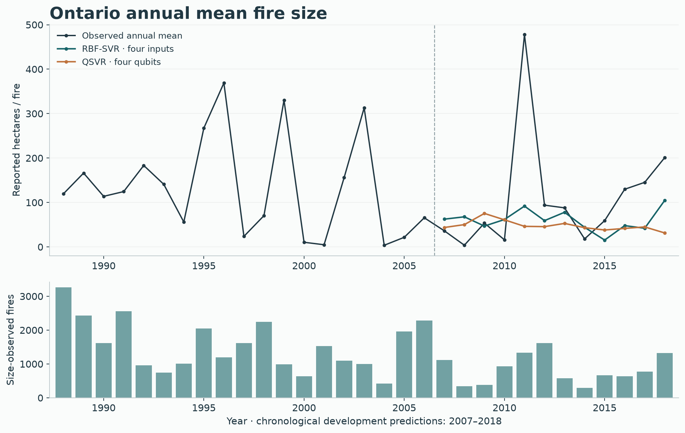
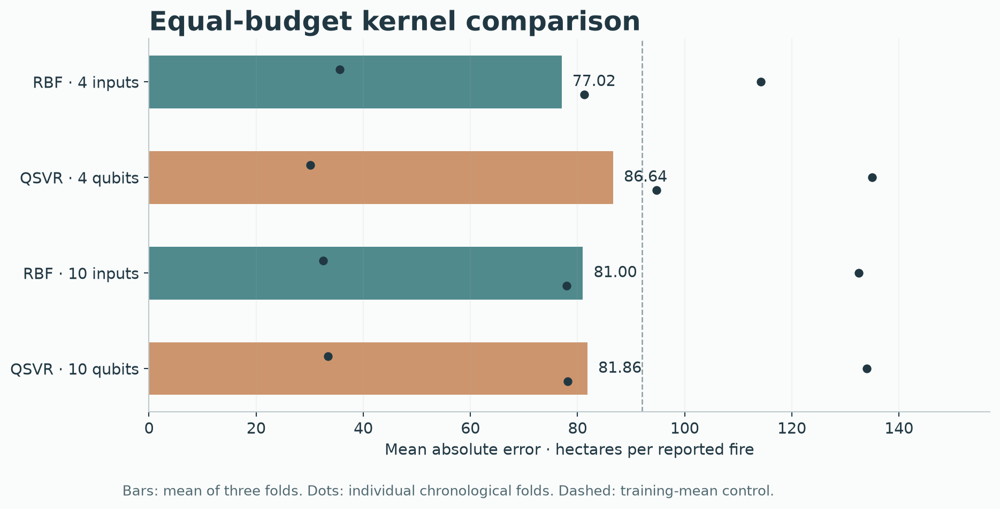
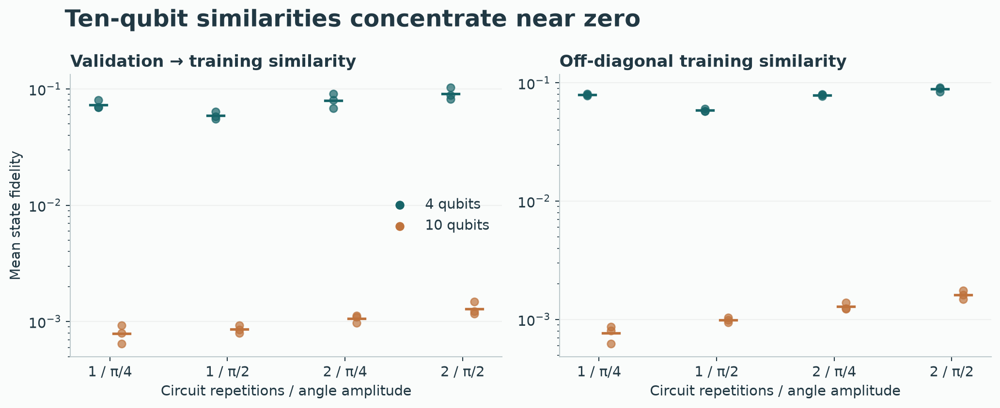

# Ontario annual wildfire regression

Development findings · October 5, 2026 · Qiskit Fall Fest open challenge. The owner-authorized goal continues through **5 PM Toronto**. Final **2019–2024 reused-year evaluation is pending**; this report currently covers 1988–2018 only.

**Classical RBF-SVR leads the matched annual comparison. Ten-qubit fidelities concentrate near zero, and climate coverage changes errors substantially.** Quantum feature selection reaches useful subsets but does not beat simpler sampling controls. The contribution is an audited macro dataset and a fair, reproducible comparison, not a quantum advantage claim.

## Question and observation unit

Can classical or quantum selection and kernels estimate **Ontario annual mean agency-reported fire size**, in hectares per size-observed incident? Each province-year is one observation: **31 training years, 1988–2018**. Mean size, total reported hectares and incident count are distinct quantities. This study predicts the annual mean; it is neither individual-fire classification nor ignition forecasting.

The source-specific annual rules retain incidents without precise daily dates, coordinates or nearby weather stations. They include **39,616 size-observed NFDB Ontario fires**, compared with 37,801 in the geographically selected older classifier cohort. Unknown/negative size is excluded from the size denominator rather than recorded as zero. Source coverage does not establish a complete census or final burned area. [Annual table](data/annual_training.csv) · [schema](DATA_SCHEMA.md) · [source rules and plan](../experiments/annual_qsvr.json).

ECCC station-month data supply ten climate summaries. Annual mean temperature needs at least nine measured months; annual totals/extremes need twelve; spring/summer summaries need all three months. Eligible station-years receive equal weight. All ten predictors exist for every training year, but station counts vary **65–340**, depending on feature/year. Equal station weighting is not provincial area weighting. Same-year full climate gives **retrospective annual estimation**, not an advance forecast.

## Design

Outer chronological validation blocks are 2007–2010, 2011–2014 and 2015–2018, each preceded by an expanding training window. Three expanding inner splits choose parameters. Every fit estimates its imputer, input standardization and log1p target standardization from its training window only. Predictions are inverse-transformed to nonnegative hectares. Reported MAE/RMSE are mean outer-fold errors; twelve development years are reused across comparisons, not independent replications.

Baselines include training mean/median, a year trend, ridge, linear SVR and RBF-SVR. The matched kernel comparison gives **36 candidate configurations per family, input width and outer fold**, selected by inner MAE: RBF bandwidth multipliers .25/1/4/16 or four quantum maps, each crossed with C=.1/1/10 and epsilon=.05/.2/.5. Epsilon is tolerance in standardized log-target space; it is not a hardware-noise correction.

The actual [FidelityQuantumKernel API](https://qiskit-community.github.io/qiskit-machine-learning/stubs/qiskit_machine_learning.kernels.FidelityQuantumKernel.html) computes state overlaps. Cached matrices feed actual [QSVR](https://qiskit-community.github.io/qiskit-machine-learning/stubs/qiskit_machine_learning.algorithms.QSVR.html), whose solver extends classical SVR; a fixture verifies equivalence to sklearn precomputed SVR.

For a training-standardized climate feature $z_j$, encode

$$\theta_j=a\tanh(z_j/2),\qquad k_q(x,y)=|\langle\phi(x)|\phi(y)\rangle|^2.$$

A four- or ten-qubit linear ZZ feature map uses single-feature and pairwise phase terms, with one/two repetitions and amplitude $a\in\{\pi/4,\pi/2\}$. Entangling gates enable circuit interactions; they do not guarantee useful meteorological interactions or better prediction. Exact local compute-uncompute simulation is the reference. No hardware was used.

## Matched development results

| Model | Inputs | MAE (ha/fire) | RMSE (ha/fire) |
|---|---:|---:|---:|
| Training mean | 0 | 92.00 | 116.05 |
| Linear year trend | 0 | 88.91 | 120.62 |
| Ridge, tuned | 10 | 81.21 | 116.85 |
| Matched RBF-SVR | 4 | **77.02** | **106.74** |
| Matched QSVR | 4 | 86.64 | 120.30 |
| Matched RBF-SVR | 10 | 81.00 | 115.26 |
| Matched QSVR | 10 | 81.86 | 115.39 |

The apparent best individual four-qubit map (74.57 MAE) is not a fair selected-family result. Inner validation selects another map; the equal-budget result favors RBF. Four-qubit QSVR wins the first outer fold and loses two; ten-qubit QSVR loses all three by small margins. The bandwidth refinement followed initial development inspection, so it is adaptive development, not independent confirmation. [All initial maps](ANNUAL_QSVR.md) · [matched receipt](results/annual-matched.json).

Both families miss the exceptionally large 2011 mean. Annual provincial summaries and log-target regression smooth a highly variable response. Low average error cannot be presented as reliable extreme-fire prediction.

## Selection and SQD

Eight selectors use one fixed ridge predictor, common annual training windows and three sensitivity seeds. Except the explicit all-ten control, each selects four inputs. Continuous-target mutual information supplies relevance; absolute correlations supply redundancy. The QUBO penalizes incorrect cardinality. [Plan](../experiments/annual_selectors.json) · [complete results](results/annual-selectors.json).

| Selector | Mean fold/seed MAE (ha/fire) |
|---|---:|
| Exact classical QUBO | 79.58 |
| Uniform bitstring sampling | 80.31 |
| QAOA sampling | 81.66 |
| Mutual-information ranking | 82.79 |
| Lasso ranking | 89.22 |
| Physical four | 89.78 |
| Random four | 90.61 |
| All ten | 102.00 |

This table compares selectors with **fixed ridge alpha=1**, not tuned kernels. QAOA uses depth one, 40 optimizer evaluations and 512 synthetic draws per fold/seed. All optimizers reach their bounded evaluation cap; no convergence is claimed. Uniform sampling has a slightly worse surrogate-energy gap than QAOA but lower prediction error. Better surrogate optimization does not ensure better regression.

Actual qiskit-addon-sqd projection and diagonalization recover the best sampled energy to numerical precision. This objective is diagonal, with only **210 feasible four-of-ten subsets**. SQD therefore adds no optimization beyond choosing the lowest-cost sampled subset; exhaustive classical enumeration is the natural control. We retain the demonstration and prune SQD advantage claims.

## What the ablations teach

| Fixed four-input climate condition | Ridge MAE | RBF MAE | QSVR MAE |
|---|---:|---:|---:|
| Same-year measured-month control | 89.78 | 85.19 | 90.39 |
| Same-year zero missing-day counts | 79.56 | 76.52 | 79.62 |
| Previous-year climate | 88.18 | 89.76 | 82.51 |
| Training-only station roster | 84.62 | 85.56 | 83.48 |

Data quality changes errors more than the matched ten-qubit/classical difference. Zero missing-day counts improve all three fixed models; unknown counts remain excluded. This is a sensitivity, not complete source certification. Prior-year inputs address a different horizon, while source publication latency remains unresolved. We retain the original same-year recipe for the primary comparison. [Context receipt](results/annual-context.json).

A fixed official Ontario boundary now masks NRCan previous-year land-cover maps for all training years. The 1 km equal-area estimate includes water/other classified classes and explicitly excludes unclassified/nodata cells. A 500 m probe changes treed/water fractions by less than .03 percentage points, with no uncovered province cells. This is coarse sampled class area, not exhaustive 30 m area, tree density or biomass. Historical temporal processing remains retrospective. [Woodland table](data/annual_training_cover.csv) · [boundary source](https://geo.statcan.gc.ca/geo_wa/rest/services/2021/Digital_boundary_files/MapServer/0) · [woodland receipt](results/annual-woodland.json).

Adding mapped treed fraction worsens fixed ridge/RBF error (98.50/94.29 versus 89.78/85.19). Fixed QSVR improves to 84.59, but adding calendar year alone gives 85.51 and both additions use five qubits. This does not establish a forest-specific gain; do not promote the lowest-looking ablation.

Across outer maps, mean validation/training fidelity is **.07576 at four qubits versus .001002 at ten**. Ten-qubit training matrices are nearly identity, with effective rank essentially equal to the training count. This measured loss of cross-year similarity explains the nearly unchanged ten-qubit predictions; more qubits do not automatically add useful information.

## Cost, verification and remaining evaluation

Four/ten-qubit development screens took **10.58/193.17 s**, running concurrently; these are not isolated throughput benchmarks. Classical preparation/fitting took .89/.29 s, matched classical exploration .45 s, selectors 2.41 s, context checks 4.05 s and province-cover processing/ablation 316.02 s. Interpreter startup/acquisition and QA refits are separate costs. All quantum measurements were simulated.

The [annual evidence audit](results/annual-evidence-audit.json) reproduces the table byte-for-byte, checks 171 metric records and replays 18 classical/24 cached-QSVR fits without new quantum states. The first collector required a correction to use each runner's exact float input path; its failed record remains preserved. Current repository verification at `9c40214` passed **130 tests / 64 CLI help paths**; later changes will receive updated checks.

Four bounded annual follow-up plans are complete: matched bandwidth budgets, continuous-target selectors, climate context, and province-masked woodland. We prune extra architecture search. This is a proposal/evaluate/prune workflow, not full Dream-RSI policy evolution. The earlier independent policy-code study concerns the incident branch only.

The remaining task is to freeze final regression and selection/prediction crossover recipes, evaluate **six reused years**, then publish the final report and presentation outline by 5 PM. Test reuse, small annual sample, network/reporting changes, retrospective sources, extreme-year error and ideal simulation remain explicit limitations.

[Run commands and detailed evidence](ANNUAL_QSVR.md) · [current goal](../GOAL.md) · [earlier scope correction](SCOPE_CORRECTION.md) · [preserved incident findings](FINAL_EVALUATION.md).
