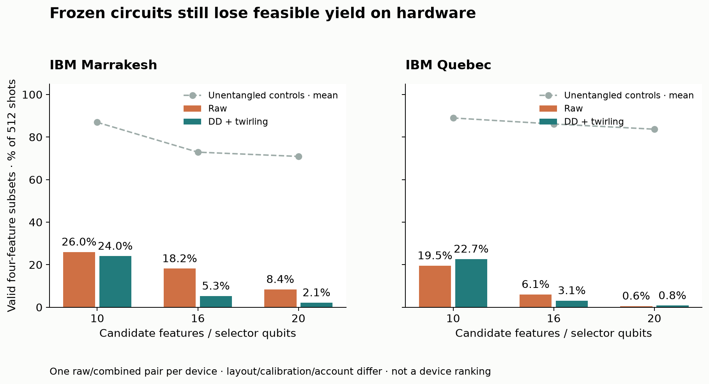
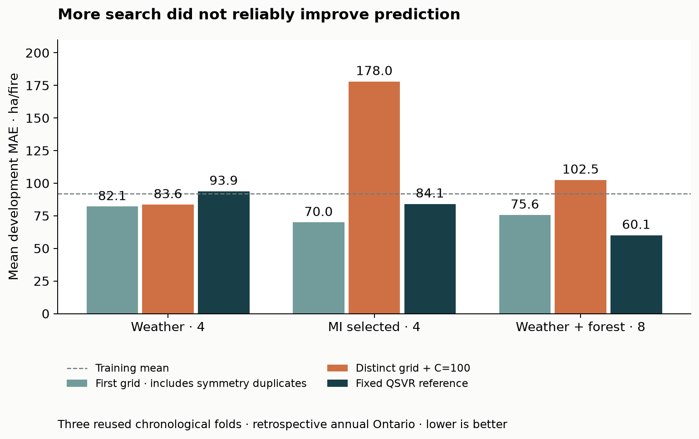

# Comprehensive research: findings in progress

**Comprehensive followup complete, with explicit pruning.** The owner reopened the remaining research after the fixed forest/hardware benchmark. [Coverage](RESEARCH_COVERAGE.md) distinguishes completed measurements from outstanding tasks. Original2019–2024 results remain unchanged. All new results below use previously inspected1988–2018 annual Ontario development folds and retrospective forest reconstruction.

## First new measurements

### Expanded-model nested tuning

The [frozen plan](../experiments/expanded_tuning.json) searches648 QSVR settings,648 RBF settings and13 ridge settings within each of nine outer fold/panel combinations. Three chronological inner splits refit median imputation, scaling, target transformation and any MI feature selection. Choose by pooled inner MAE; evaluate the chosen model on the subsequent four outer years. Outer errors never select the configuration.

There are **35,379 fits**,31,590 counted statevector constructions and24 labels-free circuit-family parity checks against actual `FidelityQuantumKernel` compute–uncompute. Elapsed local execution:23.13 seconds. These are classically simulated quantum kernels, not hardware measurements. The optimized evaluator implements the same squared-overlap kernel and retains its state cache; see [Qiskit documentation](https://qiskit-community.github.io/qiskit-machine-learning/stubs/qiskit_machine_learning.kernels.FidelityStatevectorKernel.html).

Mean outer MAE, hectares per recorded fire:

| Inputs | Tuned ridge | Tuned RBF | Tuned QSVR | Fixed QSVR |
|---|---:|---:|---:|---:|
| Weather4 |91.32|76.92|82.13|93.89|
| Inner-fold MI4 from20 candidates |82.71|82.90|69.95|84.15|
| Interleaved weather/forest8 |84.85|83.31|75.65|60.12|

Training-mean baseline:92.00. The MI4 QSVR aggregate lead is exploratory: its fold MAEs are25.81,145.43 and38.62, versus RBF32.86,135.98 and79.86. It wins two folds and loses the middle fold. There are only three reused outer folds, not new independent climate realizations. Tuning improves some panels and worsens the previously promising fixed eight-feature panel. Neither result implies quantum advantage or operational forecasting.

**Search-design limitation found in review:** canonical versus reversed ordering is a graph automorphism for all three tested topologies (product, chain, ring). Those entries repeat the same ideal fidelity geometry, apart from floating-point differences. A numerical parity test now checks this explicitly. The648-versus648 comparison matches submitted candidate/fit counts; it does not match distinct kernel geometries. Do not advertise72 independent circuit architectures. Product maps also serve as an unentangled control, not evidence that entanglement is required.

**Follow-up measured:** the distinct-geometry extension below retains this first search and its limitation; it does not replace either the original recipe or final results.

### Deeper multi-start QAOA

The [new selector plan](../experiments/selector_multistart.json) ran three declared starts at depths1–4 across three10/16/20-candidate pools and three folds: **108 searches,30,011 objective evaluations,189 fixed downstream fits and1,152,000 classical sampling draws**, in48.19 seconds. Four searches report convergence;104 do not. The training expected objective chooses starts, with no validation-based choice.

Optimum hits with1,024 samples, pooled across20 sampling seeds and three folds:

| Pool | Uniform | Optimized p1 | p2 | p3 | p4 |
|---|---:|---:|---:|---:|---:|
|10 |60/60|60/60|60/60|60/60|60/60|
|16 |26/60|56/60|56/60|50/60|55/60|
|20 |10/60|60/60|60/60|59/60|60/60|

Additional search improves the objective's sampled coverage, but depth is not monotonically helpful. With20 candidates, uniform selection's fixed QSVR mean MAE is75.74; every optimized depth gives85.35. With10 candidates, uniform already finds the optimum in every replicate. An objective optimized for marginal MI and redundancy is not the prediction loss. The objective-weight ablation below tests this concern; optimum hit rate alone is not a quantum predictive benefit.

The Monte Carlo replicates share the same climate folds; they are not independent predictive replications. All optimization is exact classical sector simulation, with full feasible-objective access. Addon SQD checks the diagonal sampled subspace, whose smallest eigenvalue equals the best observed cost. It does not discover an unsampled subset. This new study has **no hardware jobs**; earlier deep-preparation device failures remain in [the hardware report](SELECTOR_HARDWARE.md).

## Evidence and replay

[Tuning resources and fold scores](results/expanded-tuning.json) · [Selector resources and sampling scores](results/selector-multistart.json). Their ZIP bundles contain the full frozen recipes, code/version hashes, traces, counts, selected matrices and prediction coefficients. Offline replay verifies189 selector prediction equations and30,011 trace-record counts; it also verifies11,781 nested candidate-score records and36 selected regression equations. It does not resimulate every optimizer trace or refit the35,379 training models.

```sh
uv run python scripts/collect_search.py expanded-tuning
uv run python scripts/collect_search.py selector-multistart
```

These commands fit no models, simulate no states, draw no samples, submit no jobs and need no credentials or private source caches. Producer commands live in each plan's pinned revision; use a new output namespace for any explicitly declared replication.

## Follow-up measurements

### Distinct geometry and a wider solver range

[Plan](../experiments/expanded_tuning_distinct.json) · [Evidence](results/expanded-tuning-distinct.json). The new grid uses60 maps, canonical/interleaved chain or ring connectivity, and a product-map control without duplicate permutations. A labels-free seven-point check distinguishes all60 geometries at four/eight inputs; it is not a universal expressivity proof. With $C=0.1,1,10,100$ and three epsilon values, each quantum/classical panel receives720 candidates. Execution used39,267 fits and27,258 state constructions in24.87 seconds.

| Inputs | Ridge | RBF | QSVR | Fixed QSVR |
|---|---:|---:|---:|---:|
| Weather4 |91.32|98.87|83.62|93.89|
| Fold-local MI4 |82.71|83.83|178.02|84.15|
| Weather/forest8 |84.85|86.36|102.48|60.12|

Seven of nine selected quantum configurations reach $C=100$. The MI panel misses the last development fold badly (368.37 ha/fire MAE). More tuning did not reliably improve prediction; extending $C$ again is pruned because this tiny annual dataset gives unstable selection, not because another boundary value guarantees benefit. Keep both grids visible. Do not cherry-pick their better scores or call reused development an independent test.

### Selection objective alignment

[Plan](../experiments/objective_alignment.json) · [Evidence](results/objective-alignment.json). Four redundancy weights are selected inside chronological training splits using separate ridge/RBF proxies. Execution used432 fits,12,960 bounded optimizer calls and368,640 classical draws in34.26 seconds. Zero redundancy was frequently selected. On20 candidates, fixed QSVR MAE is84.15 for MI,89.25 for random,85.35 for the original exact objective,84.58 for ridge-proxy selection and82.63 for RBF-proxy selection. These small reused-fold differences do not establish a robust winner. Exact enumeration and the sampled quantum objective select the same representative subsets here. SQD on this diagonal objective is the best observed state, not a way to invent an unsampled feature set.

### Preparation and actual hardware exploration

[Local plan](../experiments/shallow_preparation.json) · [Local evidence](results/shallow-preparation.json) · [Hardware plan](../experiments/shallow_hardware_search.json). Random feasible and MI-informed basis starts remove the first cost phase, which is only global on a single basis state. The54 local searches use6,218 optimizer calls and216 fixed prediction fits,29.35 seconds. Their support and classical initialization differ from a uniform Dicke start; one-layer mixing has no cost unitary.

Native Marrakesh compilation reduces20-pool CZ gates from4,860 to1,237 and depth from8,566 to about998. Initialization, ancillas, optimization and routing also change; this is not a controlled speedup comparison.

**Three real raw IBM jobs completed:39,936 shots,18 charged QPU seconds.** Hardware choices use unconditional full penalized training-QUBO expectation, including invalid-cardinality shots. The chosen10-pool circuit finds the exact objective optimum with125/512 feasible shots. The16-pool choice has83/512 feasible shots and objective gap0.04764; the20-pool choice has52/512 feasible shots and gap0.15375. Noise remains material after shallower preparation. Freeze these choices before the separately planned raw/combined-DD confirmation on Marrakesh and Quebec. The exploration winners have selection bias; no downstream benefit follows from these numbers.

### Time/station controls and source integrity

[Control plan](../experiments/expanded_proxy_controls.json) · [Evidence](results/expanded-proxy-controls.json). The same nested720/720 grid across five panels uses65,445 fits and50,322 state constructions in45.53 seconds. Station-count-only QSVR MAE83.08 and calendar-only88.61 compare with training mean92.00. Adding station counts to weather gives87.08; adding calendar gives101.36; adding zero columns gives89.29. Weather/calendar ridge gives67.97. These controls show that a development lead can reflect coverage or time structure; they do not isolate a causal confound or prove meteorological skill. Station counts measure eligible reporting coverage, not weather itself.

[Independent decode receipt](data/forest_decode_spot_verification.json) checks12 source rasters,36 cached tiles and2,328,320 pixels against a separate zlib/NumPy decoder: zero differences, zero network calls. This independently checks numeric decoding, including signed/nodata cases, while sharing the TIFF metadata parser and ROI transform. It is not a fresh geospatial/mask audit or a full42-array verification. Source-date gaps, retrospective reconstruction and excluded unadvertised age resampling remain in the forest report.

## Real-device confirmation and measured prediction

[Exploration](results/shallow-hardware-search.json) · [Marrakesh confirmation](results/basis-confirmation-marrakesh.json) · [Quebec confirmation](results/basis-confirmation-quebec.json) · [Tuned measured kernels](results/tuned-kernel-hardware.json). These are actual returned counts; simulator outcomes are reported separately above.

Each frozen selector configuration has512 shots per arm. Feasible counts are:

| Pool | Marrakesh raw | Marrakesh DD/twirl | Quebec raw | Quebec DD/twirl |
|---|---:|---:|---:|---:|
|10 |133|123|100|116|
|16 |93|27|31|16|
|20 |43|11|3|4|

The10-pool Marrakesh combined arm samples the exact objective optimum, while its raw arm does not. Larger pools still lose feasible yield. Unentangled random/MI controls return much higher valid fractions. Routing, device calibration, time and account differ; one pair per device cannot establish a device ranking or an isolated DD effect. Readout reconstruction only reweights observed feasible states; it cannot create SQD candidates. This is noise mitigation, not logical error correction.



The tuned-kernel stage freezes two four-input panels before acquisition: the20-pool exploration subset and a MI reference. It uses19 training years, four reused development years,8,724 local training fits,720 quantum/720 classical candidates per panel,534 PUBs per arm at128 shots. Quantum map and C/epsilon choices are made before the new counts. MI refits inside inner splits. The hardware-selected subset already used all outer-training labels: its inner tuning is conditional on that selection, not a fully nested selector evaluation.

Both real IBM kernel jobs complete with136,704 physical shots and44 charged QPU seconds. MAE is ha/fire over2007–2010 only:

| Measured repair | Hardware subset: raw | Hardware subset: DD/twirl | MI4: raw | MI4: DD/twirl |
|---|---:|---:|---:|---:|
| None |157.04|88.63|92.46|3,390.90|
| PSD |85.09|246.36|64.13|42.47|
| Rank4 |90.19|53.47|21.07|18.57|
| Readout |197.35|120.06|88.71|2,021.91|
| Readout + PSD |87.18|250.64|83.07|367.50|
| Readout + rank4 |94.77|58.40|21.18|49.30|

Matched ideal references: hardware subset ridge16.61/RBF48.80/QSVR88.82; MI4 ridge22.54/RBF33.20/QSVR20.26. Those classical baselines use the same inputs and labelled years. The18.57 rank4 cell is a four-year diagnostic, not a selected winner or quantum advantage. All24 repair outcomes remain visible. The extreme unprojected MI prediction illustrates instability of a noisy indefinite Gram matrix with a classical SVR solver. Readout can reduce matrix RMSE while worsening prediction; PSD/rank projection changes the effective model, and lower matrix error is not sufficient evidence of predictive skill.

## Costs, scope and decisions

The new programme completes **nine hardware jobs,219,648 shots and82 charged QPU seconds**: exploration18, Marrakesh confirmation10, Quebec confirmation10 and tuned kernels44. Configured worst-case reserve260 seconds was not all spent. The prior fixed programme remains20 accepted jobs/18 successful/two preserved failures,585,728 shots/215 charged seconds. Combined scientific programmes:29 accepted/27 successful/two failed,805,376 returned shots/297 charged seconds across accounts. These totals are not a monthly-account ledger; account usage includes other work.

Pruning decisions resolve the remaining directions:

- Further depth/C expansion: the bounded searches expose objective/prediction mismatch and unstable tuning. Do not chase a boundary value or add layers solely because an optimizer hit its cap.
- Full20-input QSVR: keep20 candidate features for selection and four/eight-input prediction. The expanded eight-input tuning loses the fixed lead, the historical ten-input map concentrates, and only31 annual observations exist. A full20-input model is an untested hypothesis with poor present justification, not a demonstrated failure.
- Fuels, event recovery and unsupported sources: current2026 FBP, Quebec-only layers and same-event eventual recovery are excluded from historical Ontario prediction. SCANFI closure/biomass/species/age are reconstructed structural proxies, not measured fuel loads; age epochs without advertised nearest resampling stay excluded. Annual woodland ends2022. No replacement or invented series fills these gaps.
- Logical QEC: not implemented. DD/twirling, readout inversion, cardinality diagnostics and PSD/rank repair are the measured noise-management tools. A logical-code study would be a different experiment.
- Independent predictive confirmation: not obtainable by renaming already inspected annual folds. New QPU acquisitions confirm circuit/count behaviour, not unseen climate generalization. Preserve the original six later years and collect genuinely new data before promoting a model.

The requested fixed-cardinality scaling is $\binom{n}{4}$:210,1,820 and4,845 feasible subsets at10/16/20 features, asymptotically $n^4/24$. These are inexpensive exact classical controls. Four selected features require four QSVR qubits;20 selector qubits do not mean a20-qubit predictive kernel. A diagonal SQD projection recovers the smallest energy among sampled states and cannot improve an unsampled subset.

For the hackathon, lead with a source-audited sustainability task, a matched classical/Qiskit comparison, and three measured lessons: encoding controls conditioning; better QAOA objective sampling need not improve regression; hardware mitigation must be evaluated downstream. Keep the strongest classical baselines and negative hardware outcomes on the same evidence page. We have a rigorous application and diagnosis, not a breakthrough algorithm or demonstrated quantum advantage.



## Public replay and quality

All six local bundles support `uv run python scripts/collect_search.py STUDY`. Names: `selector-multistart`, `expanded-tuning`, `expanded-tuning-distinct`, `expanded-proxy-controls`, `shallow-preparation`, `objective-alignment`.

All four hardware bundles support `uv run python scripts/collect_hardware_search.py STUDY`. Names: `shallow-hardware-search`, `basis-confirmation-marrakesh`, `basis-confirmation-quebec`, `tuned-kernel-hardware`.

These arithmetic collectors need no credentials or private source caches. They fit no models, simulate no states, draw no samples and submit no jobs. Hardware replay reconstructs raw probabilities, independently solves16-state readout channels, rebuilds every PSD/rank kernel, verifies30 saved prediction equations and checks selection/count/charge accounting. It does not independently recalibrate a device or reproduce every optimizer trajectory. Source decode verification shares metadata/masks as disclosed above. Final checks pass:209 fixture tests, all10 bundles replay from a clean tracked tree, offline browser QA and inspected figures, current-tree/decompressed-ZIP credential scan, six original final hashes and16 execution-code pins. [Closeout receipt](data/comprehensive_handoff.json) records limits, including changed current dependency manifests, reused interpreter and absence of a full Git-history credential scan. Personal usage is268/600 seconds,332 remain; unused reservations are released.
