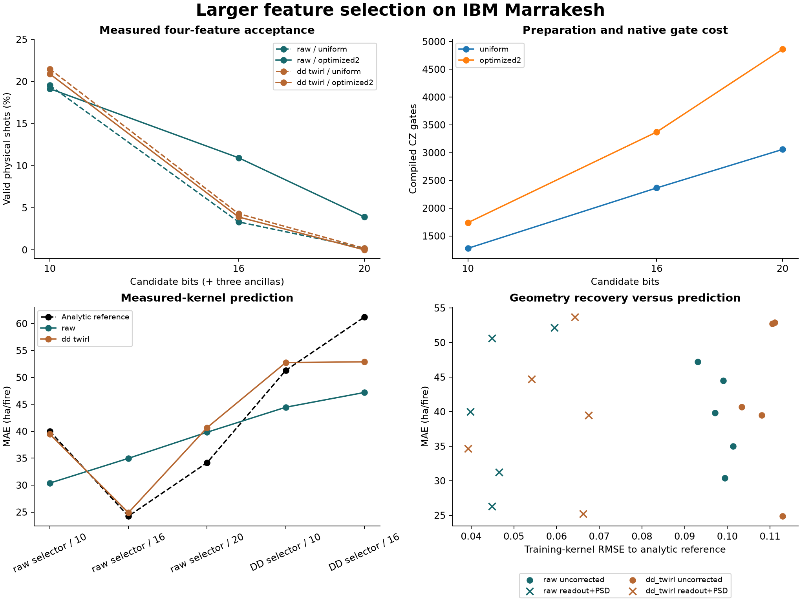

# Larger selectors on real IBM hardware

The 10/16/20-candidate study now has **actual Marrakesh counts and measured downstream QSVR kernels**. Ideal sampling gains did not survive uniformly: the 20-candidate optimized raw selector retained **20/512** valid four-feature samples; DD/twirling retained **zero**. More candidates create a larger search space, but preparation depth and noise are binding constraints. No quantum advantage is established.



## What was measured

First previously inspected chronological development fold only: 1988–2006 training (19 years), 2007–2010 validation (four years). Target remains annual Ontario mean reported hectares per fire. Original 2019–2024 evidence is unchanged. Candidate inclusion uses 10/16/20 bits **plus three counter ancillas**; each surviving selected subset uses **four QSVR qubits**. Larger candidate pools do not provide more independent climate observations.

Frozen local p=2 QAOA parameters are reused, without hardware optimization. A polynomial conditional-count Dicke initializer prepares the uniform four-of-n state; exact small-state amplitude and Qiskit p1/p2 parity tests verify its ideal behavior. The cost unitary removes a cardinality penalty that is zero in the ideal feasible sector; noisy out-of-sector dynamics differ. The original full QUBO still scores feasible samples. Counter measurements diagnose preparation failure, not logical QEC.

Uniform-preparation circuits compile to 1,277/2,364/3,057 CZ gates; optimized p2 circuits to 1,739/3,371/4,860. The 20-candidate p2 depth is 8,566. This preparation is polynomial, but it remains too deep for robust performance here.

## Actual selection and SQD

Two raw/combined jobs, eighteen PUBs each, 512 shots/PUB: **18,432 physical shots; 11 charged seconds**. Independent assignment calibration uses two circuits per actual physical layout. SQD projects the original diagonal Hamiltonian onto **observed feasible states only** and checks its lowest energy against the direct sampled minimum. It adds no optimization beyond that diagonal minimum. Counter-clean means cardinality four and final ancillas zero; the predeclared SQD basis uses cardinality four, not the stricter diagnostic.

| Acquisition | Candidates | Circuit | Valid /512 | Counter-clean /512 | SQD gap | Matched uniform gap |
|---|---:|---|---:|---:|---:|---:|
| raw | 10 | uniform | 100 | 22 | 0.0000 | 0.0147 |
| raw | 10 | optimized2 | 98 | 15 | 0.0000 | 0.0150 |
| raw | 16 | uniform | 17 | 3 | 0.2893 | 0.1547 |
| raw | 16 | optimized2 | 56 | 4 | 0.0184 | 0.0886 |
| raw | 20 | uniform | 1 | 0 | 0.8728 | 0.5084 |
| raw | 20 | optimized2 | 20 | 3 | 0.2381 | 0.2734 |
| dd_twirl | 10 | uniform | 110 | 23 | 0.0000 | 0.0147 |
| dd_twirl | 10 | optimized2 | 107 | 18 | 0.0410 | 0.0147 |
| dd_twirl | 16 | uniform | 22 | 2 | 0.2025 | 0.1524 |
| dd_twirl | 16 | optimized2 | 20 | 4 | 0.1153 | 0.1536 |
| dd_twirl | 20 | uniform | 1 | 1 | 0.4076 | 0.5084 |
| dd_twirl | 20 | optimized2 | 0 | 0 | No sample | — |

Uniform controls use 20 saved classical Monte Carlo seeds at the **same number of accepted draws** as each measured cell, not512 guaranteed-valid samples. At 16 candidates, raw optimized sampling has a smaller objective gap than these matched controls. At 20 candidates the combined run provides no subset; it is retained, never filled with simulator samples. Readout inversion reweights only the existing feasible basis, creates no new SQD states and claims no normalized full distribution. Sparse processing avoids2^n dense arrays.

## Measured kernels and fixed regressors

All five predeclared optimized subsets with valid samples are retained. A compute–uncompute circuit estimates the all-zero probability for 190 upper-triangular training entries (including diagonals) and 76 validation/train pairs per subset. Same train-only standardization, linear ZZ feature map, $\theta=(\pi/32)\tanh(z/2)$, $C=1$ and $\epsilon=0.2$. Model training remains classical; the QPU estimates similarities.

Matched fixed references, MAE in **ha/fire**:

| Selector subset | Ridge | RBF-SVR | Analytic QSVR |
|---|---:|---:|---:|
| raw-10-optimized2 | 21.23 | 29.49 | 40.00 |
| raw-16-optimized2 | 23.56 | 30.51 | 24.25 |
| raw-20-optimized2 | 19.24 | 19.27 | 34.17 |
| dd_twirl-10-optimized2 | 21.50 | 30.27 | 51.30 |
| dd_twirl-16-optimized2 | 25.03 | 40.24 | 61.20 |

Actual hardware-kernel regressors, same subsets and validation labels:

| Subset | Kernel acquisition | Raw | PSD | Rank4 | Readout | Readout+PSD | Readout+rank4 |
|---|---|---:|---:|---:|---:|---:|---:|
| raw-10-optimized2 | raw | 30.38 | 32.59 | 52.26 | 28.97 | 31.24 | 50.88 |
| raw-10-optimized2 | dd_twirl | 39.47 | 42.07 | 43.85 | 38.00 | 39.48 | 42.86 |
| raw-16-optimized2 | raw | 34.98 | 29.46 | 26.98 | 33.03 | 26.31 | 25.60 |
| raw-16-optimized2 | dd_twirl | 24.89 | 25.50 | 23.80 | 23.56 | 25.20 | 23.58 |
| raw-20-optimized2 | raw | 39.82 | 40.62 | 38.63 | 39.12 | 40.00 | 34.95 |
| raw-20-optimized2 | dd_twirl | 40.68 | 38.29 | 50.53 | 39.63 | 34.66 | 46.62 |
| dd_twirl-10-optimized2 | raw | 44.46 | 52.10 | 57.16 | 51.02 | 52.14 | 56.30 |
| dd_twirl-10-optimized2 | dd_twirl | 52.75 | 49.91 | 51.44 | 49.63 | 44.70 | 51.90 |
| dd_twirl-16-optimized2 | raw | 47.20 | 50.05 | 50.32 | 47.41 | 50.64 | 49.49 |
| dd_twirl-16-optimized2 | dd_twirl | 52.89 | 56.20 | 53.83 | 50.44 | 53.68 | 50.59 |

Every variant is reported; no winner is promoted from these reused validation errors. PSD removes negative training eigenvalues and projects cross kernels onto the same positive eigenspace; rank4 additionally keeps at most four positive directions. Independent four-qubit readout inversion retains negative quasi-probability diagnostics, then clips the zero outcome to [0,1] before declared matrix repairs. Calibration is 128 shots per prepared state, not an exact channel; correlated readout is not modeled. Geometry recovery and predictive recovery are distinct outcomes.

## Scheduler failure and declared correction

The original two 1,332-PUB kernel jobs both failed with **1520** before circuit execution. They returned **zero counts**, with `job.usage()` 0 and metrics charge 2 seconds each. IBM's [error registry](https://quantum.cloud.ibm.com/docs/en/errors) explicitly recommends splitting circuits/PUBs. Their frozen plan, intents and sanitized [failure record](results/selector-hardware-kernels.json) are preserved.

Under the owner's further-job/ten-minute monthly authority, the separately frozen [sharded plan](../experiments/selector_kernel_shards.json) copies unchanged compiled circuits into ten 268-PUB jobs (five subsets × two arms), capped 20 seconds each. Each subset/arm gets its own two calibration circuits. No failed intent is reset, no ambiguous job is retried, and no subset is selected using prediction errors. Sharding changes temporal calibration and creates a sequential-acquisition limitation; it does not change the scientific model.

The corrected jobs return **343,040 shots** and support **60 fixed QSVR fits**, using **125 charged seconds**. Expanded-study total including selectors and failures: **140 charged seconds**. Earlier Fez/Marrakesh/Quebec jobs used 75 seconds across accounts; that is a separate comparison. Monthly instance allowance and project totals spanning accounts are distinct.

| Subset | Kernel arm | Charge(s) | Created→finished(s) | Running→finished(s) | API(s) |
|---|---|---:|---:|---:|---:|
| raw-10-optimized2 | raw | 12.00 | 110.63 | 53.11 | 1.86 |
| raw-10-optimized2 | dd_twirl | 13.00 | 121.54 | 68.90 | 6.24 |
| raw-16-optimized2 | raw | 12.00 | 103.87 | 35.81 | 1.52 |
| raw-16-optimized2 | dd_twirl | 13.00 | 150.64 | 89.26 | 6.69 |
| raw-20-optimized2 | raw | 12.00 | 133.20 | 35.80 | 1.15 |
| raw-20-optimized2 | dd_twirl | 13.00 | 168.63 | 76.15 | 6.63 |
| dd_twirl-10-optimized2 | raw | 12.00 | 156.97 | 48.67 | 1.40 |
| dd_twirl-10-optimized2 | dd_twirl | 13.00 | 171.95 | 63.18 | 5.99 |
| dd_twirl-16-optimized2 | raw | 12.00 | 178.47 | 49.53 | 1.58 |
| dd_twirl-16-optimized2 | dd_twirl | 13.00 | 197.19 | 55.23 | 6.88 |

Created→finished is service turnaround; running→finished is wall time, neither is charged QPU time. API roundtrip is submission overhead and polling delay is not part of these timestamp differences.

## Replay and interpretation

```sh
uv sync --locked --group data --group analysis --group quantum --group hardware --group mitigation
uv run --no-sync python scripts/pipeline.py annual selector-hardware-collect --output .cache/wildfire/hardware-public.json --execute
```

Public replay uses no credentials, service requests, fits, new states, SQD solves or random draws. It checks shot totals/bit ordering, feasibility, actual sampled diagonal minima, stored preprocessing and fitted prediction equations, all-zero probabilities, assignment matrices and declared repairs. It does not independently reproduce the physical experiment or validate service charges from private logs. [Selector counts](results/selector-hardware.json) · [Measured shards](results/selector-hardware-kernel-shards.json) · Local sampling study · Forest source limits.

The useful finding is the separation of **ideal search quality, physical feasible-sample yield and downstream prediction**. Twenty candidates give 4,845 four-feature subsets, but exhaustive classical enumeration is still inexpensive. One acquisition pair per subset is not statistical replication; this experiment demonstrates implementation and failure modes, not a quantum speedup, causal device ranking or operational wildfire forecast.
