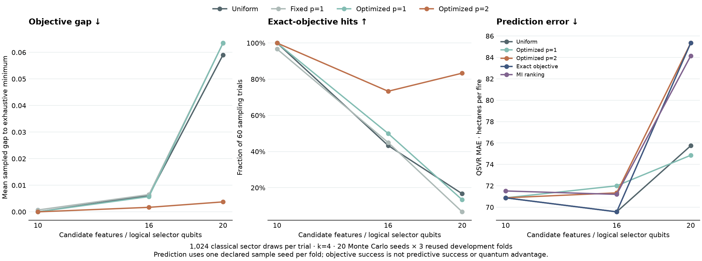

# More candidates: better sampling is not better prediction

The owner-requested **local 10 / 16 / 20-feature study is executed**. Two-layer optimized QAOA improves ideal sampling of the training selection objective as the pool grows. It does **not** consistently improve wildfire prediction. Exact classical enumeration remains cheaper at these sizes. This is a separate development diagnostic, not a replacement for the frozen annual result. The subsequent **real-hardware validation** is reported separately in [hardware selection and measured QSVR](SELECTOR_HARDWARE.md); the ideal hit rates below are not hardware results.



## Candidate pools and scaling

All examples remain **Ontario province-years**, with three previously inspected chronological folds: train 1988–2006 / validate 2007–2010; expand through 2010 / 2011–2014; through 2014 / 2015–2018. No 2019–2024 rows are opened. We select **four** inputs from each nested pool:

| Candidates / logical selector qubits | Added measurements | Feasible four-feature subsets |
|---|---|---:|
| 10 | Four climate summaries; closure, biomass, eligible stand age, selected-species ratio; prior-epoch biomass change and prior-year reported fire area | 210 |
| 16 | Spring precipitation, snowfall, high/low temperature summaries, heating/cooling degree days | 1,820 |
| 20 | Prior-epoch broadleaf, black-spruce and jack-pine absolute crown closure; previous-year recorded fire count | 4,845 |

The requested $n^4$ effect is interpreted as fixed-cardinality search growth:

$$\binom{n}{4}=\frac{n(n-1)(n-2)(n-3)}{24}=\Theta(n^4).$$

It is **not** a measured quantum-kernel complexity law or a speedup. Selector qubits represent candidate inclusion bits; downstream QSVR still uses **four qubits**. The added measurements are correlated candidates, not additional independent years. [Training table](data/forest_selector_scaling_training.csv) · [Source/date limitations](FOREST_CONTEXT.md).

## Matched methods

The training-only regression-MI/correlation QUBO is unchanged: normalized MI relevance, redundancy weight 0.5, cardinality four. Compare MI ranking, exhaustive minimum, uniform-feasible draws, fixed one-layer QAOA $(\gamma,\beta)=(0.4,0.2)$, and optimized one/two-layer QAOA. Optimizers minimize **expected training QUBO energy**, not validation MAE. One frozen start, bounded COBYLA with 48/72 evaluations; all optimizations stop at their evaluation cap without claiming convergence. Gamma is scaled by the feasible energy range; recorded physical angles retain that transformation.

The XY ring preserves ideal cardinality. Exact classical simulation uses only the $\binom{n}{4}$ feasible amplitudes, with cost phases and [Qiskit's XXPlusYY rotation](https://quantum.cloud.ibm.com/docs/en/api/qiskit/qiskit.circuit.library.XXPlusYYGate). One/two-layer parity tests match full Qiskit statevectors at small sizes. **This local study is classical sector simulation, not hardware or QiskitSampler shots.** Its uniform feasible initial state is assumed; the later hardware study supplies a tested polynomial counter-based preparation, whose actual gate depth and noisy feasible yield are measured separately.

Every sampling policy gets 20 paired Monte Carlo seeds at 256 and 1,024 draws per fold/pool. Counts are saved. Representative 1,024-draw subspaces additionally run real **qiskit-addon-sqd** projection and `solve_qubit`, checked against the direct sampled minimum. For this **diagonal** Hamiltonian SQD cannot improve on the lowest sampled energy; the sampling distribution supplies any gain.

Each selector's predeclared representative subset feeds fixed ridge, RBF-SVR and actual **FidelityQuantumKernel/QSVR**, with the same train-only imputation/scaling and four-qubit linear ZZ map $\theta=(\pi/32)\tanh(z/2)$. Selected inputs use ascending candidate order, avoiding implicit order search. This differs from the earlier primary panel's descending-MI order; its QSVR MI scores are not interchangeable.

## Sampling results

Exact-objective hits at **1,024 draws**, out of 60 trials (20 Monte Carlo seeds × three folds):

| Pool | Uniform | Fixed p=1 | Optimized p=1 | Optimized p=2 |
|---|---:|---:|---:|---:|
| 10 | 60/60 | 58/60 | 60/60 | 60/60 |
| 16 | 26/60 | 27/60 | 30/60 | 44/60 |
| 20 | 10/60 | 4/60 | 8/60 | **50/60** |

At 20 candidates, p=2 reduces mean objective gap **0.05905 → 0.00374** versus uniform. At 256 draws it hits 29/60 versus 2/60. Fixed p=1 and optimized p=1 do not consistently help. Replicates quantify sampling variability conditional on **three fixed objectives**; they are not 60 independent climate datasets, hardware repetitions or fresh validation folds. Full distributions, counts, theoretical hit probabilities and optimization traces are in the evidence bundle.

## Prediction tells a different story

Mean development QSVR MAE, **ha per reported fire**; one fixed sample seed per fold:

| Selector | 10 candidates | 16 candidates | 20 candidates |
|---|---:|---:|---:|
| MI ranking | 71.52 | 71.20 | 84.14 |
| Exact objective | 70.88 | **69.57** | 85.35 |
| Uniform feasible | 70.88 | **69.57** | 75.74 |
| Fixed p=1 | **68.10** | 72.93 | 80.59 |
| Optimized p=1 | 70.88 | 72.00 | **74.85** |
| Optimized p=2 | 70.88 | 71.34 | 85.35 |

At 20 candidates p=2 finds the exact objective subset in every representative fold, yet its QSVR error is **9.60 ha/fire worse than uniform**. Ridge similarly worsens **75.85 → 93.29**; RBF improves slightly **92.35 → 89.32**. There is no consistent selector/predictor winner. The MI/redundancy surrogate is not predictive error, and fewer than 28 fitting years make relevance estimates fragile. Additional candidates do not automatically improve either generalization or this objective's alignment.

The 20-feature exact subsets repeatedly choose the selected-species ratio, snowfall and lagged incident count plus one species closure. These structural/time-correlated combinations outperform others **on the selection surrogate**, not on QSVR prediction. Carrying earlier observations into later validation years is a one-year retrospective covariate design, not a fixed-origin multiyear forecast. Reconstructed SCANFI imagery prevents an as-of availability claim.

## Resource costs and decision

The full study took **25.73 s**, with **162 predictor fits, 54 analytic kernel matrices / 18,918 overlap pairs**, 921,600 classical draws and 36 real addon SQD checks. No extra hardware jobs or QiskitSampler shots were submitted. Pure feasible enumeration averaged **0.10 / 1.32 / 3.24 ms** at 10/16/20; two-layer optimization alone averaged **33.48 / 32.03 / 46.41 ms**, excluding sector/mixer setup, draws and SQD projection. The exact simulator already reads all feasible energies and amplitudes: this comparison cannot support an end-to-end quantum speedup.

**Keep:** the 16/20-candidate stress test, shot-matched sampling diagnosis and objective/prediction mismatch. **Prune:** treating more candidates, fixed p=1, or diagonal SQD itself as an improvement. For these pool sizes use exact classical selection as the implementation reference. A future surrogate revision needs a new train-only protocol; do not choose it from final-year errors or promote this exploratory QSVR score as confirmation.

## Reproduce from committed evidence

```sh
uv sync --locked --group data --group analysis --group quantum
uv run --no-sync python scripts/pipeline.py annual selector-scaling-collect --output .cache/wildfire/scaling-public --execute
```

Use a new output directory. Collection checks **162 equations, 54 matrices, 1,440 count records and 36 SQD records**, with fits, state generation, RNG and network methods blocked in tests. It checks stored probability arithmetic, not independent regeneration of MI/quantum states. Fresh execution, without final access: `scripts/pipeline.py annual selector-scaling --output <new-directory> --execute`. [Frozen plan](../experiments/selector_scaling.json) · [Metrics/receipt](results/selector-scaling.json) · [Portable raw evidence](data/selector-scaling-evidence.zip). Source acquisition and the original final model remain separate.
