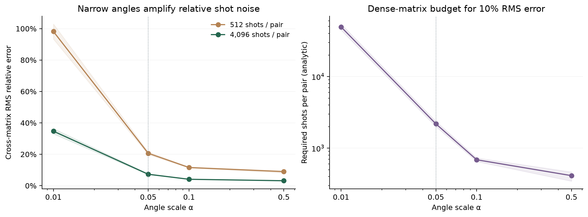

# Encoding scale and shot budget

This labels-free diagnostic uses incident-derived samples. It supplies no measured annual macro prediction result. [Scope correction](SCOPE_CORRECTION.md).

**Narrow ZZ angles shrink centered signal and amplify relative shot error.** This labels-free diagnostic quantifies an encoding/budget constraint, not a new predictor or quantum advantage. A smaller pair-query count alone does not make a kernel practical on hardware.

The [plan](../experiments/shot_feasibility.json) is frozen in `af75bec`. The three existing sampling cohorts use 256 training fires from 1988–2014 and 256 validation fires from 2015–2018, fixed geography/water/season inputs, train-only robust+tanh preprocessing and depth-two ZZ maps. All four declared scales are reported; no labels, model fits, test-year inputs, pair circuits or hardware jobs are used. Exact matrices are saved with hashes. [Collected evidence](results/shot-feasibility.json) checks recipe/source/sample/matrix hashes and recomputes every coefficient without simulating again.

| Angle scale | Mean centered train variance | Cross RMS relative error, 512 shots | 4096 shots | Shots/pair for 10% cross RMS error, condition range |
|---|---:|---:|---:|---:|
| .01 | .00456 | 98.16% | 34.71% | 44,617–54,273 |
| .05 | .10275 | 20.64% | 7.30% | 2,003–2,374 |
| .10 | .31612 | 11.58% | 4.09% | 651–729 |
| .50 | .89133 | 8.96% | 3.17% | 346–465 |

Means weight three sampling conditions equally, not independent time periods. These are analytic root-mean-square Frobenius errors relative to the **centered exact matrix**, not classifier-error percentages. The inherited .05 scale has much more signal than .01 but remains substantially noisier than the broad scales at an equal shot budget. This diagnostic does not measure predictive quality at the other scales or choose an optimal encoding. Earlier predictive scale screens used their own cohorts and remain separate.



## Derivation and assumptions

The [fidelity kernel](https://qiskit-community.github.io/qiskit-machine-learning/stubs/qiskit_machine_learning.kernels.FidelityQuantumKernel.html) estimates the all-zero probability of a compute–uncompute circuit. For a true pair probability p and S independent shots, its sample error has zero mean and variance p(1−p)/S. One estimate is shared between symmetric training entries; the known training diagonal is one. Different pair errors and train/cross estimates are assumed independent.

Write K for the n-by-n training matrix, B for the m-by-n cross matrix, E/F for their shot errors, and H=I−11ᵀ/n. Training-only centering produces errors

$$
\Delta K_c=HEH,\qquad
\Delta B_c=FH-\frac{1}{n}\mathbf{1}_m\mathbf{1}_n^TEH.
$$

Define V=Σᵢ<ⱼ Kᵢⱼ(1−Kᵢⱼ) and W=Σₐⱼ Bₐⱼ(1−Bₐⱼ). Independence gives

$$
\mathbb E\lVert\Delta K_c\rVert_F^2=
\frac{2[(1-1/n)^2+1/n^2]V}{S},\qquad
\mathbb E\lVert\Delta B_c\rVert_F^2=
\frac{(1-1/n)W+m(2-4/n)V/n^2}{S}.
$$

The second term in cross error accounts for **noisy training means**; treating centering statistics as exact would omit it. Divide the square root by the corresponding centered exact-matrix norm. For coefficient A and target η, the shot requirement is ceil(A / (η² ‖signal‖²)). A 30,000-trial synthetic Bernoulli fixture verifies both expressions, including shared symmetric errors; it is a formula check, not an additional fire experiment.

The [local-geometric check](LOCAL_GEOMETRY.md) explains the narrow-angle mechanism: centered fidelity approaches a classical metric kernel with O(α²) signal, while independent-shot noise RMS is O(α/√S). At .01 the normalized tangent shape error is 1.40%, despite 98.16% inherited 512-shot RMS error. This is a labels-free matrix explanation, not a predictor comparison or an angle choice.

## What this permits

The exact reference uses a fixed positive training variance for normalization. Randomly estimating that denominator, PSD repair, correlated estimates, readout/gate errors and classifier sensitivity are excluded. Therefore the numbers are conditional matrix-budget estimates, not guaranteed device shot requirements. Lower matrix error need not improve AP. These dense-matrix bounds also cannot be transferred directly to a nonlinear landmark inverse/projection.

The runner took **1.97 seconds**, with **6,144 cached four-qubit state preparations**; collection took **0.18 seconds** and generated no states. Interpreter startup/preflight hashing are excluded. No experimental shots were executed: shot counts are analytic scenarios. A dense 256/256 matrix needs 98,176 pair estimates before shots; the existing 16-landmark recipe needs 8,056, but its finite-shot ridge quality remains untested. Keep the measured approximation and classical comparisons in [the ridge report](KERNEL_RIDGE.md); do not promote hardware from a query-count reduction alone.

```sh
uv run --no-sync python scripts/collect_shot_feasibility.py
```

Collect the existing exclusive namespace `.cache/wildfire/shot-feasibility`; preserve its intent and matrices. An independent copy with the exact training table can pin `af75bec` and run `scripts/run_shot_feasibility.py`. This does not reopen the frozen final test or authorize new IBM submissions.
