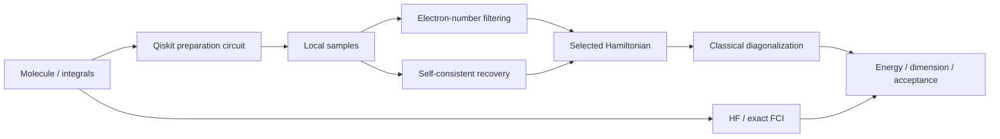

# Structure and pipeline

This layout adapts simple conventions from actual Qiskit repositories: reusable package code, separate tests, runnable notebooks and documentation beside a locked environment.

| Repository inspected | Observed pattern | Our use |
|---|---|---|
| [Qiskit SQD add-on](https://github.com/Qiskit/qiskit-addon-sqd) | `qiskit_addon_sqd/`, `docs/`, `test/`, `pyproject.toml` | Domain package, API separation, focused tests |
| [Qiskit Nature](https://github.com/qiskit-community/qiskit-nature) | Domain package, docs, tests and metadata | Separate chemistry generation from algorithms |
| [Community tutorials](https://github.com/qiskit-community/qiskit-community-tutorials) | Topic folders and explanatory notebooks | One teaching entry point; reusable logic stays Python |

Community tutorials include historical Aqua/Ignis material. We use their educational organization, not retired imports. These are established public examples, not a claim that a folder layout wins competitions.

```text
sqd_lab/
  chemistry.py       integrals, mapping, HF and FCI references
  sampling.py        circuits, bit order, noise, classical controls
  classical.py       tiny greedy selected-CI control
  subspace.py        deduplication, projection, independent validation
  pipeline.py        bounded recovery, benchmarks, reproducible outputs
  audit.py           verify saved samples and provenance
  reporting.py       summaries, controls and figures
  __main__.py        one CLI entry point
configs/sqd/         explicit H2 and H4 settings
notebooks/           executable learning entry point
docs/sqd/            learning path, report, structure, deletion inventory
tests/test_sqd.py    physical and numerical correctness
artifacts/sqd/       compact measured demonstrations and provenance
results/sqd/         ignored personal reruns
```



Dense cross-checks and tiny chains are deliberate teaching limits, not a scalable electronic-structure solver. Larger applications should use the add-on's sparse/distributed solvers and explicitly budget classical cost.

Cleanup deletes abandoned code and redundant runs. Completed reports keep their historical text; some reproduction links refer to deleted experiments. The inventory names the prior Git commit containing those files. This preserves negative findings without claiming historical reports remain fully reproducible from today's working tree.
