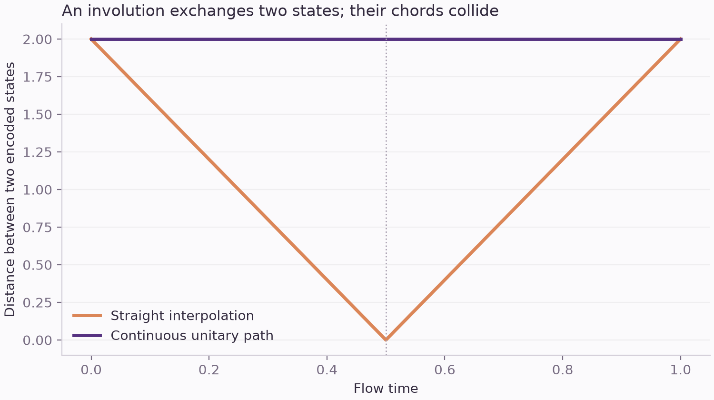
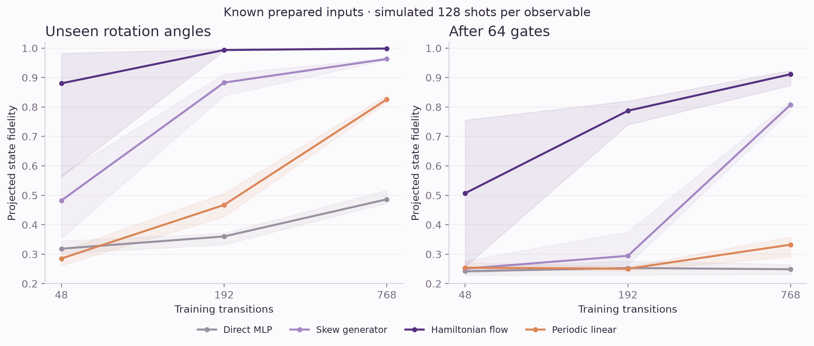
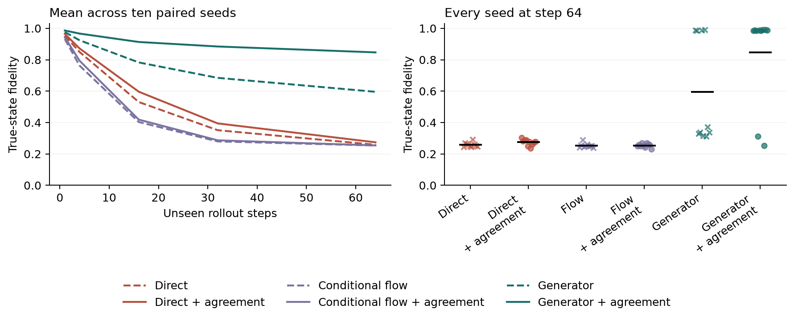
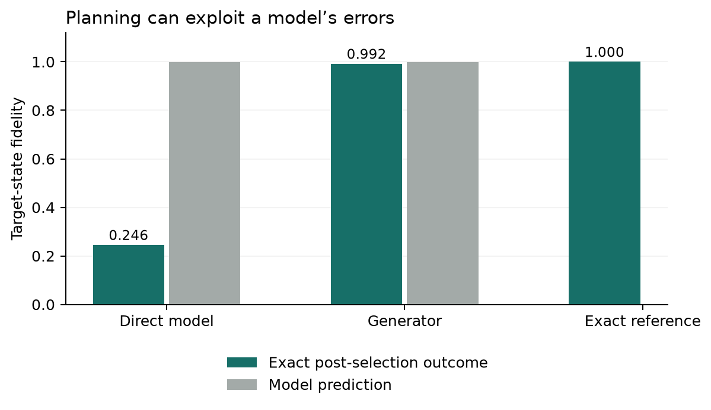
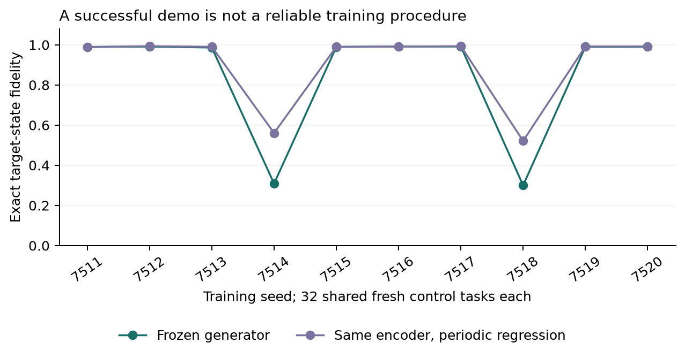
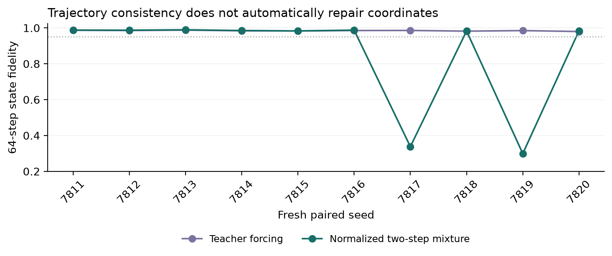
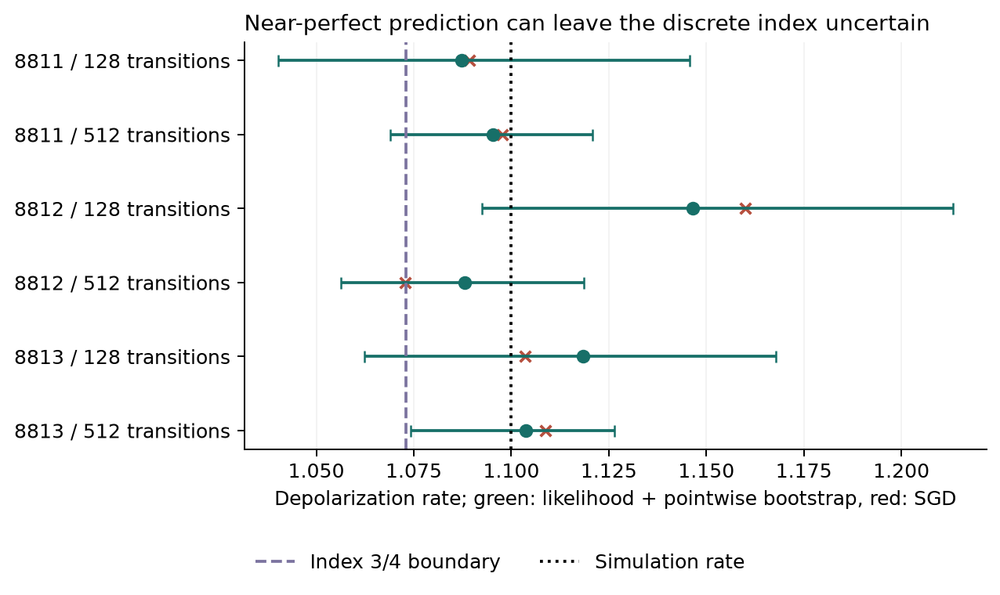
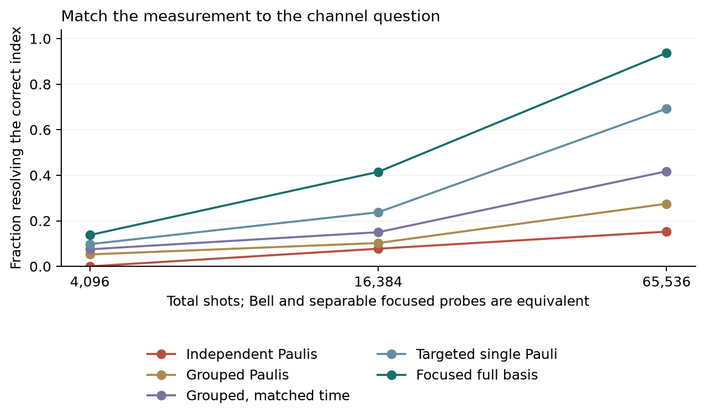
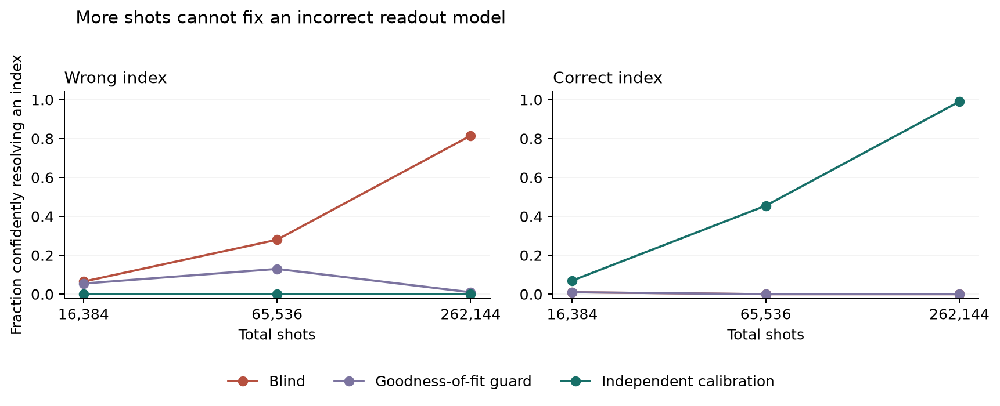

# Quantum Worlds: coupling, physicality and learned representations

**Final report - 3 October 2026. Completed before the 22:00 Toronto deadline.**

We built a two-qubit benchmark that separates learning a representation,
predicting dynamics, planning controls and identifying noise. Continuous latent
generators support accurate 64-step rollouts in eight of ten initial fresh seeds;
two failures survive excellent one-step readouts. A later teacher-forced triplet
study reaches mean 64-step fidelity 0.9845 and control fidelity 0.9871 across all
ten fresh seeds. Its same-encoder classical controller reaches 0.9924.
Physics-constrained channel models preserve physical validity,
while task-specific measurements improve entanglement-breaking index inference.
Readout misspecification can erase that benefit and produce confident errors.
All results are local simulations. No quantum computational advantage or
breakthrough is established.

## 1. A concrete flow-matching obstruction

Let an action exchange two distinct states A and B, as an involution can. Their
encoded straight paths have the same midpoint, (E(A)+E(B))/2, but require
opposite velocities E(B)-E(A) and E(A)-E(B). A deterministic field receiving
only the intermediate point, time and action cannot supply both. This exact
collision holds for any encoder that distinguishes A from B; it is not merely
a linear-encoder issue. It identifies an obstruction to fitting these paired
paths exactly, not a theorem that every trained model must have poor endpoints.

For H on qubit 0, the Pauli interpolation loses eight of fifteen dimensions at
the midpoint. Continuous unitary paths remain distinguishable. Supplying the
starting state separately removes this particular ambiguity. More integration
steps alone cannot repair missing information.

The three-seed controlled-basis screen obtains approximately 0.49 one-step
projected fidelity for unconditioned chord flow and 0.93 with source conditioning.
Physics-path generator models perform nearly perfectly, but receive derivative
labels unavailable to endpoint models. An endpoint-only periodic linear model
also performs nearly perfectly with abundant ideal data, preventing a claim
that elaborate dynamics are necessary for this simple system.

## 2. Removing the supervision confound

The endpoint-only study gives four model families identical training pairs:
direct MLP, skew-symmetric generator, Hamiltonian-commutator generator and
periodic linear regression. All use a controlled invertible latent basis.
Learning rates or ridge strengths are selected with equal three-choice grids
and two independent validation seeds, then frozen before final states are
generated. There are 144 validation runs and 120 evaluation runs over six
data/noise conditions and five fresh paired seeds.

Training angles lie in [-1.2,1.2]; evaluation uses magnitudes [1.8,pi]. Long
rollouts contain 64 unseen action steps. Prepared input states are known exactly;
only future Pauli targets receive independent simulated binomial measurement
noise. This is a calibration experiment, not a partially observed hardware
world model. 128 shots per each of 15 observables means 1,920 simulated shots
per target. No hardware was accessed.

At 768 transitions and 128 shots per observable:

| Model | Unseen-angle fidelity | 64-step fidelity | Raw valid states after rollout |
|---|---:|---:|---:|
| Hamiltonian flow | 0.998713 | 0.911398 | 100% |
| Skew generator | 0.963284 | 0.807744 | 0% |
| Periodic linear | 0.826046 | 0.332389 | 0% |
| Direct MLP | 0.486359 | 0.248885 | 0.9% |

Fidelity is measured after projection to a valid density matrix. Raw validity,
Pauli error and correction size are recorded independently, so projection
cannot conceal invalid predictions. A skew generator preserves Euclidean norm
but need not preserve density-matrix positivity; a Hamiltonian commutator does.
With sufficient noiseless data, the linear baseline is again essentially exact.

The 48-transition setting is not uniformly successful: one noiseless Hamiltonian
seed has unseen-angle fidelity 0.792 and 64-step fidelity 0.265. The reported
means retain this failure. Five paired seeds limit statistical power: even five
wins give a two-sided exact sign-flip p-value of 0.0625. Bootstrap intervals are
pointwise, conditional on the study protocol, and not multiplicity-adjusted.

## 3. Actual nonlinear latent learning

A separate JEPA-style pilot learns an encoder from Pauli observations plus
independent nuisance channels. Training uses predictive latent losses and an
anti-collapse covariance anchor, with no reconstruction objective. A physical
readout is fitted afterward on independent states with the encoder frozen.
Readout ceilings distinguish lost representation information from dynamics
error. Future information is used for training targets only.

Weak anchoring lets a latent generator collapse to effective rank about one.
Stronger anchoring restores effective rank about fourteen and readout fidelity
about 0.99. At 10,000 training steps in two validation seeds, a shared latent
generator reaches unseen-angle fidelity 0.855–0.872 and 32-step fidelity
0.433–0.441. Matched strong-anchor direct prediction reaches 0.660–0.713 and
0.349–0.390; Gaussian-source conditional flow reaches 0.682–0.698 and
0.290–0.356. These are exploratory results, not a tuned final comparison.

A physical density-matrix latent was also explored. Positivity and Haar
second-moment diversity are insufficient by themselves: initial models retain
less input information and predict poorly. A linear-encoder/joint-target pilot
improves readout fidelity to 0.78–0.81 but still fails long rollouts. These
negative results remain part of the evidence. Neither this finite diversity
regularizer nor covariance matching certifies a particular distribution.

### Fresh confirmation: information is not compositional compatibility

After the pilots, settings were frozen before generating new training and
calibration states. Ten fresh initialization/evaluation seeds compare three
families with and without same-state nuisance-view agreement: 60 runs, each
with 4,000 training steps, covariance-anchor weight 20 and a frozen encoder.
Independent evaluation readouts output positive, unit-trace density matrices;
their mean fidelity ceilings are approximately 0.999 in all conditions. The
readout receives calibration labels only after encoder training and cannot
improve the encoder. The world-model training contains no reconstruction loss.

| Model | View agreement | Unseen-angle fidelity | 64-step fidelity | Seeds above 0.95 at 64 steps |
|---|---|---:|---:|---:|
| Direct predictor | No | 0.7361 | 0.2585 | 0/10 |
| Direct predictor | Yes | 0.7807 | 0.2741 | 0/10 |
| Conditional Gaussian flow | No | 0.6398 | 0.2535 | 0/10 |
| Conditional Gaussian flow | Yes | 0.6971 | 0.2543 | 0/10 |
| Continuous generator | No | 0.9588 | 0.5957 | 4/10 |
| Continuous generator | Yes | 0.9766 | 0.8469 | 8/10 |

The generator is trained by integrating its action-conditioned linear latent
field and matching future endpoints. It is **not** trained with a flow-matching
velocity objective. The Gaussian conditional-flow comparator receives the
initial encoding as a condition and a fresh Gaussian source at every inference
step. It forecasts one step autoregressively, rather than reproducing Flow-JEPA's
full future-trajectory generator. Architecture settings were pilot-selected;
this comparison does not establish the best achievable version of each family.

With view agreement, generator-minus-direct paired differences are 0.1959 for
unseen angles and 0.5728 for 64-step fidelity. Exact paired sign-flip tests give
Holm-adjusted p=0.0195 and 0.0234 across ten declared contrasts. Corresponding
pointwise bootstrap 95% intervals are [0.1658,0.2227] and [0.3627,0.7191].
These intervals concern seeds conditional on the protocol, not all datasets or
architectures. The generator's own invariance improvement is not significant
after that adjustment (angle p=0.5664; rollout p=0.4141); its apparent pilot
benefit was too strong a causal interpretation.

Successful generators learn nearly affine Pauli coordinates: relative squared
linear-fit error is about 0.003 on independently sampled states. Failing seeds
retain state information but learn less compatible nonlinear coordinates and
larger involution/commutation residuals. This is an association, not yet a causal
proof. Exact same-generator composition and inversion are built into the
exponential; cross-gate relations and physical decoded outcomes are separate
checks. Gaussianity is unnecessary for these state coordinates.

### Frozen-model control and model exploitation

A preselected smoke checkpoint plans continuous RZ angles in a fixed 43-gate
H/CX template: four local Euler layers, three alternating CNOTs and 24 adjustable
angles. On eight fresh initial states, four Bell targets and four independent
Haar targets, each model receives 250 Adam steps and four identical random
restarts. Selection uses only learned latent goal distance. Exact simulation
evaluates the selected controls afterward and never selects a restart.

| Planner model | True target fidelity | Bell targets | Arbitrary targets | Predicted target fidelity |
|---|---:|---:|---:|---:|
| Frozen direct model | 0.2456 | 0.1862 | 0.3049 | 0.9983 |
| Frozen continuous generator | 0.9921 | 0.9934 | 0.9909 | 0.9991 |
| Exact Pauli reference | Approximately 1 | Approximately 1 | Approximately 1 | — |

The direct model's self-assessment is misleading: optimizing against it finds
circuits that exploit prediction error. A low internal goal loss is therefore
insufficient evidence of control success. The generator supports a useful
local control demo, but these eight tasks use one training seed and do not
erase the failures in the independent ten-seed study. Exact two-qubit control
is inexpensive and established; this is utility evidence, not quantum advantage.

The all-seed follow-up reproduces every frozen generator checkpoint with exactly
zero discrepancy in saved rollout fidelities, then plans for 32 fresh shared
tasks per seed. Eight seeds achieve mean target fidelity 0.986–0.992; two fail at
0.300 and 0.309. The across-seed mean is 0.8529. Transferred periodic regression
on the same generator encoders averages 0.9013, but still fails at 0.522 and
0.561 on the two problematic encoders. On the first predefined direct-model
checkpoint, the same classical transfer improves planning from 0.3352 to
0.9686. The exact reference remains essentially perfect. The two failing
generators forecast target fidelity 0.882 and 0.970 despite actual values near
0.3. These fresh control tasks confirm utility and expose reliability limits;
retraining the same seeds is reproduction, not additional independent evidence.

### Strong classical predictor: much of the deficit is in dynamics

On the two first, preselected saved checkpoint seeds, periodic affine regression
is fitted to the same training endpoints after freezing each encoder. It uses
constant discrete-gate maps and the basis [1,cos(theta),sin(theta)] for RZ gates.
This is a transferred-encoder comparator, not an independently trained encoder.
All models then face the same fresh evaluation states and the same readout.

Direct encoders support 64-step fidelity 0.805–0.950 with the linear predictor,
versus 0.250–0.285 with their original MLP. Conditional-flow encoders support
0.960–0.969, versus 0.239–0.268 originally. Generator encodings support
0.987–0.989, approximately matching their original generator. Thus, much of the
original gap is a predictor/inductive-bias limitation rather than unusable
representations. This limited checkpoint comparison reinforces the need for a
strong classical baseline and weakens any claim that flow integration itself
is indispensable. Raw Pauli inputs already make this small system tractable.

A first four-seed algebra-prior intervention is negative: imposing strong
operator-level involution and RZ-commutation penalties from initialization
lowers readout ceilings to 0.907–0.928 and 64-step fidelity to 0.247–0.256,
compared with approximately 0.988 for its paired unregularized generators.
Correct algebra alone does not ensure informative coordinates or successful
optimization. This intervention is exploratory and separate from the frozen
ten-seed confirmation.

### Short-trajectory training: a failed intervention and a loss-scale confound

The final exploitation screen compares the same 4,096 observed two-action
triplets across four fresh seeds. Both conditions use intermediate and final
encoder targets, the same nuisance views, and the same covariance anchors.
Adding a two-step free-running endpoint loss consumes more compute but no
extra observed labels. Direct predictions remain poor under either objective.
Generator one-step training reaches 64-step fidelity 0.980-0.984, while adding
the equally weighted rollout term yields 0.223-0.250 and degrades readout
information. This particular intervention fails in all four generator seeds.

However, addition doubles total predictive weight relative to regularization.
A diagnostic normalizes the teacher/rollout mixture by its total weight. Three
seeds recover to 0.981-0.987, while one still fails at 0.307 despite a readout
ceiling near 0.999. This separates a loss-balance problem from the remaining
composition problem; it does not prove that trajectory consistency is harmful
in general or that normalization improves reliability. A fixed-setting fresh
paired diagnostic was queued while the fourth result arrived; the screen did
not pass the proposed positive advancement gate. We retain that chronology
rather than labeling it a selected success.

The fresh diagnostic uses new training/calibration states and ten new seeds:

| Generator training | Unseen-angle fidelity | 64-step fidelity | Seeds above 0.95 |
|---|---:|---:|---:|
| Teacher-forced triplets | 0.9937 | 0.9845 | 10/10 |
| Normalized one-step/two-step mixture | 0.9813 | 0.8524 | 8/10 |

Seven paired seeds show tiny rollout gains for the mixture, but two fail
severely. The mean paired difference is -0.1322; its pointwise bootstrap 95%
interval is [-0.3308,0.0018] and exact two-sided sign-flip p=0.4980. Ten seeds
do not establish a significant mean effect. They do refute a claim that this
fixed intervention removes composition failures. Readout ceilings remain near
0.999 in both conditions. Compared with the earlier single-transition study,
teacher forcing also changes training data and anchor averaging, so its apparent
reliability improvement cannot be attributed causally to one component.

Every frozen checkpoint then plans on the same 32 new Bell/Haar target tasks.
This produces 41 comparisons: twenty models, twenty same-encoder periodic-linear
predictors fitted to their saved training transitions, and an exact reference.
Latent cost selects controls; exact outcomes are evaluated afterward. Teacher
forcing gives mean control fidelity 0.9871, with all ten seed means between
0.9842 and 0.9912. The classical transfer gives 0.9924. The normalized mixture
averages 0.8636, or 0.8972 with classical transfer; both preserve its two failed
encoders. The exact reference is essentially perfect. This is a useful local
control demo with strong classical competition, not a quantum speedup. Seeds
share one training dataset and one task set within this study; broader data and
observation-model reliability remains untested.

The teacher-forced models also create the specified Bell state with mean
fidelity 0.9920 and negativity 0.4948 (ideal: 0.5). Their decoded predictions
for H/RZ in each order have fidelity about 0.9942. Mean latent residuals for
H and CX involutions and independent-qubit RZ commutation are 0.00043,
0.00041 and 0.00048. RZ inversion and same-generator angle addition are exact
to numerical precision because the exponential builds them in; they are not
evidence that the model discovered those identities. These checks show usable
relational and compositional predictions in the chosen complete-state setting.

## 4. Physical contraction is not representation collapse

The noise extension calibrates global two-qubit depolarization and amplitude
damping on qubit 0. It uses known physical Pauli coordinates, a known dictionary
of channel types, and learns only their two positive rates in the physical
model. Skew and unconstrained affine generators are larger baselines. This is
a structural boundary experiment, separate from nonlinear JEPA: no claim of
learned perception, unknown-noise discovery, or hardware validation follows.

There are 36 exploratory runs: three paired seeds, 128 or 512 transitions,
noiseless or 128-shot output observables, and three models. Times are trained
in [0.05,0.8] and evaluated in [1.2,2.0]. Inputs are known prepared density
matrices; all models receive the same noisy endpoint labels. Negative noise
times are forbidden. At 512 transitions and 128 shots per observable:

| Model | Unseen-time fidelity | 32-step fidelity | Raw valid states at unseen times |
|---|---:|---:|---:|
| Physical channel dictionary | 0.999983 | 0.999984 | 100% |
| Skew generator | 0.733414 | 0.589951 | 23.4% |
| Affine generator | 0.983478 | 0.996079 | 72.9% |

Fidelity here is squared Uhlmann fidelity for mixed states, after density repair
where needed. A maximally mixed predictor already scores 0.9464 at step 32:
noise makes late prediction easier by forgetting initial states. Long-rollout
fidelity alone is therefore insufficient. Complete positivity is checked with
normalized Choi matrices, separately from positivity on sampled states: the
physical model passes 96/96 sampled gate/time checks, the skew model 0/96 and
affine models 35/96. The physical dictionary is CPTP by construction for positive
rates and time; sampled checks alone do not prove a general model CPTP.

For global depolarization, centered linear encodings obey z_future=p z_current.
If current covariance is sI, future covariance is p²sI. Anchoring both to I
has per-direction objective [(s-1)²+(p²s-1)²]/2, minimized at
s=(1+p²)/(1+p⁴), with a strictly positive residual whenever 0<p<1.
The implementation's mean over all covariance entries adds a factor 1/D to
this isotropic expression. Thus, source/future whitening conflicts with genuine
contraction for a linear informative encoding. This is a concrete consistency
check, not a theorem that every nonlinear encoder must fail. Artificial
nuisance invariance and real physical loss of distinguishability need different
treatment; future isotropy should not be imposed blindly.

The same channel links prediction to entanglement loss. For d=4 depolarization,
p(t)=exp(-gamma*t), and the known isotropic-channel threshold is p=1/5:
t_EB=log(5)/gamma. For fixed step Delta, its entanglement-breaking index is
ceil(log(5)/(gamma*Delta)). This follows from the established
[depolarizing-semigroup analysis](https://link.springer.com/article/10.1007/s00023-020-00906-4).
Our simulated gamma=1.10 gives t_EB=1.4631 and index three at Delta=0.5.
At that threshold, worst-case trace distance from the stationary state remains
0.15: entanglement breaking is not complete input forgetting. Choi partial
transpose eigenvalues cross zero as expected; sufficiency uses the isotropic
family, not a generic 4×4 PPT test. These are known formulas validated by the
experiment, not new quantum theory.

One noisy stochastic-optimizer estimate gives an index of four despite
unseen-time fidelity 0.999976. A discrete threshold can be wrong when continuous
prediction looks excellent. Model-conditional point estimates are not uncertainty
certificates for the true channel. A separate classical full-batch likelihood
fit corrects that point estimate to index three. However, 200 parametric
bootstrap replicates for each of the six noisy fits yield pointwise intervals
that span indices three and four in four cases. These are approximate intervals
conditional on the known channel dictionary, prepared inputs and independent
binomial measurements; they provide no simultaneous-coverage or hardware-model
guarantee. Accuracy, optimizer convergence, model assumptions and uncertainty
must all be checked before interpreting a predicted entanglement-loss index.

## 5. Measure the channel question, not every observable

The uncertain index motivates a separate, inexpensive measurement experiment.
For the known four-dimensional isotropic depolarizing family, prepare |00>,
evolve for a fixed dimensionless time t=0.8, and measure both qubits in Z.
The probability of returning 00 is q=(1+3 exp(-gamma t))/4. The complete basis
outcome therefore estimates the channel rate directly; marginalizing to one
qubit discards information. An exact binomial Clopper–Pearson interval for q
maps monotonically to a rate interval and then to a set of possible indices.
We call an index resolved only when that entire interval implies one integer.
This is conditional on the specified channel family, preparation and readout.
It is not a general channel certificate.

We froze six designs after two cheap screens, then ran 400 fresh measurement
replicates per design and shot budget. Tomography uses 64 independently prepared
Haar states. Grouped tomography obtains three compatible Pauli observables from
each joint measurement, avoiding a straw-man comparison to ungrouped shots.
The matched-time variant uses t=0.8 for every tomography input, isolating the
advantage from an unnecessarily short exposure. Total shots are equal; state
preparation and circuit overhead are not included in this resource comparison.
Tomography intervals use an approximate profile-likelihood construction; the
targeted designs use exact binomial intervals. Their different interval methods
must be considered alongside the independently reported rate RMSE.

At 65,536 total shots and gamma=1.10, the true step-0.5 index is three:

| Measurement design | Correctly resolved index | Rate RMSE | Empirical interval coverage |
|---|---:|---:|---:|
| Independent Pauli measurements | 15.25% | 0.03234 | 95.00% |
| Grouped Pauli measurements | 27.50% | 0.01899 | 94.75% |
| Grouped, matched exposure time | 41.75% | 0.01513 | 96.75% |
| Targeted single-qubit marginal | 69.25% | 0.01112 | 94.50% |
| Focused full-basis measurement | 93.75% | 0.00783 | 94.25% |

The gain is task-specific measurement design. A Bell preparation followed by
inverse Bell measurement has exactly the same probabilities as this product
preparation under global isotropic noise. We verify the equivalence against
Qiskit and reuse the same counts for this analytic control; it is not an
independent experiment or evidence of entanglement advantage. The single-qubit
marginal is likewise derived from the focused counts. Budgets share random
seeds, so neither budgets nor these controls may be pooled as independent data.
All 7,200 comparisons are preserved, with 400 independent replicates within a
design/budget. Pointwise Monte Carlo proportion intervals are saved separately.
Nominal exact coverage under the model does not require a finite Monte Carlo
coverage fraction to equal 95%.

### More shots can make an incorrect model more confidently wrong

We challenged that result with independent symmetric 1% bit-flip readout error
on each qubit. For gamma=1.05, the true step-0.5 index is four. Ignoring readout
error biases the inferred decay rate upward toward index three. A goodness-of-fit
guard tests the unequal nonreturn outcomes and withholds a result when its
approximate Pearson test rejects the ideal model. A calibrated estimator reserves
one quarter of the same total budget for independent prepared-|00> readout
references and uses the remaining three quarters for the channel probe.

Two exact 97.5% binomial intervals, one for readout error and one for return
probability, give a conservative joint rate interval by Bonferroni and monotonic
propagation. The guarantee still assumes identical independent bit-flip errors,
ideal reference preparation, and unchanged readout between reference and probe.
We do not know how it performs under arbitrary asymmetric or correlated errors.

At 262,144 total shots, across 200 fresh trials:

| Estimator | Correctly resolved | Confidently wrong | Withheld | Underlying rate interval coverage |
|---|---:|---:|---:|---:|
| Blind ideal-readout model | 0% | 81.5% | 0% | 0% |
| Blind model with fit guard | 0% | 1.0% | 99.0% | 0% |
| Independently calibrated | 99.0% | 0% | 0% | 99.5% |

The fit guard is useful but is not a certificate: its two accepted trials are
wrong, and the quoted underlying interval coverage is not selective coverage
conditional on acceptance. Calibration has a cost under ideal readout: at
65,536 shots, correct resolution falls from 93.5% to 77.5% because reference
shots and conservative uncertainty propagation consume budget. This stress
study contains 3,600 policy comparisons, with 200 independent replicates within
each scenario/budget; guarded results reuse blind observations. Rates, counts,
shot accounting and all shared-control dependencies are audited. Model checks
and calibration matter more than simply increasing shots near a discrete index
boundary.

## 6. What is and is not new

[Flow-JEPA](https://arxiv.org/abs/2608.29029) already combines latent prediction
with flow matching and retains the initial observation as a condition; our
unconditioned chord witness does not refute it. [Semigroup-JEPA](https://arxiv.org/abs/2609.10464)
already studies physical generalization. [Quantum Flow Matching](https://arxiv.org/abs/2508.12413)
already studies density-matrix generation with quantum circuits, and
[Hamiltonian learning](https://www.nature.com/articles/s41467-023-44008-1) is established.

Our defensible output is an audited benchmark, a quantum-gate illustration of
paired-path ambiguity, and controlled evidence separating norm preservation
from physical validity. The midpoint argument is an elementary application of
trajectory-crossing ambiguity; novelty has not been established. Successful
Hamiltonian calibration is useful, but does not establish a new algorithm.
Rotation composition guaranteed by an exponential is an architectural prior,
not a discovered law. Learned commutation, noncommutation and Bell-state
predictions are evaluated separately in the saved metrics.

The measurement result is a useful channel-identification demonstration, not a
new quantum algorithm. The finite-shot confidence construction uses established
binomial inference. The combined benchmark exposes three practical failure
modes: incompatible learned coordinates, invalid unconstrained channel forecasts,
and confident index errors under readout misspecification. The evidence supports
these scoped observations rather than a claim of a new general world model.

## 7. Evidence and recommended direction

- `artifacts/quantum-world-screen-v2-20261003`: controlled-basis, three-seed screen.
- `artifacts/quantum-world-endpoint-confirmation-20261003`: frozen selections,
  paired data hashes, all runs, checkpoints and completion counts.
- `artifacts/quantum-world-jepa-screen-v2-20261003`, `quantum-world-jepa-strong-anchor-20261003`
  and `quantum-world-jepa-long-generator-20261003`: nonlinear encoder pilots.
- `artifacts/quantum-world-density-*`: exploratory physical-latent pilots.
- `artifacts/quantum-world-jepa-confirmation-20261003`: 60 fresh paired runs,
  positive readouts, gate-algebra diagnostics and multiplicity-adjusted tests.
- `artifacts/quantum-world-control-smoke-20261003`: frozen checkpoint hashes,
  all task states, selected controls and post-selection exact outcomes.
- `artifacts/quantum-world-transferred-linear-20261003`: same-encoder strong
  classical predictors, with independent paired evaluation states.
- `artifacts/quantum-world-algebra-exploration-20261003`: all eight runs of the
  failed strong-algebra-prior intervention.
- `artifacts/quantum-world-noise-channels-20261003`: 36 endpoint fits, mixed-state
  metrics, structural Choi audit, and conditional entanglement-breaking times.
- `artifacts/quantum-world-control-confirmation-20261003`: all ten reproduced
  checkpoints and 23 planning comparisons on fresh shared tasks.
- `artifacts/quantum-world-noise-rate-audit-v2-20261003`: classical likelihood
  fits and 1,200 parametric-bootstrap fits. The first serialization failure is
  preserved separately and contains no scientific results.
- `artifacts/quantum-world-measurement-confirmation-20261003`: frozen six-design
  equal-shot confirmation, raw counts, shared-control and seed accounting.
- `artifacts/quantum-world-readout-stress-v2-20261003`: ideal and misspecified
  readout scenarios, calibration uncertainty and failed-model guard. The first
  implementation failure occurred before any scientific results and is retained.
- `artifacts/quantum-world-sequence-screen-20261003`: all 16 matched-triplet
  teacher-forced/short-rollout training comparisons, including failed generators.
- `artifacts/quantum-world-sequence-normalized-20261003`: eight same-seed
  diagnostic runs isolating total predictive loss scale, including the failure.
- `artifacts/quantum-world-sequence-confirmation-20261003`: twenty fresh paired
  runs with the advancement-decision chronology preserved.
- `artifacts/quantum-world-sequence-control-20261003`: 41 frozen-checkpoint
  planning comparisons, task states, controls and exact outcome reproduction.
- `artifacts/quantum-world-sprint-20261003`: regenerated figures and paired statistics.

The feasible project is **physics-informed quantum dynamics with audited control
and channel uncertainty**. Use the teacher-forced latent generator as the learned
unitary world-model demonstration, retain the same-encoder classical regression baseline,
and show physical channel identification and calibrated index inference as a
separate noisy-system experiment. We have not integrated a nonlinear noisy JEPA
model end to end. Full Pauli observations are informationally complete and the
15-dimensional latent is not compression or image perception. Exact statevectors
provide reference outcomes; a learned raw-statevector comparator was not included.
Training targets use the current encoder with stopped gradients, rather than a
separate EMA target encoder. Exact NumPy/SciPy evolution generates states and
Qiskit independently checks conventions and channels. Random long compositions
are evaluated; a special held-out composition grammar is not defined. Useful next work
would improve seed reliability and test genuinely partial observations before
adding a larger encoder or another quantum regularizer.

The research cycle balanced cheap mechanism screens with independent
confirmation and adversarial checks. Failed density latents, strong algebra
penalties, source-free interpolation and short-rollout training are retained.
The ledger records decisions and wall-clock progress; manifests bind protocols,
source snapshots and report figures. All 149 tests and the FlyWalk smoke check
pass. No hardware evidence is claimed.

Reproduce frozen study figures with `uv run python -m scripts.quantum_world_report`.
See `PROTOCOL.md` and the artifact manifests for experiment settings. The original
screen with a numerical projection failure and the first interrupted JEPA pilot
are preserved with explicit validity/failure notes; they are not final evidence.

Regenerate the measurement and trajectory summaries with
`uv run python -m scripts.quantum_world_measurement_summary` and
`uv run python -m scripts.quantum_world_sequence_summary`. Build the PDF from this
source with `uv run --with reportlab==4.4.9 python -m scripts.quantum_world_pdf`.
The final completion audit binds evidence, figures, report source and PDF hashes.
